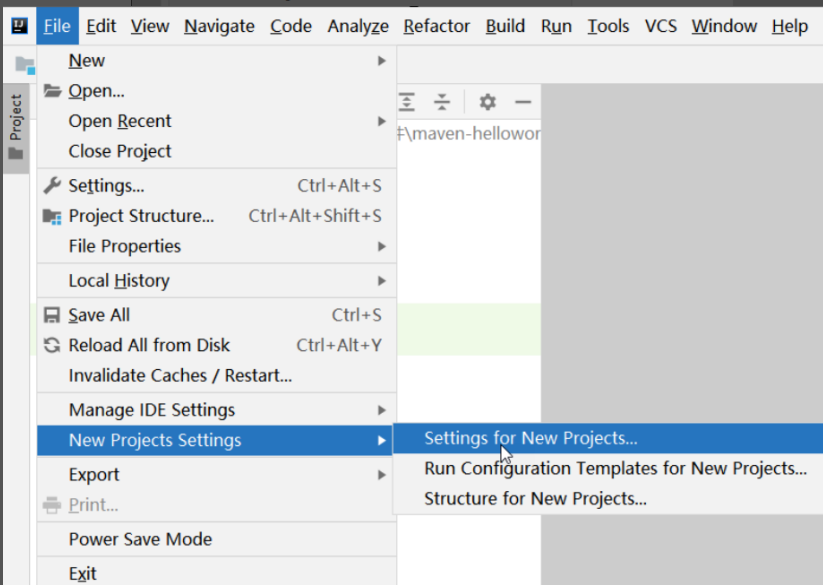

# Maven	

## Maven简介


Maven是一个项目管理工具。它可以帮助程序员构建工程，管理jar包，编译代码，完成测试，项目打包等等。

> - Maven工具是基于POM（Project Object Model，项目对象模型）实现的。在Maven的管理下每个项目都相当于是一个对象。
> - Maven标准化了项目的构建。即对项目结构，构建命令等进行了标准化定义。
> - Maven提供了一个免费的中央仓库，在其中几乎可以找到任何的流行开源类库。
> - Maven是跨平台的，在Windows、Linux、Mac上，都可以使用同样的命令。

## Maven的作用


### 一键构建

我们的项目往往都要经历编译、测试、运行、打包、安装 ，部署等一系列过程，这些过程称之为构建。通过Maven工具，可以使用简单的命令轻松完成构建工作。

### 依赖管理

传统的Web项目中，我们必须将工程所依赖的jar包复制到工程中，导致了工程的变得很大。如果一个公司具有相同架构的项目有十个，那么就需要将这一份jar包复制到十个不同的工程中，非常浪费资源。

同样的项目内容，传统Web项目大小如下：


而使用Maven构建的项目大小如下：


这说明了传统Web项目中大部分磁盘空间是被jar包占据，而Maven项目中一定没有jar包，那没有jar包的项目是怎么运行的呢？


maven工程中不直接将jar包导入到工程中，而是有一个专门存放jar包的仓库，仓库中的每个jar包都有自己的坐标。maven工程中只要配置jar包坐标即可，运行项目需要使用jar包时，根据坐标即可从maven仓库中拿到jar包即可运行。

## Maven的安装


### 下载

进入https://maven.apache.org/download.cgi即可完成下载


### 安装

解压下载好的安装文件，解压后目录结构如下：


- bin：存放maven的命令
- boot：存放maven本身的引导程序，如类加载器等
- conf：存放maven的配置文件
- lib：存放maven本身运行所需的jar包

### 配置环境变量

由于Maven是由Java语言开发的，运行时依赖Java环境，所以要在计算机的环境变量中配置`JAVA_HOME`


为了更方便的使用Maven命令，需要在环境变量中配置`MAVEN_HOME`和`Path`


### 查看版本

打开CMD命令窗口，输入`mvn -v`，显示Maven版本和Java版本，证明安装成功


## Maven工程的类型和结构


### Maven工程类型

- POM工程

  POM工程是逻辑工程，Maven并不会对该类型工程做打包处理，这些工程往往不包含具体的业务，而是用来整合其他工程的。

- JAR工程

  普通Java工程，在打包时会将项目打成jar包。

- WAR工程

  JAVA Web工程，在打包时会将项目打成war包。

### Maven工程结构

接下来我们通过一个WAR工程学习Maven工程的结构

文件目录结构：


- src：源代码
- target：编译生成的文件
- pom.xml：Maven工程配置文件，如坐标信息等。

项目结构：


- src/main/java：存放项目的java 文件
- src/main/resources：存放项目资源文件，如配置文件
- src/test/java：存放项目的测试文件
- src/test/resources：存放测试时的资源文件

## 一键构建

### 项目的生命周期


使用maven完成项目的构建的过程中，包括：验证、编译、测试、打包、部署等过程，maven将这些过程规范为项目构建的生命周期。


| 生命周期      | 所做工作                                                   |
| ------------- | ---------------------------------------------------------- |
| 验证 validate | 验证项目是否正确                                           |
| 编译 compile  | 源代码编译                                                 |
| 测试 Test     | 使用适当的单元测试框架（例如junit）运行测试。              |
| 打包 package  | 创建JAR/WAR包                                              |
| 检查 verify   | 对集成测试的结果进行检查，以保证质量达标。                 |
| 安装 install  | 安装打包的项目到本地仓库，以供其他项目使用。               |
| 部署 deploy   | 拷贝最终的工程包到远程仓库中，以共享给其他开发人员和工程。 |

> maven有三套相互独立的生命周期。分为是构建生命周期，clean生命周期（清理构建后的文件）、site生命周期（生成项目报告）。作为开发人员我们一般重点学习构建生命周期即可。

### Maven常用命令


在Maven构建项目的每一步都可以使用一句简单的命令完成，接下来我们学习这些命令：

| 命令            | 作用                                                |
| --------------- | --------------------------------------------------- |
| mvn clean       | 清除编译的class文件，即删除target目录。             |
| mvn validate    | 验证项目是否正确                                    |
| mvn compile     | 编译maven项目                                       |
| mvn test        | 编译maven项目及运行测试文件                         |
| mvn package     | 编译maven项目及运行测试文件，并打包                 |
| mvn install     | 编译maven项目及运行测试文件并打包，并发布到本地仓库 |
| mvn deploy      | 部署项目到远程仓库                                  |
| mvn tomcat7:run | 使用tomcat运行项目                                  |

> Maven依赖插件来执行命令，比如clean、validate等命令是maven自带的，tomcat7命令是引入的第三方插件。

## 依赖管理 ***

### Maven仓库类型

#### 本地仓库

本地仓库指用户计算机中的文件夹。用来存储从远程仓库或中央仓库下载的jar包，只有下载到本地仓库的jar包才能使用，项目使用jar包时优先从本地仓库查找。

#### 远程仓库

远程仓库一般指私服，它是架设在局域网的仓库服务，可以从中央仓库下载资源，供局域网使用，从而减少每个程序员都从中央仓库下载浪费的带宽。

如果项目需要的jar包本地仓库没有，则会去远程仓库下载，下载到本地仓库即可使用。

> 远程仓库不是必须配置的，如果本地仓库没有jar包，也没有配置远程仓库，则会直接从中央仓库下载。

#### 中央仓库

中央仓库是互联网上的服务器，是Maven提供的最大的仓库，里面拥有最全的jar包资源。

如果项目需要的jar包，本地仓库和远程仓库都没有，则会去中央仓库下载，下载到本地仓库使用。

Maven中央仓库访问页面：https://mvnrepository.com/

> 中央仓库访问速度较慢，我们一般都会配置镜像代理中央仓库的下载请求，如阿里镜像、华为镜像等。

### Maven配置文件 ***


本地仓库的默认位置是`${user.dir}/.m2/repository`，`${user.dir}`表示 windows用户目录，我们可以通过修改`${MAVEN_HOME}\conf\settings.xml`，修改本地仓库的位置。

#### 配置本地仓库

在`<settings>`中添加如下标签：

```xml
<!-- 本地仓库路径 -->
<localRepository>F://repository</localRepository>
```

#### 配置镜像

由于中央仓库访问速度较慢，可以配置镜像代理中央仓库的下载请求。在`<settings>`下的`<mirrors>`中添加如下标签即可配置镜像：

```xml
<mirror> 
  <!-- 指定镜像ID -->
  <id>nexus-aliyun</id> 
  <!-- 匹配中央仓库。-->
  <mirrorOf>central</mirrorOf>
  <!-- 指定镜像名称 -->  
  <name>Nexus aliyun</name> 
  <!-- 指定镜像路径 -->
<url>http://maven.aliyun.com/nexus/content/groups/public</url> 
</mirror>
```

#### 配置JDK版本

创建maven项目的时候，默认使用的JDK是1.5版本，验证语法、编译、运行时都会按照JDK1.5操作，这样就有很多语法无法使用。我们本机安装的JDK是JDK11，可以配置maven按照JDK11创建项目。

在`<settings>`下的`<profiles>`中添加如下标签即可配置JDK版本：

```xml
<profile>  
  <id>jdk11</id>  
  <activation>  
    <activeByDefault>true</activeByDefault>  
    <jdk>11</jdk>  
  </activation>  
  <properties>  
    <maven.compiler.source>11</maven.compiler.source>  
    <maven.compiler.target>11</maven.compiler.target>  
    <maven.compiler.compilerVersion>11</maven.compiler.compilerVersion>  
  </properties>  
</profile>
```

## Maven工程开发 *

### Idea配置Maven插件 *

在使用Idea开发项目时，可以整合Maven插件进行一键构建和依赖管理。Idea自带Maven插件，我们也可以指定自己下载的Maven插件。

依据图片指示，选择本地maven安装目录，指定settings配置文件。


之后，点击File — New Projects Settings — Settings for New Projects，再设置一遍Maven，使得新项目也可以使用同样的Maven配置。



### 构建Maven工程


接下来我们构建一个Maven的Web工程：

1. 打开 idea，选择创建一个新工程

   

2. 选择Maven工程，并使用maven的web工程模板

   

3. 点击 Next 填写项目信息

   

4. 点击 Next，此处不做改动，点击Finish构建项目

   

5. 手动添加src/main/java目录，此时该目录还不能写Java代码。

6. 将src/main/java目录设置为Java代码目录。

   

### pom文件配置


pom文件最上方是项目基本信息：


> - groupId
>
>   groupId一般定义项目组名，命名规则使用反向域名。例如com.itbaizhan
>
> - artifactId
>
>   artifactId一般定义项目名，命名使用小写字母。项目发布后，它的坐标是groupId+artifactId。
>
> - version
>
>   version定义版本号。版本号一般有三段，第一段：革命性的产品升级。第二段：新功能版本。第三段：修正一些bug。
>
> - packaging
>
>   packaging定义打包方式。

`<properties>`中定义一些配置信息：


`<dependencies>`中定义依赖的jar包坐标：

由于项目是web项目，需要写Servlet和JSP，所以需要引入Servlet和JSP的依赖。查找依赖坐标的网站：https://mvnrepository.com/


```xml
<dependencies>
  <dependency>
    <groupId>junit</groupId>
    <artifactId>junit</artifactId>
    <version>4.11</version>
    <scope>test</scope>
  </dependency>
  <!-- jsp -->
  <dependency>
    <groupId>javax.servlet.jsp</groupId>
    <artifactId>jsp-api</artifactId>
    <version>2.2</version>
  </dependency>
  <!-- servlet -->
  <dependency>
    <groupId>javax.servlet</groupId>
    <artifactId>javax.servlet-api</artifactId>
    <version>3.0.1</version>
  </dependency>
</dependencies>
```

> 为什么之前的web项目中没有引入jsp和servlet的jar包？
>
> 因为之前项目中使用的是tomcat中的jsp和servlet中的jar包，在项目中没有引入。

`<plugins>`中定义第三方插件：

web项目依赖tomcat运行，所以添加tomcat7插件

```xml
<plugins>
  <!-- tomcat插件 -->
  <plugin>
    <groupId>org.apache.tomcat.maven</groupId>
    <artifactId>tomcat7-maven-plugin</artifactId>
    <version>2.1</version>
    <configuration>
      <port>8080</port>
      <path>/</path>
      <uriEncoding>UTF-8</uriEncoding>
      <server>tomcat7</server>
    </configuration>
  </plugin>
</plugins>
```

### 编写代码


接下来编写Servlet和Jsp代码：

```java
@WebServlet("/demo1")
public class MyServlet extends HttpServlet {
  @Override
  protected void doGet(HttpServletRequest req, HttpServletResponse resp) throws ServletException, IOException {
    req.getRequestDispatcher("hello.jsp").forward(req,resp);
   }
}
```

```html
<%@ page contentType="text/html;charset=UTF-8" language="java" %>
<html>
  <head>
    <title>测试</title>
  </head>
  <body>
    <h1>你好，百战程序员！</h1>
  </body>
</html>
```


运行项目，按照如图步骤，配置使用maven中的tomcat7插件运行项目：


点击OK后配置完成，点击Idea的运行符号即可使用maven中的tomcat7插件运行项目。

### 依赖范围


访问servlet后，发现报500异常，这是为什么呢？


这是由于项目中引入了Servlet和Jsp的jar包，而在项目运行时，Tomcat要使用它自带的Servlet和Jsp的jar包，这样就造成了jar包冲突。但如果项目不引入Servlet和Jsp的jar包，则根本无法通过编译。

此时可以设置依赖的作用范围解决该问题，设置Servlet和Jsp的jar包只在编译期起作用，运行时不起作用，这样不仅可以通过编译，还能在运行时避免jar包冲突。

通过在`<dependency>`中添加`<scope>`，可以设置依赖的作用范围，有以下取值：

> - compile
>
>   默认范围。表示该依赖在编译和运行时生效，项目打包时也会将该依赖打包进去。
>
> - provided
>
>   使用此依赖范围的Maven依赖，编译和测试时有效，但在运行时无效。典型的例子是servlet-api，在运行时Web容器已经提供依赖，就不需要Maven重复地引入一遍。
>
> - runtime
>
>   runtime范围表明编译时不需要生效，而只在运行时生效。典型的例子是JDBC驱动包，编译时只需要JDK的JDBC接口即可，只有运行项目时才需要具体的JDBC驱动。
>
> - test
>
>   test范围表明使用此依赖范围的依赖，只在编译和运行测试代码的时生效，程序的正常运行不需要此类依赖。典型的例子就是JUnit，它只有在编译测试代码及运行测试的时候才需要。
>
> - system
>
>   如果有些你依赖的jar包没有Maven坐标的，它完全不在Maven体系中，这时候你可以把它下载到本地硬盘，然后通过system来引用。（不推荐使用）

所以对于Servlet和Jsp依赖，我们添加依赖范围为provided即可。

```xml
<dependency>
  <groupId>javax.servlet.jsp</groupId>
  <artifactId>jsp-api</artifactId>
  <version>2.2</version>
  <scope>provided</scope>
</dependency>
<dependency>
  <groupId>javax.servlet</groupId>
  <artifactId>javax.servlet-api</artifactId>
  <version>3.0.1</version>
  <scope>provided</scope>
</dependency>
```

重启项目，即可正常访问Servlet和Jsp

## Maven工程测试 *

### 测试概述

测试即在交付前对写好的代码进行评测，分为黑盒测试和白盒测试：

- 黑盒测试：不需要写代码，给输入值，看程序是否能够输出期望的值。
- 白盒测试：需要写代码的。关注程序具体的执行流程。


单元测试是指对软件中的最小可测试单元进行检查和验证，Java里单元测试指一个类的功能。单元测试是在软件开发过程中要进行的最低级别的测试活动，软件的独立单元将在与程序的其他部分相隔离的情况下进行测试。

Junit是Java编程语言的单元测试框架，用于编写和运行可重复的自动化测试。从分类中属于白盒测试。

### Junit使用步骤


#### 在Maven项目中引入依赖

```xml
<dependency>
  <groupId>junit</groupId>
  <artifactId>junit</artifactId>
  <version>4.12</version>
  <scope>test</scope>
</dependency>
```

#### 定义被测试的类

我们定义一个计算器工具类。

```java
public class Calculator {
  // 加法
  public int add(int a,int b){
    return a+b;
   }
  // 除法
  public int div(int a,int b){
    return a/b;
   }
}
```

#### 对定义的类进行测试

1. 创建src/test/java包，并将改包设置为测试包。

2. 在src/test/java中创建测试类的包，包名一般与被测试包名一致。

3. 定义测试类，类名一般为被测试类+Test

   

4. 测试类中编写测试方法。

   ```java
   public class CalculatorTest {
     /**
      * 测试方法是可以独立运行的，写法如下：
      * 1.方法名一般为test+被测试方法名
      * 2.方法上方添加@Test
      * 3.测试方法没有参数和返回值
      */
     @Test
     public void testAdd(){
       Calculator calculator = new Calculator();
       int add = calculator.add(1, 2);
       System.out.println(add);
      }
   
   
     @Test
     public void testDiv(){
       Calculator calculator = new Calculator();
       int div = calculator.div(2,0);
       System.out.println(div);
      }
   }
   ```
   

### Junit结果判定  断言！ *


点击测试方法边的三角运行测试方法，如果出现绿色对钩，证明方法能正常运行；如果出现红色感叹号，证明方法抛出异常，需要修改方法。


当然，不是能正常运行就代表方法一定没有问题，也有可能方法的结果和预期结果不一致，这时就需要使用断言操作。

```java
@Test
public void testAdd(){
  Calculator calculator = new Calculator();
  int add = calculator.add(1, 2);
  /**
   * 断言
   * 参数1：预期结果，参数2：实际结果
   */
  Assert.assertEquals(2,add);
}
```

如果真实结果和预期结果不一致，则会抛出以下异常：


### @Before、@After


在测试类中，@Before修饰的方法会在测试方法之前自动执行，@After修饰的方法会在测试方法执行之后自动执行。之后的学习中，我们可以设置前置方法为获取资源，后置方法为释放资源。

```java
@Before
public void before(){
  System.out.println("开始测试");
}


@After
public void after(){
  System.out.println("结束测试");
}
```

## 依赖冲突调解 *

### 依赖冲突产生的原因——依赖传递

假设你的项目依赖jar包A，jar包A又依赖jar包B。当添加jar包A时，Maven会把jar包B也自动加入到项目中。比如刚刚我们添加了junit依赖，junit又依赖hamcrest，所以Maven会将junit和hamcrest都加入项目中。


这时就可能会产生依赖冲突问题，比如依赖A会引入依赖C，依赖B也会引入依赖C。如果不进行调解则会引入两个依赖C，那么Maven是如何解决依赖冲突问题的呢？


 依赖冲突调解

我们以Spring依赖为例，spring-webmvc依赖spring-aop，spring-context也依赖spring-aop，如果两个同时引入，会引入哪个版本的spring-aop呢？

```xml
<dependency>
  <groupId>org.springframework</groupId>
  <artifactId>spring-context</artifactId>
  <version>5.2.12.RELEASE</version>
</dependency>
<dependency>
  <groupId>org.springframework</groupId>
  <artifactId>spring-webmvc</artifactId>
  <version>4.2.4.RELEASE</version>
</dependency>
```


### 最短路径优先原则

**Maven调解依赖冲突的第一原则是最短路径优先原则：**

也就是说项目依赖关系树中路径最短的版本会被使用。例如，假设有几个jar包之间的依赖关系是：`A->B->C->D(2.0)`和`E->F->D(1.0)`，如果同时引入A和E，那么D(1.0)会被使用，因为E到D的路径更短。

查看依赖路径的方式如下：


spring-webmvc到spring-aop的路径如下：


spring-context到spring-aop的路径如下：


可以看到，spring-webmvc到spring-aop的路径为：

> ```
> spring-webmvc` -> `spring-context` ->`spring-aop
> ```

而spring-context到spring-aop的路径为：

> ```
> spring-context` ->`spring-aop
> ```

spring-context到spring-aop的路径更短，所以spring-aop会按照spring-context的版本引入。


### 最先声明原则


最短路径优先原则不能解决所有问题，比如这样的依赖关系：`A–>B–>C(1.0)`和`D–>E–>C(2.0)`，同时引入A和D之后，C(1.0)和C(2.0)的依赖路径长度都为2。此时第一原则将不能解决问题

**Maven调解依赖冲突的第二原则是最先声明原则：**

在依赖路径长度相等的前提下，在POM中依赖声明的顺序靠前的会被解析使用。比如：以上案例中，spring-webmvc和spring-context到spring-core的路径都为1。谁声明在上方，spring-core会按照谁的版本引入。


### 排除依赖、锁定版本 *


如果不想使用Maven默认的冲突调解方式，有两种方式可以手动进行冲突调解。

#### **排除依赖 *** 

比如以上案例中，想使用spring-webmvc的spring-aop包，那么可以让spring-context引入时排除引入spring-aop包，这样就可以使用spring-webmvc的spring-aop包了，写法如下：

```xml
<dependency>
  <groupId>org.springframework</groupId>
  <artifactId>spring-webmvc</artifactId>
  <version>4.2.4.RELEASE</version>
</dependency>
<dependency>
  <groupId>org.springframework</groupId>
  <artifactId>spring-context</artifactId>
  <version>5.2.12.RELEASE</version>
  <exclusions>
    <exclusion>
      <groupId>org.springframework</groupId>
      <artifactId>spring-aop</artifactId>
    </exclusion>
  </exclusions>
</dependency>
```

#### 锁定版本 *

在Maven中为某个jar包配置锁定版本后，不考虑依赖的声明顺序和依赖路径，以锁定的版本的为准添加到工程中，此方法在企业开发中常用。以下可以直接配置spring-aop锁定的版本。

```xml
<dependencyManagement>
  <dependencies>
    <dependency>
      <groupId>org.springframework</groupId>
      <artifactId>spring-aop</artifactId>
      <version>4.2.4.RELEASE</version>
    </dependency>
  </dependencies>
</dependencyManagement>
```

## Maven聚合开发 *

### 聚合关系


之前我们在Idea中开发时会将项目的所有包放在同一个工程当中。


> - domain：定义实体类
> - dao：操作数据库
> - service：具体的业务逻辑，需要调用dao的方法。
> - controller：前后端交互，需要调用service的方法。
> - webapp：存放前端资源

假如我们现在写了两个项目分别是电商卖家端和电商买家端，两个项目都需要调用serive层查询订单的方法。原来的写法如下：


重复编码造成开发效率降低。

而使用maven后，我们可以把之前的项目按需拆分成一个个小项目，之后将小项目发布到仓库中，小项目之间也可以互相引用，并且在我们的项目中引入需要的小项目即可。


Maven将一个大项目分成一个个小项目开发，最后打包时会将这些小的项目打成一个完整的war包独立运行。


### 继承关系

Maven中的继承是针对于父工程和子工程。父工程定义的依赖和插件子工程可以直接使用。注意父工程类型一定为POM类型工程。

#### 多继承

在Maven中对于继承采用的也是单继承，也就是说一个子项目只能有一个父项目。但我们可以在`<dependencyManagement>`配置多继承。写法如下：

```xml
<dependencyManagement>
  <dependencies>
    <!--父项目a-->
    <dependency>
      <groupId>com.itbaizhan</groupId>
      <artifactId>parent_a</artifactId>
      <version>1.0-SNAPSHOT</version*>
      <type>pom</type>
      <!-- 引入父项目，scope的值为import -->
      <scope>import</scope>
    </dependency>


    <!--父项目b-->
    <dependency>
      <groupId>com.itbaizhan</groupId>
      <artifactId>parent_b</artifactId>
      <version>1.0-SNAPSHOT</version>
      <type>pom</type>
      <scope>import</scope>
    </dependency>
  </dependencies>
</dependencyManagement>
```

### 搭建父工程 *


1. 创建一个Maven工程，创建时不需要选择模板。

   

   

2. 由于父工程是虚拟工程，不需要写逻辑代码，所以删除父工程的src目录。

3. 由于父工程的依赖和插件子工程都能继承，可以将需要的依赖和插件都配置在父工程中。

   ```xml
   <groupId>com.itbaizhan</groupId>
   <artifactId>maven_demo2</artifactId>
   <version>1.0-SNAPSHOT</version>
   <packaging>pom</packaging>
   
   
   <properties>
     <maven.compiler.source>11</maven.compiler.source>
     <maven.compiler.target>11</maven.compiler.target>
   </properties>
   
   
   <dependencies>
     <dependency>
       <groupId>junit</groupId>
       <artifactId>junit</artifactId>
       <version>4.12</version>
       <scope>test</scope>
     </dependency>
     <dependency>
       <groupId>javax.servlet.jsp</groupId>
       <artifactId>jsp-api</artifactId>
       <version>2.2</version>
       <scope>provided</scope>
     </dependency>
     <dependency>
       <groupId>javax.servlet</groupId>
       <artifactId>javax.servlet-api</artifactId>
       <version>3.0.1</version>
       <scope>provided</scope>
     </dependency>
     <!-- jdbc驱动 -->
     <dependency>
       <groupId>mysql</groupId>
       <artifactId>mysql-connector-java</artifactId>
       <version>8.0.27</version>
     </dependency>
     <!-- jstl -->
     <dependency>
       <groupId>org.apache.taglibs</groupId>
       <artifactId>taglibs-standard-spec</artifactId>
       <version>1.2.5</version>
     </dependency>
     <dependency>
       <groupId>org.apache.taglibs</groupId>
       <artifactId>taglibs-standard-impl</artifactId>
       <version>1.2.5</version>
     </dependency>
   </dependencies>
   
   
   <build>
     <plugins>
       <!-- tomcat插件 -->
       <plugin>
         <groupId>org.apache.tomcat.maven</groupId>
         <artifactId>tomcat7-maven-plugin</artifactId>
         <version>2.1</version>
         <configuration>
           <port>8080</port>
           <path>/</path>
           <uriEncoding>UTF-8</uriEncoding>
           <server>tomcat7</server>
           <systemProperties>
   <java.util.logging.SimpleFormatter.format>%1$tH:%1$tM:%1$tS %2$s%n%4$s: %5$s%6$s%n</java.util.logging.SimpleFormatter.format>
           </systemProperties>
         </configuration>
       </plugin>
     </plugins>
   </build>
   ```

   

### 搭建dao模块 *

dao子工程中一般写实体类和dao层：

1. 在父工程下创建maven模块，不选择模板，创建时一定要选择父工程。

   

   

2. 子模块的pom文件中写入父工程证明继承成功。

   > 在父工程中 也许要添加`<moudle> `模块标签

   

3. 准备数据库、

   ```mysql
   CREATE DATABASE `student`;
   USE `student`;
   DROP TABLE IF EXISTS `student`;
   CREATE TABLE `student` (
    `id` int(11) NOT NULL AUTO_INCREMENT,
    `name` varchar(255) DEFAULT NULL,
    `sex` varchar(10) DEFAULT NULL,
    `address` varchar(255) DEFAULT NULL,
    PRIMARY KEY (`id`)
   ) ENGINE=InnoDB AUTO_INCREMENT=3 DEFAULT CHARSET=utf8;
   
   
   insert into `student`(`id`,`name`,`sex`,`address`) values (1,'百战程序员','男','北京'),(2,'北京尚学堂','女','北京');
   ```

4. 编写实体类

   ```java
   public class Student {
     private int id;
     private String name;
     private String sex;
     private String address;
     
     // 省略getter/setter/tostring/构造方法
   }
   ```

5. 在resources中编写连接数据库的配置文件db.properties

   ```yaml
   jdbc.url=jdbc:mysql:///student
   jdbc.user=root
   jdbc.password=root
   ```

6. 编写dao方法

   ```java
   public class StudentDao {
     // 查询所有学生
     public List<Student> findAll() throws Exception {
       // 读取配置文件
       Properties properties = new Properties();
       InputStream is = this.getClass().getClassLoader().getResourceAsStream("db.properties");
       properties.load(is);
   
   
       String url = properties.getProperty("jdbc.url");
       String user = properties.getProperty("jdbc.user");
       String password = properties.getProperty("jdbc.password");
   
   
       // 查询数据库
       Connection connection = DriverManager.getConnection(url, user, password);
       Statement statement = connection.createStatement();
       ResultSet resultSet = statement.executeQuery("select * from student");
   
   
       // 处理结果集
       List<Student> students = new ArrayList();
       while (resultSet.next()){
         int id = resultSet.getInt("id");
         String name = resultSet.getString("name");
         String sex = resultSet.getString("sex");
         String address = resultSet.getString("address");
         Student student = new Student(id, name, sex, address);
         students.add(student);
        }
   
   
       // 释放资源
       resultSet.close();
       statement.close();
       connection.close();
   
   
       return students;
      }
   }
   ```

7. 测试dao方法

   ```java
   public class StudentDaoTest {
     // 测试findAll
     @Test
     public void testFindAll() throws Exception {
       StudentDao studentDao = new StudentDao();
       List<Student> all = studentDao.findAll();
       all.forEach(System.out::println);
      }
   }
   ```

### 搭建service模块 *

service子工程中一般写service层的内容，也需要继承父工程，由于需要调用dao子工程的方法，所以需要导入dao子工程的依赖。

1. 在父工程下创建maven模块，不选择模板，选择父工程。

2. 在service模块的pom文件中引入dao子工程的依赖。

   ```xml
   <dependencies>
     <dependency>
       <groupId>com.itbaizhan</groupId>
       <artifactId>maven_demo2_dao</artifactId>
       <version>1.0-SNAPSHOT</version>
     </dependency>
   </dependencies>
   ```

3. 编写Service方法

   ```java
   public class StudentService {
     private StudentDao studentDao = new StudentDao();
     public List<Student> findAllStudent() throws Exception {
       return studentDao.findAll();
      }
   }
   ```

4. 测试service方法

   ```java
   public class StudentServiceTest {
     // 测试findAllStudent
     @Test
     public void testFindAll() throws Exception {
       StudentService studentService = new StudentService();
       List<Student> allStudent = studentService.findAllStudent();
       allStudent.forEach(System.out::println);
      }
   }
   ```

### 搭建web模块 **

web子工程中一般要写控制器和前端页面的内容。它不是普通的java工程，而是一个web工程，需要继承父工程，导入service子工程的依赖。

1. 在父工程下创建maven模块，选择web工程模板，选择父工程。

   

   

2. 创建好后，添加父工程，删除pom文件中的jdk编译版本，删掉junit依赖，引入service依赖。

   ```xml
   <parent>
     <artifactId>maven_demo2</artifactId>
     <groupId>com.itbaizhan</groupId>
     <version>1.0-SNAPSHOT</version>
   </parent>
   
   
   <properties>
     <project.build.sourceEncoding>UTF-8</project.build.sourceEncoding>
     <maven.compiler.source>11</maven.compiler.source>
     <maven.compiler.target>11</maven.compiler.target>
   </properties>
   
   
   <dependencies>
     <dependency>
       <groupId>com.itbaizhan</groupId>
       <artifactId>maven_demo2_service</artifactId>
       <version>1.0-SNAPSHOT</version>
     </dependency>
   </dependencies>
   ```

3. 编写控制器

   ```java
   @WebServlet("/allStudent")
   public class FindAllStudentServlet extends HttpServlet {
     @Override
     protected void doGet(HttpServletRequest req, HttpServletResponse resp) throws ServletException, IOException {
         //实例化service
       StudentService studentService = new StudentService();
       List<Student> allStudent = null;
       try {
         allStudent = studentService.findAllStudent();
        } catch (Exception e) {
         e.printStackTrace();
        }
       req.setAttribute("allStudent",allStudent);
       req.getRequestDispatcher("allStudent.jsp").forward(req,resp);
      }
   }
   ```

4. 编写JSP页面

   ```jsp
   <%@ page contentType="text/html;charset=UTF-8" language="java" isELIgnored="false" %>
   <%@ taglib prefix="c" uri="http://java.sun.com/jsp/jstl/core" %>
   <html>
   <head>
     <title>所有学生</title>
   </head>
   <body>
   <table align="center" border="1" cellspacing="0" cellpadding="0" width="500px">
     <tr>
       <th>id</th>
       <th>姓名</th>
       <th>性别</th>
       <th>地址</th>
     </tr>
     <c:forEach items="${allStudent}" var="student">
       <tr>
         <td>${student.id}</td>
         <td>${student.name}</td>
         <td>${student.sex}</td>
         <td>${student.address}</td>
       </tr>
     </c:forEach>
   </table>
   </body>
   </html>
   ```

### 运行项目

有以下两种方式可以运行项目：

1. 配置tomcat插件运行父工程，此时会自动聚合运行项目。

   点开配置tomcat7插件：

   进行如下配置：

   

   点击运行箭头即可访问http://localhost:8080/allStudent

   

2. 配置tomcat插件运行web子工程。

   运行web子工程时会从本地仓库下载依赖的jar包，所以必须将dao模块和service模块发布到本地仓库，我们可以直接发布整个项目。

   

之后按照tomcat插件配置父工程的方式配置web工程即可：


点击运行箭头即可访问http://localhost:8080/allStudent

## 依赖传递失效及解决方案

之前的案例中，junit是在父工程当中引入的，如果在dao工程引入，service工程引入dao工程，即`service --> dao --> junit`。按照依赖的传递性，service工程也可以使用junit。可实际情况却是无法使用。这就是依赖传递失效问题。


Maven在定义依赖传递时，一些依赖范围的依赖无法传递，表格如下：


> 在实际开发中，不需要记这张表格，遇到依赖没有传递过来时，我们直接在本工程再次添加一遍依赖即可。
>
> ```xml
> <dependencies>
>  <dependency>
>    <groupId>com.itbaizhan</groupId>
>    <artifactId>maven_demo2_dao</artifactId>
>    <version>1.0-SNAPSHOT</version>
>  </dependency>
>  <dependency>
>    <groupId>junit</groupId>
>    <artifactId>junit</artifactId>
>    <version>4.12</version>
>    <scope>test</scope>
>  </dependency>
> </dependencies>
> ```