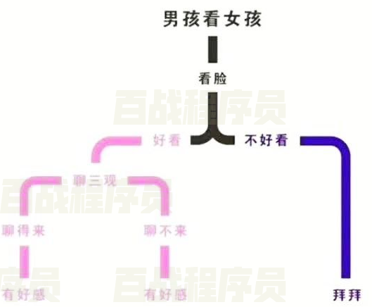

# Mybatis

## 什么是框架？


框架即一个半成品软件。开发者从头开发一个软件需要花费大量精力，于是有一些项目组开发出半成品软件，开发者在这些软件的基础上进行开发，这样的软件就称之为框架。

如果将开发完成的软件比作是一套已经装修完毕的新房，框架就好比是一套已经修建好的毛坯房。用户直接购买毛坯房，保证建筑质量和户型合理的同时可以进行风格的自由装修。

> 使用框架开发的好处：
>
> 1. 省去大量的代码编写、减少开发时间、降低开发难度。
> 2. 限制程序员必须使用框架规范开发，增强代码的规范性，降低程序员之间沟通及日后维护的成本。
> 3. 将程序员的注意力从技术中抽离出来，更集中在业务层面。

使用框架就好比和世界上最优秀的软件工程师共同完成一个项目，并且他们完成的还是基础、全局的工作。

## 什么是ORM框架？


ORM（Object Relationl Mapping），对象关系映射，即在数据库和对象之间作映射处理。

之前我们使用JDBC操作数据库，必须手动进行数据库和对象间的数据转换。

```java
// 新增方法，将对象转为sql语句字段
public void AddUser(User user) throws Exception {
  Class.forName("com.mysql.jdbc.Driver");
  Connection connection = DriverManager.getConnection("jdbc:mysql://localhost:3306/mybatis?characterEncoding=utf-8","root", "root");
  String sql = "INSERT INTO user values (null,?,?,?,?)";


  PreparedStatement preparedStatement = connection.prepareStatement(sql);
  preparedStatement.setString(1,user.getName());
  preparedStatement.setInt(2,user.getAge());
  preparedStatement.setString(3,user.getAddress());
  preparedStatement.setString(4,user.getSex());
  preparedStatement.executeUpdate();
  // 省略资源关闭...
}


// 查询方法，将数据库结果集转为对象
public List<User> findAllUser() throws Exception {
  Connection connection = DriverManager.getConnection("jdbc:mysql://localhost:3306/mybatis?characterEncoding=utf-8", "root", "root");
  PreparedStatement preparedStatement = connection.prepareStatement("select * from user");
  ResultSet resultSet = preparedStatement.executeQuery();


  //遍历查询结果集
  List<User> users = new ArrayList<>();
  while(resultSet.next()){
    // 拿到每一列数据
    int id = resultSet.getInt("id");
    String name = resultSet.getString("name");
    int age = resultSet.getInt("age");
    String address = resultSet.getString("address");
    String sex = resultSet.getString("sex");
    // 将数据封装到对象中
    User user = new User();
    user.setId(id);
    user.setName(name);
    user.setAge(age);
    user.setAddress(address);
    user.setSex(sex);
    users.add(user);
   }
  // 省略资源关闭...
  return users;
}
```

这段代码中，数据库数据与对象数据的转换代码繁琐、无技术含量。而使用ORM框架代替JDBC后，框架可以帮助程序员自动进行转换，只要像平时一样操作对象，ORM框架就会根据映射完成对数据库的操作，极大的增强了开发效率。

## 什么是MyBatis?


MyBatis是一个半自动的ORM框架，其本质是对JDBC的封装。使用MyBatis不需要写JDBC代码，但需要程序员编写SQL语句。之前是apache的一个开源项目iBatis，2010年改名为MyBatis。

> 补充：
>
> Hibernate也是一款持久层ORM框架，多年前的市场占有率很高，但近年来市场占有率越来越低。
>
> MyBatis与Hibernate的比较：
>
> - MyBatis是一个半自动的ORM框架，需要手写SQL语句。
> - Hibernate是一个全自动的ORM框架，不需要手写SQL语句。
> - 使用MyBatis的开发量要大于Hibernate。
>
> 为什么Hibernate市场占有率越来越低：
>
> - 对于新手学习Hibernate时间成本比MyBatis大很多，MyBatis上手很快。
> - Hibernate不需要写SQL语句是因为框架来生成SQL语句。对于复杂查询，开发者很难控制生成的SQL语句，这就导致SQL调优很难进行。
> - 之前的项目功能简单，数据量小，所以使用Hibernate可以快速完成开发。而近年来项目的数据量越来越大，而互联网项目对查询速度要求也很高，这就要求我们一定要精细化的调整SQL语句。此时灵活性更强，手动编写SQL语句的MyBatis慢慢代替了Hibernate使用。
> - 在高并发、大数据、高性能、高响应的互联网项目中，MyBatis是首选的持久框架。而对于对性能要求不高的比如内部管理系统等可以使用Hibernate。

## MyBatis入门


### 环境搭建 *

1. 将SQL文件导入数据库

2. 创建maven工程，引入依赖

   ```xml
   <dependencies>
     <!--  mybatis  -->
     <dependency>
       <groupId>org.mybatis</groupId>
       <artifactId>mybatis</artifactId>
       <version>3.5.7</version>
     </dependency>
     <!--  mysql驱动包  -->
     <dependency>
       <groupId>mysql</groupId>
       <artifactId>mysql-connector-java</artifactId>
       <version>8.0.26</version>
     </dependency>
   
   
     <!--  junit  -->
     <dependency>
       <groupId>junit</groupId>
       <artifactId>junit</artifactId>
       <version>4.10</version>
     </dependency>
     <!--  log4j  -->
     <dependency>
       <groupId>log4j</groupId>
       <artifactId>log4j</artifactId>
       <version>1.2.12</version>
     </dependency>
   </dependencies>
   ```

3. **创建mybatis核心配置文件SqlMapConfig.xml**

   ```xml
   <?xml version="1.0" encoding="UTF-8"?>
   <!DOCTYPE configuration
       PUBLIC "-//mybatis.org//DTD Config 3.0//EN"
       "http://mybatis.org/dtd/mybatis-3-config.dtd">
   <configuration>
     <!--  配置环境  -->
     <environments default="mysql">
       <environment id="mysql">
         <!--  事务类型  -->
         <transactionManager type="JDBC"></transactionManager>
         <!--  数据源  -->
         <dataSource type="POOLED">
           <property name="driver" value="com.mysql.jdbc.Driver"/>
           <property name="url" value="jdbc:mysql:///mybatis"/>
           <property name="username" value="root"/>
           <property name="password" value="root"/>
         </dataSource>
       </environment>
     </environments>
   </configuration>
   ```

4. 将log4j.properties文件放入resources中，让控制台打印SQL语句。

5. 创建实体类

   ```java
   public class User {
     private int id;
     private String username;
     private String sex;
     private String address;
       // 省略getter/setter/构造方法/toString方法
   }
   ```

### 创建持久层接口和映射文件

1. 在java目录创建持久层接口

   ```java
   public interface UserMapper {
     List<User> findAll();
   }
   ```

2. 在resource目录创建映射文件

   ```xml-dtd
   <?xml version="1.0" encoding="UTF-8"?>
   <!DOCTYPE mapper
       PUBLIC "-//mybatis.org//DTD Mapper 3.0//EN"
       "http://mybatis.org/dtd/mybatis-3-mapper.dtd">
   <mapper namespace="com.itbaizhan.mapper.UserMapper">
     <select id="findAll" resultType="com.itbaizhan.pojo.User">
        select * from user
     </select>
   </mapper>
   ```

3. 将映射文件配置到mybatis核心配置文件中

   ```xml-dtd
   <!--  注册映射文件  -->
   <mappers>
     <mapper resource="com/itbaizhan/mapper/UserMapper.xml">     </mapper>
   </mappers>
   ```

> 映射文件注意事项：
>
> - 映射文件要和接口名称相同。
>
> - 映射文件要和接口的目录结构相同。
>
>   
>
> - 映射文件中namespace属性要写接口的全名。
>
> - 映射文件中标签的id属性是接口方法的方法名。
>
> - 映射文件中标签的resultType属性是接口方法的返回值类型。
>
> - 映射文件中标签的parameterType属性是接口方法的参数类型。
>
> - 映射文件中resultType、parameterType属性要写全类名，如果是集合类型，则写其泛型的全类名。

### 测试持久层接口方法 *

```java
@Test
public void testFindAll() throws Exception {
  // （1）读取核心配置文件
  InputStream is = Resources.getResourceAsStream("SqlMapConfig.xml");
  // （2）创建SqlSessionFactoryBuilder对象
  SqlSessionFactoryBuilder builder = new SqlSessionFactoryBuilder();
  // （3）SqlSessionFactoryBuilder对象获取SqlSessionFactory对象
  SqlSessionFactory factory = builder.build(is);
  // （4）SqlSessionFactory对象获取SqlSession对象
  SqlSession session = factory.openSession();
  // （5）SqlSession对象获取代理对象
  UserMapper userMapper = session.getMapper(UserMapper.class);
  // （6）代理对象执行方法
  List<User> all = userMapper.findAll();
  all.forEach(System.out::println);

  // （7）释放资源
  session.close();
  is.close();
}
```

## MyBatis核心对象及工作流程


### MyBatis核心对象

- SqlSessionFactoryBuilder

  SqlSession工厂构建者对象，使用构造者模式创建SqlSession工厂对象。

- SqlSessionFactory

  SqlSession工厂，使用工厂模式创建SqlSession对象。

- SqlSession

  该对象可以操作数据库，也可以使用动态代理模式创建持久层接口的代理对象操作数据库。

- Mapper

  持久层接口的代理对象，他具体实现了持久层接口，用来操作数据库。

### MyBatis工作流程

1. 创建SqlSessionFactoryBuilder对象
2. SqlSessionFactoryBuilder对象构建了SqlSessionFactory对象：构造者模式
3. SqlSessionFactory对象生产了SqlSession对象：工厂模式
4. SqlSession对象创建了持久层接口的代理对象：动态代理模式
5. 代理对象操作数据库


## 使用SqlSession操作数据库 *

除了代理对象能够操作数据库，SqlSession也能操作数据库。只是这种方式在开发中使用的较少，接下来我们使用SqlSession操作数据库：

```java
@Test
public void testFindAll2() throws Exception {
  // （1）读取核心配置文件
  InputStream is = Resources.getResourceAsStream("SqlMapConfig.xml");
  // （2）创建SqlSessionFactoryBuilder对象
  SqlSessionFactoryBuilder builder = new SqlSessionFactoryBuilder();
  // （3）SqlSessionFactoryBuilder对象获取SqlSessionFactory对象
  SqlSessionFactory factory = builder.build(is);
  // （4）SqlSessionFactory对象获取SqlSession对象
  SqlSession session = factory.openSession();
  // （5）SqlSession直接操作数据库
  List<User> users = session.selectList("com.itbaizhan.mapper.UserMapper.findAll");
  users.forEach(System.out::println);
  // （6）关闭资源
  session.close();
  is.close();
}
```

## Mapper动态代理原理


接下来我们通过源码，了解MyBatis的Mapper对象究竟是怎么生成的，他又是如何代理接口的方法。

### 获取代理对象

点开测试类的`getMapper`方法，查看该方法最终调用了什么方法。


当看到`Proxy.newProxyInstance`时，可以确定`getMapper`方法最终调用的是JDK动态代理方法，且使用MapperProxy类定义代理方式

### 查看代理方式

点开MapperProxy类，查看invoke方法，查看代理对象是如何工作的。


可以看到，MapperProxy调用了MapperMethod的execute方法定义了代理方式，且底层调用的是SqlSession的方法，根据映射文件标签不同调用不同的SqlSession方法。

> 结论：
>
> - SqlSession的getMapper方法，最终是调用的是JDK动态代理方法，生成一个代理对象，类型就是传入的接口类型。
> - MapperProxy对象通过调用MapperMethod的execute方法定义了代理方式，该方法的底层调用的是SqlSession的方法。

## MyBatis增删改查 ***


### 注意事项

> 第2步后，还需要在核心配置文件 sqlmapconfig.xml中添加映射文件！！！
>
> 参考上的 **Mybatis入门 》创建持久层接口和映射文件**章节

### 新增用户

1. 持久层接口添加方法

   ```
   void add(User user);
   ```

2. 映射文件添加标签

   ```xml-dtd
   <insert id="add" parameterType="com.itbaizhan.pojo.User">
      insert into user(username,sex,address) values(#{username},#{sex},#{address})
   </insert>
   ```

3. 编写测试方法

   ```java
   @Test
   public void testAdd() throws Exception {
     InputStream is= Resources.getResourceAsStream("SqlMapConfig.xml");
     SqlSessionFactoryBuilder builder = new SqlSessionFactoryBuilder();
     SqlSessionFactory factory = builder.build(is);
     SqlSession session = factory.openSession();
     UserMapper userMapper = session.getMapper(UserMapper.class);
     User user = new User("程序员", "男", "上海");
     userMapper.add(user);
     // 提交事务
     session.commit();
     session.close();
     is.close();
   }
   ```

   > 注意：
   >
   > 1. 当接口方法的参数类型为POJO类型时，SQL语句中绑定参数时使用`#{POJO的属性名}`即可。
   > 2. MyBatis事务默认手动提交，所以在执行完增删改方法后，需要手动调用SqlSession对象的事务提交方法，否则数据库将不发生改变。


### 优化测试类

我们发现MyBatis的测试方法在操作数据库前都需要获取代理对象，操作数据库后都需要释放资源，可以利用Junit的前置后置方法，优化测试类代码。

```java
InputStream is = null;
SqlSession session = null;
UserMapper userMapper = null;


@Before
public void before() throws IOException {
  // （1）读取核心配置文件
  is = Resources.getResourceAsStream("SqlMapConfig.xml");
  // （2）创建SqlSessionFactoryBuilder对象
  SqlSessionFactoryBuilder builder = new SqlSessionFactoryBuilder();
  // （3）SqlSessionFactoryBuilder对象获取SqlSessionFactory对象
  SqlSessionFactory factory = builder.build(is);
  // （4）SqlSessionFactory对象获取SqlSession对象
  session = factory.openSession();
  // （5）获取代理对象
  userMapper = session.getMapper(UserMapper.class);
}


@After
public void after() throws IOException {
  // 释放资源
  session.close();
  is.close();
}
```

这样Junit就会自动执行获取代理对象和释放资源的方法。

### 修改用户

1. 持久层接口添加方法

   ```java
   void update(User user);
   ```

2. 编写测试方法

   ```xml
   <update id="update" parameterType="com.itbaizhan.pojo.User">
      update user
      set username = #{username},
      sex    = #{sex},
      address=#{address}
      where id = #{id}
   </update>
   ```

3. 编写测试方法

   ```java
   @Test
   public void testUpdate(){
     User user = new User(8,"程序员1","女","深圳");
     userMapper.update(user);
     session.commit();
   }
   ```

### 删除用户

1. 持久层接口添加方法

   ```java
   void delete(int userId);
   ```

2. 映射文件添加标签

   ```xml
   <delete id="delete" parameterType="int">
      delete from user where id = #{id}
   </delete>
   ```

   > 注：当方法的参数类型是简单数据类型时，#{}中可以写任意名称
   >
   > - 简单数据类型：基本数据类型、字符串等

3. 编写测试方法

   ```java
   @Test
   public void testDelete(){
     userMapper.delete(8);
     session.commit();
   }
   ```

### 根据ID查询用户

1. 持久层接口添加方法

   ```java
   User findById(int userId);
   ```
   
2. 映射文件添加标签

   ```xml
<select id="findById" parameterType="int" resultType="com.itbaizhan.pojo.User">
      select * from user where id = #{userId}
</select>
   ```

3. 编写测试方法

   ```java
   @Test
   public void testFindById(){
     User user = userMapper.findById(1);
     System.out.println(user);
   }
   ```

### 模糊查询 ***


#### 使用#定义参数

1. 持久层接口添加方法

   ```java
   List<User> findByNameLike(String username);
   ```

2. 映射文件添加标签

   ```xml
   <select id="findByNameLike" parameterType="string" resultType="com.itbaizhan.user.User">
      select * from user where username like #{name}
   </select>
   ```

3. 编写测试方法

   ```java
   @Test
   public void testFindByNameLike(){
     List<User> users = userMapper.findByNameLike("%王%");
     for (User user:users){
       System.out.println(user);
      }
   }
   ```

> 我们看到在映射文件中，parameterType的值为`string`而没有写`java.lang.String`，这是为什么呢？
>
> - 参数/返回值类型为基本数据类型/包装类/String等类型时，我们可以写全类名，也可以写别名。

| 数据类型   | 别名               |
| ---------- | ------------------ |
| byte       | _byte              |
| long       | _long              |
| short      | _short             |
| int        | _int               |
| int        | _integer           |
| double     | _double            |
| float      | _float             |
| boolean    | _boolean           |
| String     | string             |
| Byte       | byte               |
| Long       | long               |
| Short      | short              |
| Integer    | int/integer        |
| Double     | double             |
| Float      | float              |
| Boolean    | boolean            |
| Date       | date               |
| BigDecimal | decimal/bigdecimal |
| Object     | object             |
| Map        | map                |
| HashMap    | hashmap            |
| List       | list               |
| ArrayList  | arraylist          |
| Collection | collection         |
| Iterator   | iterator           |

#### 使用$定义参数 ***

模糊查询如果不想在调用方法时参数加%，可以使用拼接参数的方式设置Sql：

```xml
<select id="findByUsernameLike" parameterType="string" resultType="com.itbaizhan.pojo.User">
   select * from user where username like '%${value}%'
</select>
```

测试方法写法如下：

```java
@Test
public void testFindByNameLike(){
  List<User> users = userMapper.findByUsernameLike("尚学堂");
  users.forEach(System.out::println);
}
```

> \#和$的区别：
>
> 1. \#表示sql模板的占位符，$表示将字符串拼接到sql模板中。
> 2. \#可以防止sql注入，一般能用#就不用$。
> 3. ${}内部的参数名必须写value。

#### 使用`<bind>`定义参数

如果使用`#`还不想在调用方法的参数中添加`%`，可以使用`<bind>`，`<bind>`允许我们在 Sql语句以外创建一个变量，并可以将其绑定到当前的Sql语句中。用法如下：

```xml
<select id="findByUsernameLike" parameterType="string" resultType="com.itbaizhan.pojo.User">
  <bind name="likeName" value="'%'+username+'%'"/>
   select * from user where username like #{likeName}
</select>
```

测试方法写法如下：

```java
@Test
public void testFindByNameLike(){
  List<User> users = userMapper.findByUsernameLike("尚学堂");
  users.forEach(System.out::println);
}
```

### 分页查询 ***


分页查询时，Sql语句使用limit关键字，需要传入开始索引和每页条数两个参数。MyBatis的多参数处理有以下方式：

#### 顺序传参 

Sql中的参数使用arg0，arg1...或param1，param2...表示参数的顺序。此方法可读性较低，在开发中不建议使用。

1. 持久层接口方法

   ```java
   /**
      * 分页查询
      * @param startIndex 开始索引
      * @param pageSize 每页条数
      * @return
      */
   List<User> findPage(int startIndex,int pageSize);
   ```

2. 映射文件

   ```xml
   <select id="findPage" resultType="com.itbaizhan.mapper.User">
      select * from user limit #{arg0},#{arg1}
   </select>
   
   
   <select id="findPage" resultType="com.itbaizhan.mapper.User">
      select * from user limit #{param1},#{param2}
   </select>
   ```

3. 测试类

   ```java
   @Test
   public void testFindPage(){
     List<User> users = userMapper.findPage(0,3);
     users.forEach(System.out::println);
   }
   ```

#### @Param传参

在接口方法的参数列表中通过@Param定义参数名称，在Sql语句中通过注解中所定义的参数名称指定参数位置。此方式参数比较直观的，推荐使用。

1. 持久层接口方法

   ```java
   List<User> findPage1(@Param("startIndex") int startIndex, @Param("pageSize")int pageSize);
   ```

2. 映射文件

   ```xml
   <select id="findPage1" resultType="com.itbaizhan.mapper.User">
     select * from user limit #{startIndex},#{pageSize}
   </select>
   ```

3. 测试类

   ```java
   @Test
   public void testFindPage1(){
     List<User> users = userMapper.findPage1(3,3);
     users.forEach(System.out::println);
   }
   ```

#### POJO传参  ***

自定义POJO类，该类的属性就是要传递的参数，在SQL语句中绑定参数时使用POJO的属性名作为参数名即可。此方式推荐使用。

1. 自定义POJO

   ```java
   public class PageQuery {
     private int startIndex;
     private int pageSize;
       // 省略getter/setter/构造方法
   }
   ```

2. 持久层接口方法

   ```java
   List<User> findPage2(PageQuery pageQuery);
   ```

3. 映射文件

   ```xml
   <select id="findPage2" resultType="com.itbaizhan.pojo.User" parameterType="com.itbaizhan.pojo.PageQuery">
      select * from user limit #{startIndex},#{pageSize}
   </select>
   ```

4. 测试类

   ```java
   @Test
   public void testFindPage2(){
     PageQuery pageQuery = new PageQuery(3, 3);
     List<User> users = userMapper.findPage2(pageQuery);
     users.forEach(System.out::println);
   }
   ```

#### Map传参

如果不想自定义POJO，可以使用Map作为传递参数的载体，在SQL语句中绑定参数时使用Map的Key作为参数名即可。此方法推荐使用。

1. 持久层接口方法

   ```java
   List<User> findPage3(Map<String,Object> params);
   ```

2. 映射文件

   ```xml
   <select id="findPage3" resultType="com.itbaizhan.pojo.User" parameterType="map">
      select * from user limit #{startIndex},#{pageSize}
   </select>
   ```

3. 测试类

   ```java
   @Test
   public void testFindPage3(){
     Map<String,Object> params = new HashMap();
     params.put("startIndex",0);
     params.put("pageSize",4);
     List<User> users = userMapper.findPage3(params);
     users.forEach(System.out::println);
   } @Test
   public void testFindPage3(){
     Map<String,Object> params = new HashMap();
     params.put("startIndex",0);
     params.put("pageSize",4);
     List<User> users = userMapper.findPage3(params);
     users.forEach(System.out::println);
   }
   ```

### 聚合查询_查询用户总数

1. 持久层接口方法

   ```java
   int findCount();
   ```

2. 映射文件

   ```xml
   <select id="findCount" resultType="int">
      select count(id) from user
   </select>
   ```

3. 测试类

   ```java
   @Test
   public void testFindCount(){
     System.out.println(userMapper.findCount());
   }
   ```

### 主键回填

有时我们需要获取新插入数据的主键值。如果数据库中主键是自增的，这时我们就需要使用MyBatis的主键回填功能。

1. 持久层接口方法

   ```java
   void add(User user);
   ```
   
2. 映射文件

   ```xml
   <insert id="add" parameterType="com.itbaizhan.user.User">
     <!-- keyProperty:主键属性名，keyColumn:主键列名，resultType:主键类型，order:执行时机 -->
     <selectKey keyProperty="id" keyColumn="id" resultType="int" order="AFTER">
        SELECT LAST_INSERT_ID();
     </selectKey>
      insert into user(username,birthday,sex,address) values(#{username},#{birthday},#{sex},#{address})
   </insert>
   ```
   
   > SELECT LAST_INSERT_ID()：查询刚刚插入的记录的主键值，只适用于自增主键，且必须和insert语句一起执行。
   
3. 测试类

   ```java
   @Test
   public void testAdd(){
     User user = new User("尚学堂", new Date(), "男", "北京");
     userMapper.add(user);
     session.commit();
     System.out.println(user.getId());
   }
   ```

## MyBatis配置文件  各种标签 ***


### 标签结构

MyBatis配置文件结构：

```yaml
-configuration
    -properties（属性）
        -property
    -settings（全局配置参数）
        -setting
    -plugins（插件）
        -plugin
    -typeAliases（别名）
        -typeAliase
        -package
    -environments（环境）
        -environment
            -transactionManager（事务管理）
            -dataSource（数据源）
    -mappers（映射器）
        -mapper
        -package
```

### properties 

#### `<properties>`

属性值定义。properties标签中可以定义属性值，**也可以引入外部配置文件**。无论是内部定义还是外部引入，都**可以使用${name}获取值**。

例如：我们可以**将数据源配置写到外部**的db.properties中，再**使用properties标签引入外部配置文件**，这样可以做到动态配置数据源。

1. 编写db.properties

   ```xml
   jdbc.driver=com.mysql.jdbc.Driver
   jdbc.url=jdbc:mysql://localhost:3306/mybatis
   jdbc.username=root
   jdbc.password=root
   ```

2. 在配置文件中引入db.properties

   ```xml
   <properties resource="db.properties"></properties>
   <environments default="mysql">
     <environment id="mysql">
       <transactionManager type="JDBC"></transactionManager>
       <dataSource type="POOLED">
         <property name="driver" value="${jdbc.driver}"/>
         <property name="url" value="${jdbc.url}"/>
         <property name="username" value="${jdbc.username}"/>
         <property name="password" value="${jdbc.password}"/>
       </dataSource>
     </environment>
   </environments>
   ```

当然我们也可以将数据源数据通过`<properties>`配置到MyBatis配置文件内，但这样做没什么意义。

```xml
<properties>
  <property name="jdbc.driver" value="com.mysql.jdbc.Driver"></property>
  <property name="jdbc.url" value="jdbc:mysql://localhost:3306/mybatis"></property>
  <property name="jdbc.username" value="root"></property>
  <property name="jdbc.password" value="root"></property>
</properties>


<environments default="mysql">
  <environment id="mysql">
    <transactionManager type="JDBC"></transactionManager>
    <dataSource type="POOLED">
      <property name="driver" value="${jdbc.driver}"/>
      <property name="url" value="${jdbc.url}"/>
      <property name="username" value="${jdbc.username}"/>
      <property name="password" value="${jdbc.password}"/>
    </dataSource>
  </environment>
</environments>
```

### settings

#### `<settings>`

`<settings>`是配置MyBatis运行时的一些行为的，例如缓存、延迟加载、命名规则等一系列控制性参数。后期我们会使用该标签配置缓存和延迟加载等。

### plugins

#### `<plugins>`

`<plugins>`是配置MyBatis插件的。插件可以增强MyBatis功能，比如进行sql增强，打印日志，异常处理等。后期我们会使用该标签配置分页插件。

### typeAliases

#### `<typeAliases>`


MyBatis对常用类有默认别名支持，比如java.lang.Stirng的别名为string。除此之外，我们也可以使用`<typeAliases>`设置自定义别名。

#### 为一个类配置别名

```xml
<typeAliases>
    <typeAlias type="全类名" alias="别名"></typeAlias>
</typeAliases>
```

此时我们即可在映射文件中使用自定义别名，如：

1. 配置文件：

   ```xml
   <typeAliases>
       <typeAlias type="com.itbaizhan.pojo.User" alias="User">     </typeAlias>
   </typeAliases>
   ```

2. 映射文件：

   ```xml
   <select id="findAll" resultType="User">
      select * from user
   </select>
   ```

#### 为一个所有包下的所有类配置别名

```xml
<typeAliases>
  <package name="包名"></package>
</typeAliases>
```

此时该包下的所有类都有了别名，别名省略包名，和类名相同。如：

1. 配置文件：

   ```xml
   <typeAliases>
     <package name="com.itbaizhan.pojo"></package>
   </typeAliases>
   ```

2. 映射文件：

   ```xml
   <select id="findPage2" resultType="User" parameterType="PageQuery">
      select * from user limit #{startIndex},#{pageSize}
   </select>
   ```

### environments

#### `<environments>`

`<environments>`可以为MyBatis配置数据环境。

#### 事务管理

`session.commit` 对事物进行提交操作

```xml
<environments default="mysql">
  <environment id="mysql">
    <!-- JDBC：使用JDBC的提交和回滚 MANAGED：不做事务处理-->
    <transactionManager type="JDBC"></transactionManager>
  </environment>
</environments>
```

#### 连接池

```xml
<environments default="mysql">
  <environment id="mysql">
    <transactionManager type="JDBC"></transactionManager>
    <!-- 连接池设置 -->
    <dataSource type="POOLED">
      <!-- 数据源设置... -->
    </dataSource>
  </environment>
</environments>
```

> dataSource的type属性：
>
> - POOLED：使用连接池管理连接，使用MyBatis自带的连接池。
> - UNPOOLED：不使用连接池，直接由JDBC连接。
> - JNDI：由JAVAEE服务器管理连接，如果使用Tomcat作为服务器则使用Tomcat自带的连接池管理。

### mappers***

#### `<mappers>`


`<mappers>`用于注册映射文件或持久层接口，只有注册的映射文件才能使用，共有四种方式都可以完成注册：

1. 使用相对路径注册映射文件

   ```xml
   <mappers>
    <mapper resource="com/itbaizhan/mapper/UserMapper.xml"/>
   </mappers>
   ```

2. 使用绝对路径注册映射文件

   ```xml
   <mappers>  
     <mapper url="file:///C:\Users\a\IdeaProjects\mybatiscase\mybatisDemo1\src\main\resources\com\itbaizhan\mapper\UserMapper.xml"/> 
   </mappers>
   ```

3. 注册持久层接口
   ```xml
   <mappers>  
     <mapper class="com.itbaizhan.mapper.UserMapper"/> 
   </mappers>
    <mappers>  
     <mapper class="com.itbaizhan.mapper.UserMapper"/> 
   </mappers>
   ```
   
4. 注册一个包下的所有持久层接口

   ```xml
   <mappers>
     <package name="com.itbaizhan.mapper"/>
   </mappers>
   ```

## MyBatis映射文件 各种标签 ***

MyBatis映射文件中除了`<insert>`、`<delete>`、`<update>`、`<select>`外，还有一些标签可以使用：

### resultMap ***

标签的作用的自定义映射关系。

MyBatis可以将数据库结果集封装到对象中，是因为结果集的列名和对象属性名相同：


当POJO属性名和数据库列名不一致时，MyBatis无法自动完成映射关系。如：


#### 此时有两种解决方案：

1. Sql语句的查询字段起与POJO属性相同的别名。

   ```xml
   <select id="findAll" resultType="com.itbaizhan.pojo.Teacher">
      select tid as id,tname as teacherName from teacher;
   </select>
   ```

2. 自定义映射关系

   - 在映射文件中，使用`<resultMap>`自定义映射关系：

   ```xml
   <!-- id:自定义映射名 type：自定义映射的对象类型  -->
   <resultMap id="teacherMapper" type="com.itbaizhan.pojo.Teacher">
     <!-- id定义主键列  property:POJO属性名 column:数据库列名  -->
     <id property="id" column="tid"></id>
     <!-- result定义普通列  property:POJO属性名 column:数据库列名  -->
     <result property="teacherName" column="tname"></result>
   </resultMap>
   ```

   * 在`<select>`标签中，使用`resultMap`属性代替`resultType`属性，使用自定义映射关系。

   ```xml
   <select id="findAll" resultMap="teacherMapper">
      select * from teacher
   </select>
   ```

   


### sql&include


`<sql>`用来定义可重用的Sql片段，通过`<include>`引入该片段。如：Sql语句的查询字段起与POJO属性相同的别名，该Sql片段就可以重用。

```xml
<sql id="selectAllField">
   select tid as id,tname as teacherName
</sql>


<select id="findAll" resultType="com.itbaizhan.pojo.Teacher">
  <include refid="selectAllField"></include>
   from teacher;
</select>


<select id="findById" resultType="com.itbaizhan.pojo.Teacher">
  <include refid="selectAllField"></include>
   from teacher where tid = #{id}
</select>
```

### 特殊字符处理


在Mybatis映射文件中尽量不要使用一些特殊字符，如：`<`，`>`等。

我们可以使用符号的实体来表示：

| 符号 | 实体     |
| ---- | -------- |
| <    | `&lt;`   |
| >    | `&gt;`   |
| &    | `&amp;`  |
| ‘    | `&apos;` |
| “    | `&quot;` |

如：

```xml
<select id="findById2" resultType="com.itbaizhan.pojo.Teacher">
  <include refid="selectAllField"></include>
   from teacher where tid &gt; #{id}
</select>
```

## 动态SQL *	


一个查询的方法的Sql语句不一定是固定的。比如电商网站的查询商品，用户使用不同条件查询，Sql语句就会添加不同的查询条件。此时就需要在方法中使用动态Sql语句。

### if

`<if>`标签内的Sql片段在满足条件后才会添加，用法为：`<if test="条件">`。例如：根据不同条件查询用户：

1. 持久层接口添加方法

   ```java
   // 用户通用查询
   List<User> findByCondition(User user); 
   
   ```

2. 映射文件添加标签

   ```xml
   <select id="findByCondition" parameterType="com.itbaizhan.pojo.User" resultType="com.itbaizhan.pojo.User">
      select * from user where 1 = 1
     <if test="username != null and username.length() != 0">
        and username like #{username}
     </if>
     <if test="sex != null and sex.length() != 0">
        and sex = #{sex}
     </if>
     <if test="address != null and address.length() != 0">
        and address = #{address}
     </if>
   </select>
   ```
   
3. 编写测试方法

   ```java
   @Test
   public void testFindByCondition(){
     User user = new User();
     List<User> users1 = userMapper2.findByCondition(user);
     //users1.forEach(System.out::println);
   
   
     user.setUsername("%尚学堂%");
     List<User> users2 = userMapper2.findByCondition(user);
     users2.forEach(System.out::println);
   
   
     user.setAddress("北京");
     List<User> users3 = userMapper2.findByCondition(user);
     users3.forEach(System.out::println);
   }
   ```

#### 注意事项

> 注意事项!
>
> 1. if中的条件不能使用&&/||，而应该使用and/or
>
> 2. if中的条件可以直接通过属性名获取参数POJO的属性值，并且该值可以调用方法。
>
> 3. where后为什么要加1=1？
>
>    任意条件都可能拼接到Sql中。如果有多个条件，从第二个条件开始前都需要加And关键字。加上1=1这个永久成立的条件，就不需要考虑后面的条件哪个是第一个条件，后面的条件前都加And关键字即可。

### where & set

#### where

`<where>`可以代替sql中的where 1=1 和第一个and，更符合程序员的开发习惯，使用`<where>`后的映射文件如下：

```xml
<select id="findByCondition" resultType="com.itbaizhan.user.User" parameterType="com.itbaizhan.user.User">
   select * from user
  <where>
    <if test="username != null and username.length() != 0">
       username like #{username}
    </if>
    <if test="sex != null and sex.length() != 0">
       and sex = #{sex}
    </if>
  </where>
</select>
```

#### set

`<set>`标签用在update语句中。借助`<if>`，可以只对有具体值的字段进行更新。`<set>`会自动添加set关键字，并去掉最后一个if语句中多余的逗号。

```xml
<update id="update" parameterType="com.itbaizhan.user.User">
   update user
  <set>
    <if test="username != null and username.length() > 0">
       username = #{username},
    </if>
    <if test="sex != null and sex.length() > 0">
       sex = #{sex},
    </if>
  </set>
  <where>
     id = #{id}
  </where>
</update>
```

### choose、when、otherwise



这些标签表示多条件分支，类似JAVA中的`switch...case`。`<choose>`类似`switch`，`<when>`类似`case`，`<otherwise>`类似`default`，用法如下：

```xml
<select id="findByCondition" resultType="com.itbaizhan.user.User" parameterType="com.itbaizhan.user.User">
   select * from user
  <where>
    <choose>
      <when test="username.length() &lt; 5">
         username like #{username}
      </when>
      <when test="username.length() &lt; 10">
         username = #{username}
      </when>
      <otherwise>
         id = 1
      </otherwise>
    </choose>
  </where>
</select>
```

>  这段代码的含义为：用户名<5时使用模糊查询，用户名>=5并且<10时使用精确查询，否则查询id为1的用户

### foreach ***


`<foreach>`类似JAVA中的for循环，可以遍历集合或数组。`<foreach>`有如下属性：

- collection：遍历的对象类型
- open：开始的sql语句
- close：结束的sql语句
- separator：遍历每项间的分隔符
- item：表示本次遍历获取的元素，遍历List、Set、数组时表示每项元素，遍历map时表示键值对的值。
- index：遍历List、数组时表示遍历的索引，遍历map时表示键值对的键。

#### 遍历数组

我们使用`<foreach>`遍历数组进行批量删除。

1. 持久层接口添加方法

   ```java
   void deleteBatch(int[] ids);
   ```

2. 映射文件添加标签

   ```xml
   <delete id="deleteBatch" parameterType="int">
      delete from user
     <where>
       <foreach open="id in(" close=")" separator="," collection="array" item="id" >
          #{id}
       </foreach>
     </where>
   </delete>
   ```

3. 编写测试方法

   ```java
   @Test
   public void testDeleteBatch(){
     int[] ids = {9,11};
     userMapper.deleteBatch(ids);
     session.commit();
   }
   ```

#### 遍历Collection

`<foreach>`遍历List和Set的方法是一样的，我们使用`<foreach>`遍历List进行批量添加。

1. 持久层接口添加方法

   ```java
   void insertBatch(List<User> users);
   ```

2. 映射文件添加标签

   ```xml
   <insert id="insertBatch" parameterType="com.itbaizhan.user.User">
      insert into user values
     <foreach collection="list" item="user" separator=",">
       #{user.username},#{user.birthday},#{user.sex},#{user.address})
     </foreach>
   </insert>
   ```

3. 编写测试方法

   ```java
   @Test
   public void testDeleteBatch(){
     int[] ids = {1,2,3};
     userMapper.deleteBatch(ids);
     session.commit();
   }
   ```

#### 遍历Map

我们使用`<foreach>`遍历Map进行多条件查询。

1. 持久层接口添加方法

   ```java
   /**
      * 多条件查询
      * @param map 查询的条件键值对 键：属性名 值：属性值
      * @return
      */
   List<User> findUser(@Param("queryMap") Map<String,Object> map);
   ```

2. 映射文件添加标签

   ```xml
   <select id="findUser" parameterType="map" resultType="com.itbaizhan.pojo.User">
      select * from user
     <where>
       <foreach collection="queryMap" separator="and" index="key" item="value">
          ${key} = #{value}
       </foreach>
     </where>
   </select>
   ```

3. 编写测试方法

   ```java
   @Test
   public void testFindUser(){
     Map<String,Object> queryMap = new HashMap();
     queryMap.put("sex","男");
     queryMap.put("address","北京");
     List<User> users = userMapper2.findUser(queryMap);
     users.forEach(System.out::println);
   }
   ```

## 缓存介绍


缓存是内存当中一块存储数据的区域，目的是提高**查询**效率。MyBatis会将查询结果存储在缓存当中，当下次执行**相同**的SQL时不访问数据库，而是直接从缓存中获取结果，从而减少服务器的压力。

- 什么是缓存？

  > 存在于内存中的一块数据。

- 缓存有什么作用？

  > 减少程序和数据库的交互，提高查询效率，降低服务器和数据库的压力。

- 什么样的数据使用缓存？

  > 经常查询但不常改变的，改变后对结果影响不大的数据。

- MyBatis缓存分为哪几类？

  > 一级缓存和二级缓存

- 如何判断两次Sql是相同的？

  > 1. 查询的Sql语句相同
  > 2. 传递的参数值相同
  > 3. 对结果集的要求相同
  > 4. 预编译的模板Id相同


