### 项目简介

livegoods 是一个房屋海选平台，项目采用前后端分离架构，前端使用移动端展示页面，后端采用微服务架构做项目开发和部署。整个项目包含了在线房屋租赁、房屋买卖、和房屋相关的商城功能。项目前后端分离的开发方式，有前端团队和后端团队。前端团队负责编写客户端页面，后端团队（就是我们）负责实现服务端操作。

#### 技术特点

| 组件名称              | 作用                                                      | 版本   |
| --------------------- | --------------------------------------------------------- | ------ |
| CentOS linux          | 操作系统                                                  | 7.5    |
| JDK                   | 编译运行平台                                              | 11     |
| spring cloud          | 把各类成熟的框架组合起来，降低开发成本                    | 2021   |
| --spring cloud config | 项目配置中心，对公共配置进行统一管理                      | 3.1    |
| --spring cloud stream | 支持kafka、rabbitmq消息中间件，简化消息系统在项目中的开发 | 3.2.1  |
| --eureka              | 服务注册中心                                              | 3.1.0  |
| --openfeign           | 远程调用组件                                              | 3.1.0  |
| --resillience4j       | 熔断、限流组件                                            | 2.1.0  |
| spring framework      | 轻量级的控制反转(IOC)和面向切面(AOP)的容器框架            | 5.2.5  |
| spring mvc framework  | 基于MVC的轻量级web开发框架                                | 5.2.5  |
| spring boot           | 用注解方式实现对spring框架的自动配置                      | 2.6.3  |
| spring security       | 安全框架                                                  | 2.6.3  |
| redis                 | 缓存服务器                                                | 6.2.6  |
| elasticSearch         | 搜索服务                                                  | 7.13.1 |
| fastdfs               | 图片上传服务                                              | 1.27   |
| mongoDB               | NoSql数据库服务器                                         | 5.0.8  |
| docker                | 容器虚拟化及自动部署工具                                  | 1.13.1 |

#### 项目模块结构

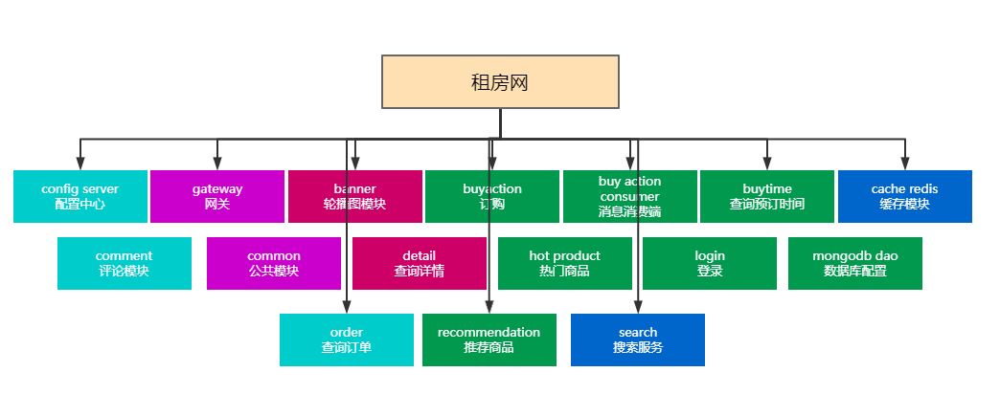

| 模块名称                               | 模块功能                 |
| -------------------------------------- | ------------------------ |
| livegoods                              | 父工程                   |
| --livegoods_config_server              | 公共配置管理中心         |
| --livegoods_gateway                    | 网关，负责服务路由转发   |
| --livegoods_banner                     | 轮播图展示               |
| --livegoods_buyaction                  | 预订商品并发送消息       |
| --livegoods_buyaction_message_consumer | 预订后更新商品并消费消息 |
| --livegoods_buytime                    | 查询商品预订时间         |
| --livegoods_cache_redis                | redis配置模块            |
| --livegoods_comment                    | 新增或查询商品评论       |
| --livegoods_common                     | 公共模块                 |
| --livegoods_detail                     | 查询商品详情             |
| --livegoods_hot_product                | 查询热销商品             |
| --livegoods_login                      | 登录模块                 |
| --livegoods_mongodb_dao                | mongodb连接配置          |
| --livegoods_order                      | 查询用户订单             |
| --livegoods_recommendation             | 获取推荐商品             |
| --livegoods_search                     | 搜索商品模块             |

功能展示

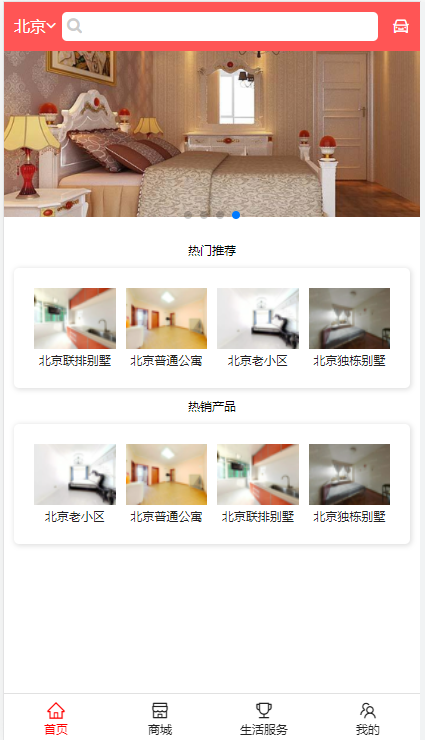


#### 项目总体架构

整个项目使用微服务架构，并使用 Spring Cloud 2021版作为微服务架构总体实现技术。拆分颗粒度为接口，每个接口对应一个功能。使用 Eureka 作为注册中心，使用 Gateway 作为网关，使用 Config 作为分布式配置中心，使用 OpenFeign 进行远程调用，使用resillience4j 进行服务熔断，使用 Elasticsearch 提升搜索效率，缓存工具使用 Redis，缓存技术使用 Spring Cache，数据库使用 MongoDB，数据访问技术使用 Spring Data，图片上传下载使用 FastDFS。MongoDB 身为 NoSQL 数据库，又带有索引，本身读取性能就很高，此处可以使用 redis 作为缓存工具，也可以直接从 MongoDB 中取数据。在本次项目中使用 redis 作为缓存工具，SpringCache 作为缓存技术。

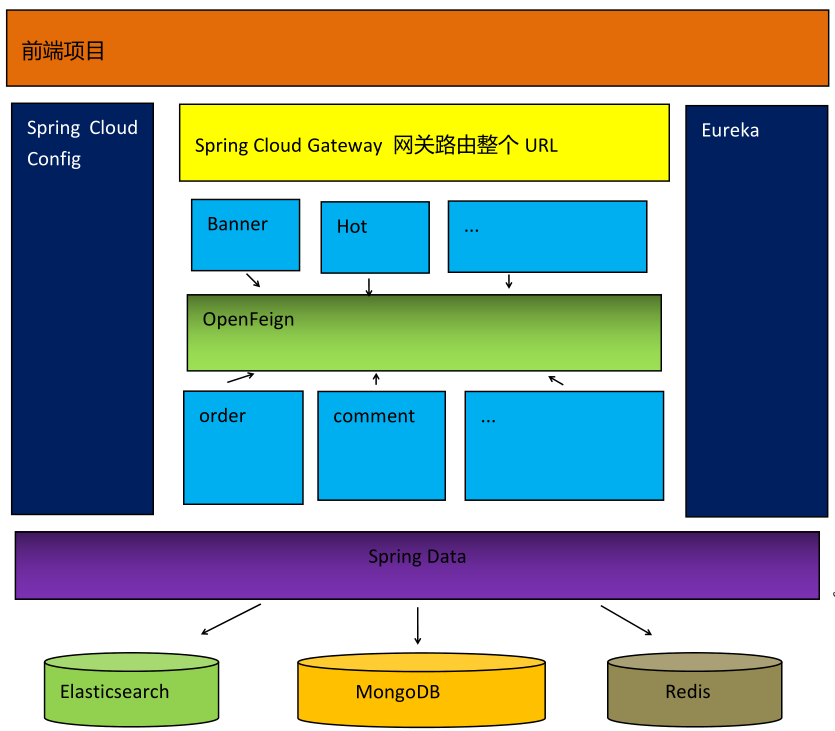


#### 前端工程说明

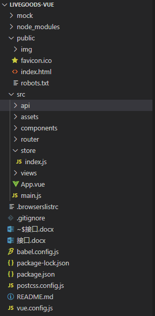

mock：模拟数据

public：图片和公共文件

src：代码文件夹

  --api：后台请求接口

  --assets：项目资源

  --components：组件

  --router：自定义路由

  --store：vuex 全局变量

  --views：项目页面

  --App.vue：项目主页面

  --main.js：项目入口

启动前端项目

首先安装nodeJs环境

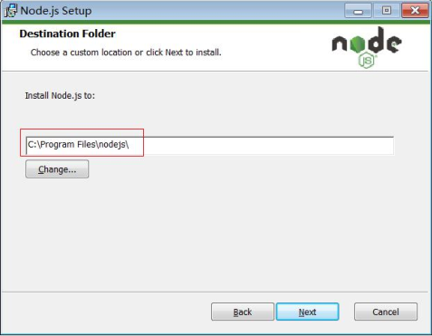

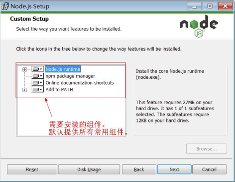


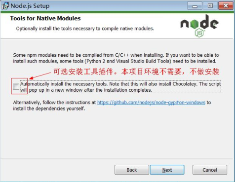

安装淘宝镜像：

```shell
npm install -g cnpm --registry=https://registry.npm.taobao.org
```

普通安装

```shell
npm install -g concurrently
```

本系统中的前端工程，提供的是一个压缩包。livegoods-vue.rar。vueJS 开发的前端应用，
安装部署非常方便。使用 NodeJS 提供的命令即可实现。

启动前端工程

进入前端工程所在目录，打开powershell窗口，运行以下命令启动前端项目

```shell
npm run serve
```

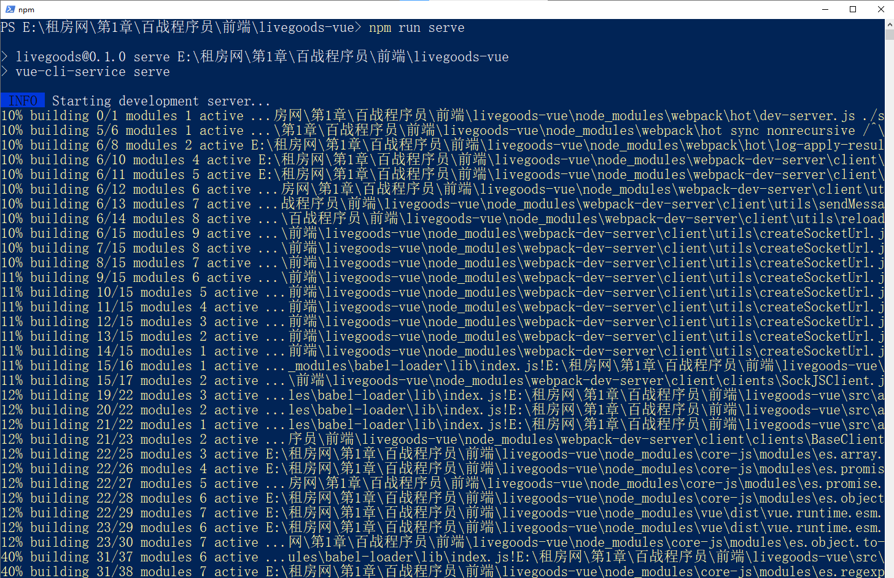

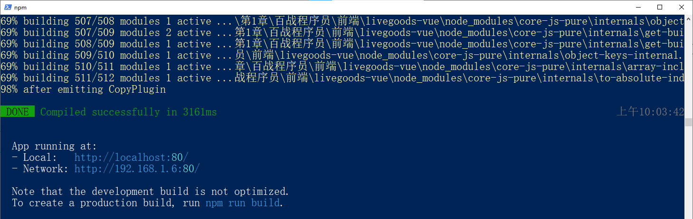


### 项目环境搭建

#### docker安装

硬件条件

| 序号 | 硬件 | 要求    |
| ---- | ---- | ------- |
| 1    | CPU  | 推荐2核 |
| 2    | 内存 | 至少2G  |
| 3    | 硬盘 | 至少20G |

编辑配置文件

```shell
vi /etc/docker/daemon.json
```

拷贝下面的内容/etc/docker/daemon.json 中

```shell
{ "registry-mirrors":
["https://32xw0apq.mirror.aliyuncs.com"] }
systemctl daemon-reload
systemctl restart docker

#我自己的 249@qq的支付宝创建的 
sudo mkdir -p /etc/docker
sudo tee /etc/docker/daemon.json <<-'EOF'
{
  "registry-mirrors": ["https://pi2gvbvl.mirror.aliyuncs.com"]
}
EOF
sudo systemctl daemon-reload
sudo systemctl restart docker
```

>
>
>上方参考docker安装csdn文本在阿里云账号里设置镜像加速器

```shell
yum -y install docker 安装
systemctl start docker 启动
systemctl restart docker 重启
systemctl stop docker 停止
systemctl enable docker 开机自启
```

前方有坑---------如果你在 docker 运行期间操作了防火墙[启动或关闭]必须重启docker

```shell
docker systemctl restart docker
```


#### JDK安装

> Xshell复制 scp

安装JDK11，如果是tar.gz文件，则执行解压缩命令

```shell
tar -zxvf jdk-11.0.11_linux-x64_bin.tar.gz
```

解压缩后，默认安装在当前目录下，在/etc/profile文件末尾增加以下2行

```shell
export JAVA_HOME=/usr/local/jdk-11.0.11/
export PATH=$PATH:$JAVA_HOME/bin

执行让其生效 
source /ect/profile
```

输入命令检查安装是否完成，如果出现下面的文字则安装成功

```shell
[root@192 etc]# java -version
java version "11.0.11" 2021-04-20 LTS
Java(TM) SE Runtime Environment 18.9 (build 11.0.11+9-LTS-194)
Java HotSpot(TM) 64-Bit Server VM 18.9 (build 11.0.11+9-LTS-194, mixed mode)
```


#### redis安装

使用docker安装redis，执行以下命令

```shell
docker run -d --name redis -p 6390:6379 redis --requirepass
"123456"
```

查看是否安装成功

```shell
docker ps -a|grep redis
5f98f7914cd redis "docker-entrypoint..."   4 months ago Up 2 hours 0.0.0.0:6390->6379/tcp
```

可以通过以下进入docker

```bash
docker exec -it [容器id] bash 
进入后

[root@localhost docker]# docker exec -it 021e bash
root@021e2ca358ef:/data# redis-cli -h localhost -p 6379
localhost:6379> AUTH ZHUOHAN2022
OK
localhost:6379> keys *
(empty array)
localhost:6379> 
```


#### fastdfs安装

使用docker安装fastdfs，下载fastdfs镜像

```shell
docker pull registry.cn-beijing.aliyuncs.com/tianzuo/fastdfs
```

启动镜像

```shell
#注意 -e IP=  参数的ip地址为本机ip

docker run -d --restart=always --privileged=true --net=host --name=fastdfs -e IP=192.168.66.123 -e WEB_PORT=8888 -v ${HOME}/fastdfs:/var/local/fdfs registry.cn-beijing.aliyuncs.com/tianzuo/fastdfs
```

查看镜像

```shell
175282b0e781 registry.cn-beijing.aliyuncs.com/tianzuo/fastdfs   "/bin/bash /start.sh"   4 months ago     Up 2 hours     fastdfs
```

测试上传，进入容器中修改client.conf文件，按照如下进行修改

```shell
vim /etc/fdfs/client.conf
#需要修改的内容如下
base_path=/home/fastdfs
#tracker服务器IP和端口
tracker_server=192.168.139.128:22122
```

保存后，测试上传

```shell
#查找图片
bash-4.4# find / -name '*.jpg'
/etc/fdfs/anti-steal.jpg

cd /
#三个路径 一个测试上传程序  配置文件 上传文件
bash-4.4# ./fdfs_upload_file /etc/fdfs/client.conf /etc/fdfs/anti-steal.jpg 

#生成地址
group1/M00/00/00/wKhCe2OtTxSAXHioAABdreSfEnY165.jpg
#[ip地址+端口号/group地址]
2023/1/5重新上传
http://192.168.66.123:8888/group1/M00/00/00/wKhCe2O2cgKAdpE2AABdreSfEnY450.jpg
```

上传成功后，生成如下名称文件及目录

```shell
group1/M00/00/00/wKjTiF7h5EWASb5aAACGZa9JdFo611.png
```


#### mongoDB安装

访问hub.docker.com，搜索mongo镜像

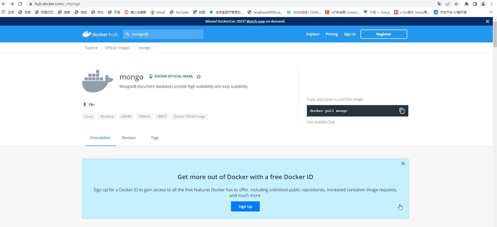

查看可用的镜像

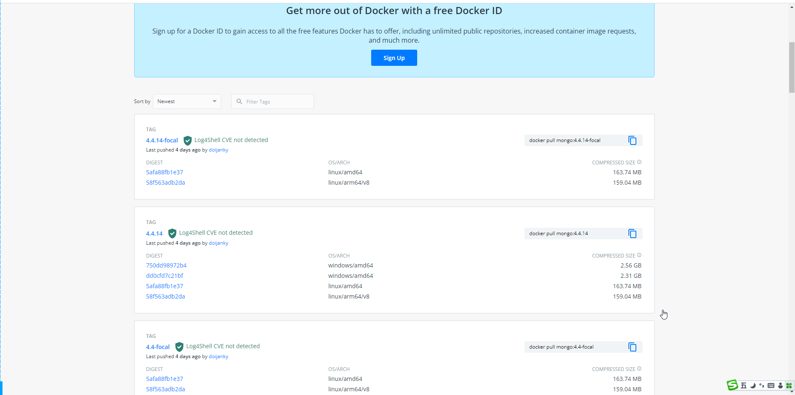

执行以下命令获取你想要拉取的镜像

```shell
docker pull mongo:xxx
docker pull mongo:4.4.14-focal
```

使用以下命令来查看是否已下载了 mongo镜像

```shell
 docker images
```

安装完成后，我们可以使用以下命令来创建并运行 mongo 容器

```shell
docker run -itd --name mongo -p 27017:27017 mongo:4.4.14-focal --auth
```

进入容器中，启动mongo shell，创建mongoDB用户

```shell
[root@localhost ~]# docker exec -it mongo bash
#进入mongo终端
root@583ff6fc914b:/# mongo

```


mongodb设置管理用户和密码：

```shell
show dbs
```

进入admin数据库

```shell
use admin 
```

创建管理员账户

```shell
db.createUser({ user: "root", pwd: "root", roles: [{ role: "root", db: "admin" }] })
```

返回界面

```bash
> db.createUser({ user: "root", pwd: "root", roles: [{ role: "root", db: "admin" }] })
Successfully added user: {
	"user" : "root",
	"roles" : [
		{
			"role" : "root",
			"db" : "admin"
		}
	]
}
```


mongodb中的用户是基于身份role的，该管理员账户的 role是 root，即超级用户角色

验证用户添加是否成功

```shell
db.auth("root", "root"); 
```

如果返回1，则表示成功。


#### RabbitMQ安装

下载RabbitMQ镜像

```shell
docker pull rabbitmq:3.8.32-management-alpine
```

创建并运行 RabbitMQ容器

```shell
docker run -d -p 15672:15672 -p 5672:5672 \
	-e RABBITMQ_DEFAULT_USER=admin \
	-e RABBITMQ_DEFAULT_PASS=admin \
	--name rabbitmq \
	rabbitmq:3.8.32-management-alpine
```

参数说明：

-d：表示在后台运行容器；
-p：将容器的端口 5672（应用访问端口）和 15672 （控制台Web端口号）映射到主机中；
-e：指定环境变量：
RABBITMQ_DEFAULT_USER：默认的用户名；
RABBITMQ_DEFAULT_PASS：默认的用户密码；
--name rabbitmq：设置容器名称；
rabbitmq：容器使用的镜像名称；

设置 docker启动的时候自动启动

```shell
docker update rabbitmq --restart=always
```

启动rabbitmq_management（当前容器自带管理端 ，所以不需要操作）

```bash
docker exec -it rabbitmq /bin/bash
user@[id] /: rabbitmq-plugins enable rabbitmq-management
```


#### elasticSearch安装

下载elasticSearch安装包，elasticsearch-7.13.1-linux-x86_64.tar.gz

```shell
tar -zxvf elasticsearch-7.13.1-linux-x86_64.tar.gz
```

安装分词包，elasticsearch-analysis-ik-7.13.zip，进入elasticSearch安装目录下的plugins目录，创建analysis-ik文件夹，解压到该目录下

```shell
[estest@192 plugins]$ ls
analysis-ik
```

解压ik分词器到elasticsearch的plugins目录下

```bash
unzip elasticsearch-analysis-ik-7.13.zip -d /usr/local/elasticsearch1/plugins/analysis-ik
```

添加estest用户，elasticsearch默认不能用root用户启动，需要为其创建新用户

```shell
useradd estest
passwd estest
```

改变对elasticsearch目录的拥有者账号

```
chown -R estest /usr/local/elasticsearch-7.13.1
```

修改/etc/sysctl.conf，在文件末尾添加

```shell
vm.max_map_count=655360
```

执行sysctl -p 使其生效

修改/etc/security/limits.conf，在末尾添加

```
*  soft nofile 65536
*  hard nofile 65536
*  soft nproc  4096
*  hard nproc  4096
```

修改elasticsearch下config目录中的elasticsearch.yml文件

```
node.name: node-1
network.host: 0.0.0.0
http.port: 9200
cluster.initial_master_nodes: ["node-1"]
```

切换到estest账号

```
su estest
```

启动elasticsearch，执行bin目录下的elasticsearch命令

```shell
[estest@192 bin]$ ./elasticsearch 
```

启动成功后，在浏览器中输入ip:9200，如果出现以下文字则安装成功

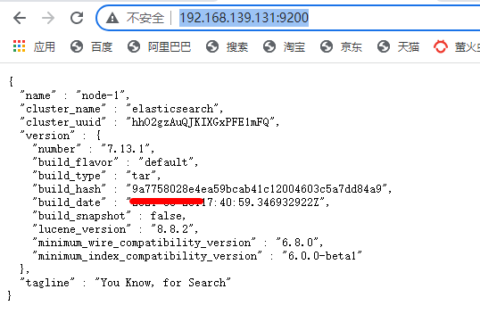


### 项目架构搭建

#### 前期准备

##### 上传图片

在fastdfs中上传图片，用于页面展示

执行以下命令进入fastdfs镜像，修改相关配置文件

```shell
docker exec -it 容器id bash
```

进入/etc/fdfs目录，修改client.conf中的tracker_server地址

```shell
# tracker_server can ocur more than once, and tracker_server format is 
#  "host:port", host can be hostname or ip address
tracker_server=192.168.139.132:22122
```

把图片文件拷贝到fdfs容器中

```
docker cp 目录名称 容器id:/usr/local
```

执行上传命令，上传6张图片，记下上传后生成的图片路径

```
group1/M00/00/00/wKhCe2OukS-AFbIYABLGy4zg5nA343.png
group1/M00/00/00/wKhCe2OukUOADkdWAAjIobLVxBY174.png
group1/M00/00/00/wKhCe2OukVeAatDIAAro9yfjOVw311.png
group1/M00/00/00/wKhCe2OukWWAPeFcAAuC467ZRns114.png
group1/M00/00/00/wKhCe2OukXCALP_XABS0Lvm4RSc134.png
group1/M00/00/00/wKhCe2OukXmAe9LtABHVENCjbfU144.png、

2023/1/5
bash-4.4# ./fdfs_upload_file /etc/fdfs/client.conf /usr/local/zufangwangImgs/1.png 
bash: ./fdfs_upload_file: No such file or directory
bash-4.4# cd /usr/bin/
group1/M00/00/00/wKhCe2O2c3CAd0KQABLGy4zg5nA691.png
group1/M00/00/00/wKhCe2O2c4iAJ-CbAAjIobLVxBY481.png
group1/M00/00/00/wKhCe2O2c42AMvi0AAro9yfjOVw012.png
group1/M00/00/00/wKhCe2O2c5CAHJyUAAuC467ZRns574.png
group1/M00/00/00/wKhCe2O2c5OAM8YsABS0Lvm4RSc384.png
group1/M00/00/00/wKhCe2O2c5aAJcnRABHVENCjbfU108.png
微信图片_0331105538.jpg 微信图片_0331111339.jpg 微信图片_03311055381.jpg 微信图片_03311055382.jpg  微信图片_03311055383.jpg 微信图片_03311055384.jpg 微信图片_03311055385.jpg 微信图片_03311055386.jpg 微信图片_03311113391.jpg 微信图片_03311113392.jpg 微信图片0331105450.jpg 
group1/M00/00/00/wKhCe2O2c-qAA3mXAAHhnl0byuU711.jpg
group1/M00/00/00/wKhCe2O2c_SAAwxFAAHi9pWaKhE961.jpg
group1/M00/00/00/wKhCe2O2c_-ALwbFAAKGJ3D_v1k562.jpg
group1/M00/00/00/wKhCe2O2dAuARDj5AAJI_3pe_30979.jpg
group1/M00/00/00/wKhCe2O2dBWALmC2AAJ6zxOohkc289.jpg
group1/M00/00/00/wKhCe2O2dB6AXMyrAAI1pI2ohVU034.jpg
group1/M00/00/00/wKhCe2O2dCeAYRFtAAHRIjaxOGM613.jpg
group1/M00/00/00/wKhCe2O2dC-AG1crAAIJt8EuM8M962.jpg
group1/M00/00/00/wKhCe2O2dDiACuNZAAG4U6ny2vQ219.jpg
group1/M00/00/00/wKhCe2O2dEGALW_lAAEefOtgMqQ850.jpg
group1/M00/00/00/wKhCe2O2dEuAZ0hNAAHiL9U5wu0807.jpg
```

```shell

cd /usr/bin/


bash-4.4# ./fdfs_upload_file /etc/fdfs/client.conf /usr/local/1.jpg
bash-4.4# ./fdfs_upload_file /etc/fdfs/client.conf /usr/local/2.jpg
bash-4.4# ./fdfs_upload_file /etc/fdfs/client.conf /usr/local/3.jpg
bash-4.4# ./fdfs_upload_file /etc/fdfs/client.conf /usr/local/4.jpg
bash-4.4# ./fdfs_upload_file /etc/fdfs/client.conf /usr/local/5.jpg
bash-4.4# ./fdfs_upload_file /etc/fdfs/client.conf /usr/local/6.jpg
```


##### 录入数据

在 MongoDB **创建 livegoods 的数据库**，**创建 banner 的集合**，并录入 6条数据。数据中目前只需要包含图片路径即可。图片名称从fastdfs 中进行复制（要保证路径在浏览器地址栏能正常访问,在录入到 mongodb 之前一定要去浏览器中测试所有路径）。ip 及端口可以通过软编码进行设置，开发环境和上线环境可能不一致。

使用以下命令在banner集合中插入数据

```sql
use renthouse
db.banner.insert({"url":"/group1/M00/00/00/wKhCe2O2c3CAd0KQABLGy4zg5nA691.png","createTime":new Date()})
db.banner.insert({"url":"/group1/M00/00/00/wKhCe2O2c4iAJ-CbAAjIobLVxBY481.png","createTime":new Date()})
db.banner.insert({"url":"/group1/M00/00/00/wKhCe2O2c42AMvi0AAro9yfjOVw012.png","createTime":new Date()})
db.banner.insert({"url":"/group1/M00/00/00/wKhCe2O2c5CAHJyUAAuC467ZRns574.png","createTime":new Date()})
db.banner.insert({"url":"/group1/M00/00/00/wKhCe2O2c5OAM8YsABS0Lvm4RSc384.png","createTime":new Date()})
db.banner.insert({"url":"/group1/M00/00/00/wKhCe2O2c5aAJcnRABHVENCjbfU108.png","createTime":new Date()})
```

录入后的banner集合

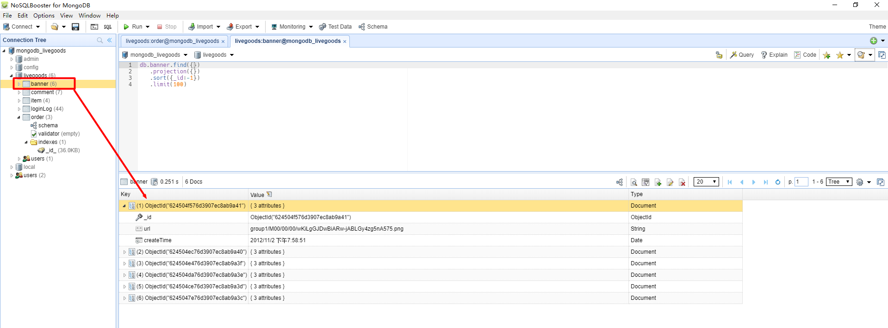


#### 模块创建

##### livegoods父工程

父工程命名为livegoods，pom.xml内容为：

```xml
<?xml version="1.0" encoding="UTF-8"?>
<project xmlns="http://maven.apache.org/POM/4.0.0"
         xmlns:xsi="http://www.w3.org/2001/XMLSchema-instance"
         xsi:schemaLocation="http://maven.apache.org/POM/4.0.0 http://maven.apache.org/xsd/maven-4.0.0.xsd">
    <modelVersion>4.0.0</modelVersion>

    <groupId>com.bjsxt</groupId>
    <artifactId>livegoods</artifactId>
    <packaging>pom</packaging>
    <version>1.0-SNAPSHOT</version>
    <modules>
        <module>livegoods_pojo</module>
        <module>livegoods_mongodb_dao</module>
        <module>livegoods_eureka</module>
        <module>livegoods_banner</module>
        <module>livegoods_commons</module>
        <module>livegoods_gateway</module>
        <module>livegoods_hot_product</module>
        <module>livegoods_recommendation</module>
        <module>livegoods_search</module>
        <module>livegoods_details</module>
        <module>livegoods_cache_redis</module>
        <module>livegoods_comment</module>
        <module>livegoods_buytime</module>
        <module>livegoods_login</module>
        <module>livegoods_rabbit_publisher</module>
        <module>livegoods_buyaction</module>
        <module>livegoods_buyaction_message_consumer</module>
        <module>livegoods_order</module>
        <module>livegoods_config_server</module>
    </modules>
    <properties>
        <spring-boot-version>2.6.3</spring-boot-version>
        <cloud-version>2021.0.0</cloud-version>
        <lcn-version>5.0.0</lcn-version>
        <fastdfs-version>1.27</fastdfs-version>
        <commons-lang-version>3.4</commons-lang-version>
        <lombok-version>1.18.2</lombok-version>
        <config-client-version>2.2.8.RELEASE</config-client-version>
    </properties>
    <dependencyManagement>
        <dependencies>
            <dependency>
                <groupId>org.springframework.boot</groupId>
                <artifactId>spring-boot-dependencies</artifactId>
                <version>${spring-boot-version}</version>
                <type>pom</type>
                <scope>import</scope>
            </dependency>
            <dependency>
                <groupId>org.springframework.cloud</groupId>
                <artifactId>spring-cloud-dependencies</artifactId>
                <version>${cloud-version}</version>
                <type>pom</type>
                <scope>import</scope>
            </dependency>
            <dependency>
                <groupId>org.projectlombok</groupId>
                <artifactId>lombok</artifactId>
                <version>${lombok-version}</version>
            </dependency>
            <!-- fastdfs -->
            <dependency>
                <groupId>cn.bestwu</groupId>
                <artifactId>fastdfs-client-java</artifactId>
                <version>${fastdfs-version}</version>
            </dependency>
            <dependency>
                <groupId>org.apache.commons</groupId>
                <artifactId>commons-lang3</artifactId>
                <version>${commons-lang-version}</version>
            </dependency>
        </dependencies>
    </dependencyManagement>
    <build>
        <pluginManagement>
            <plugins>
                <plugin>
                    <groupId>org.springframework.boot</groupId>
                    <artifactId>spring-boot-maven-plugin</artifactId>
                    <executions>
                        <execution>
                            <id>repackage</id>
                            <goals>
                                <goal>repackage</goal>
                            </goals>
                        </execution>
                    </executions>
                </plugin>
                <plugin>
                    <groupId>com.spotify</groupId>
                    <artifactId>docker-maven-plugin</artifactId>
                    <version>1.0.0</version>
                </plugin>
                <plugin>
                    <groupId>org.apache.maven.plugins</groupId>
                    <artifactId>maven-compiler-plugin</artifactId>
                    <version>3.8.1</version>
                    <configuration>
                        <target>11</target>
                        <source>11</source>
                    </configuration>
                </plugin>
            </plugins>
        </pluginManagement>
    </build>
</project>
```


##### livegoods-eureka模块

配置文件application.yml内容

> 修改应用名字

```yaml
server:
  port: 8761
spring:
  application:
    name: livegoods-eureka-server
eureka:
  client:
    fetch-registry: false
    register-with-eureka: false
```

pom.xml

> **记得**
>
> **修改镜像名字 不能使用驼峰命名 需要全小写**
>
> **修改ip配置**

```xml
<?xml version="1.0" encoding="UTF-8"?>
<project xmlns="http://maven.apache.org/POM/4.0.0"
         xmlns:xsi="http://www.w3.org/2001/XMLSchema-instance"
         xsi:schemaLocation="http://maven.apache.org/POM/4.0.0 http://maven.apache.org/xsd/maven-4.0.0.xsd">
    <parent>
        <artifactId>livegoods</artifactId>
        <groupId>com.bjsxt</groupId>
        <version>1.0-SNAPSHOT</version>
    </parent>
    <modelVersion>4.0.0</modelVersion>
    <artifactId>livegoods_eureka</artifactId>
    <version>1.0-SNAPSHOT</version>
    <dependencies>
        <dependency>
            <groupId>org.springframework.cloud</groupId>
            <artifactId>spring-cloud-starter-netflix-eureka-server</artifactId>
        </dependency>
    </dependencies>
    <build>
        <plugins>
            <plugin>
                <groupId>org.springframework.boot</groupId>
                <artifactId>spring-boot-maven-plugin</artifactId>
                <version>2.5.6</version>
            </plugin>
            <plugin>
                <groupId>com.spotify</groupId>
                <artifactId>docker-maven-plugin</artifactId>
                <configuration>                    <imageName>livegoods/eurekaserver:1.0</imageName>
                    <baseImage>openjdk:11</baseImage>                    <dockerHost>http://192.168.139.128:2375</dockerHost>
                    <entryPoint>["java", "-jar", "/${project.build.finalName}.jar"]</entryPoint>
                    <exposes>
                        <expose>8761</expose>
                    </exposes>
                    <resources>
                        <resources>
                            <targetPath>/</targetPath>
 <directory>${project.build.directory}</directory>
 <include>${project.build.finalName}.jar</include>
                        </resources>
                    </resources>
                </configuration>
            </plugin>
        </plugins>
    </build>
</project>
```

启动类EurekaServerApp

```java
@SpringBootApplication
@EnableEurekaServer
public class EurekaServerApp {
    public static void main(String[] args) {
        SpringApplication.run(EurekaServerApp.class, args);
    }
}
```

可以单独启动作为服务注册中心，也可以执行maven打包命令，生成livegoods-eureaka.jar

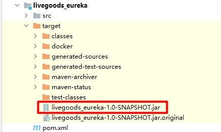

修改/usr/lib/systemd/system/docker.service文件，打开2375端口

```shell
ExecStart=/usr/bin/dockerd -H tcp://0.0.0.0:2375 -H unix://var/run/docker.sock \
```

重新载入服务

```shell
systemctl daemon-reload
```

重启docker

```shell
systemctl restart docker.service
```

然后执行docker build命令，生成livegoods/eurekaserver:1.0镜像文件

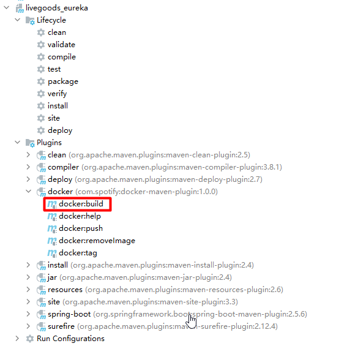

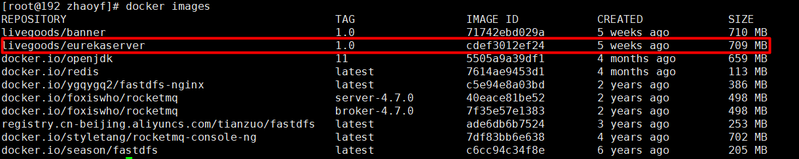

再执行下面的命令启动eureka服务，把 服务虚拟化。

>  **运行镜像时必须带 tag**

```shell
docker run -p 8761:8761 --name eureka -d livegoods/eurekaserver:1.0
```


##### livegoods-banner模块

该模块主要用于展示首页上的轮播图片

模块pom.xml文件

```xml
<?xml version="1.0" encoding="UTF-8"?>
<project xmlns="http://maven.apache.org/POM/4.0.0"
         xmlns:xsi="http://www.w3.org/2001/XMLSchema-instance"
         xsi:schemaLocation="http://maven.apache.org/POM/4.0.0 http://maven.apache.org/xsd/maven-4.0.0.xsd">
    <parent>
        <artifactId>livegoods</artifactId>
        <groupId>com.bjsxt</groupId>
        <version>1.0-SNAPSHOT</version>
    </parent>
    <modelVersion>4.0.0</modelVersion>

    <artifactId>livegoods_banner</artifactId>
    <version>1.0-SNAPSHOT</version>

    <dependencies>
        <dependency>
            <groupId>org.springframework.boot</groupId>
            <artifactId>spring-boot-starter-web</artifactId>
        </dependency>
        <dependency>
            <groupId>org.springframework.cloud</groupId>
            <artifactId>spring-cloud-starter-netflix-eureka-client</artifactId>
        </dependency>
        <!--配置中心客户端-->
        <dependency>
            <groupId>org.springframework.cloud</groupId>
            <artifactId>spring-cloud-config-client</artifactId>
        </dependency>
        <dependency>
            <groupId>org.springframework.boot</groupId>
           <artifactId>spring-boot-starter-actuator</artifactId>
        </dependency>
        <!--默认加载bootstrap-->
        <dependency>
            <groupId>org.springframework.cloud</groupId>
         <artifactId>spring-cloud-starter-bootstrap</artifactId>
        </dependency>
    </dependencies>

    <build>
        <plugins>
            <plugin>
                <groupId>org.springframework.boot</groupId>
               <artifactId>spring-boot-maven-plugin</artifactId>
            </plugin>
            <plugin>
                <groupId>com.spotify</groupId>
                <artifactId>docker-maven-plugin</artifactId>
                <configuration>
                    <imageName>livegoods/banner:1.0</imageName>
                    <baseImage>openjdk:11</baseImage>
                <dockerHost>http://192.168.139.128:2375</dockerHost>
                    <entryPoint>["java", "-jar", "/${project.build.finalName}.jar"]</entryPoint>
                    <exposes>
                        <expose>9000</expose>
                    </exposes>
                    <resources>
                        <resources>
                            <targetPath>/</targetPath>                         <directory>${project.build.directory}</directory>
                                              <include>${project.build.finalName}.jar</include>
                        </resources>
                    </resources>
                </configuration>
            </plugin>
            <plugin>
                <groupId>org.apache.maven.plugins</groupId>
                <artifactId>maven-compiler-plugin</artifactId>
                <version>3.8.1</version>
                <configuration>
                    <target>11</target>
                    <source>11</source>
                </configuration>
            </plugin>
        </plugins>
    </build>
</project>
```

配置文件bootstrap.yml

```yaml
server:
  port: 9000
spring:
  application:
    name: livegoods-banner
  profiles:
    active: mongodb  #bannerNginx,此处添加rabbit配置，目的是自动刷新configServer的配置
  cloud:
    config:
      uri: http://localhost:9010
      label: master
      name: renthouse
      profile: dev
#暴露健康检查端口
management:
  endpoints:
    web:
      exposure:
        include: refresh
```


##### livegoods-config-server模块

配置中心模块，负责管理公共配置文件，pom.xml文件如下

```xml
<?xml version="1.0" encoding="UTF-8"?>
<project xmlns="http://maven.apache.org/POM/4.0.0"
         xmlns:xsi="http://www.w3.org/2001/XMLSchema-instance"
         xsi:schemaLocation="http://maven.apache.org/POM/4.0.0 http://maven.apache.org/xsd/maven-4.0.0.xsd">
    <parent>
        <artifactId>livegoods</artifactId>
        <groupId>com.bjsxt</groupId>
        <version>1.0-SNAPSHOT</version>
    </parent>
    <modelVersion>4.0.0</modelVersion>

    <artifactId>livegoods_config_server</artifactId>
    <dependencies>
        <!--配置中心服务端-->
        <dependency>
            <groupId>org.springframework.cloud</groupId>
            <artifactId>spring-cloud-config-server</artifactId>
        </dependency>
        <!--eureka客户端-->
        <dependency>
            <groupId>org.springframework.cloud</groupId>
            <artifactId>spring-cloud-starter-netflix-eureka-client</artifactId>
        </dependency>
    </dependencies>
</project>
```

配置文件，application.yml

```yaml
server:
  port: 9010
spring:
  application:
    name: livegoods-configserver
  cloud:
    config:
      server:
        git:
          uri: https://gitee.com/zhaoyfi/xa-sxt.git
          search-paths:
            - livegoods
      label: master

eureka:
  client:
    service-url:
      defaultZone: http://192.168.139.132:8761/eureka/
  instance:
    prefer-ip-address: true
```

启动类

```java
@SpringBootApplication
@EnableConfigServer
public class ConfigApplication {

    public static void main(String[] args) {
        SpringApplication.run(ConfigApplication.class,args);
    }
}
```


##### livegoods-buyaction模块

预订商品模块，pom.xml文件内容如下

```xml
<?xml version="1.0" encoding="UTF-8"?>
<project xmlns="http://maven.apache.org/POM/4.0.0"
         xmlns:xsi="http://www.w3.org/2001/XMLSchema-instance"
         xsi:schemaLocation="http://maven.apache.org/POM/4.0.0 http://maven.apache.org/xsd/maven-4.0.0.xsd">
    <parent>
        <artifactId>livegoods</artifactId>
        <groupId>com.bjsxt</groupId>
        <version>1.0-SNAPSHOT</version>
    </parent>
    <modelVersion>4.0.0</modelVersion>

    <artifactId>livegoods_buyaction</artifactId>
    <version>1.0-SNAPSHOT</version>

    <dependencies>
        <dependency>
            <groupId>org.springframework.boot</groupId>
            <artifactId>spring-boot-starter-web</artifactId>
        </dependency>
        <dependency>
            <groupId>org.springframework.cloud</groupId>
            <artifactId>spring-cloud-starter-netflix-eureka-client</artifactId>
        </dependency>
        <!--配置中心客户端-->
        <dependency>
            <groupId>org.springframework.cloud</groupId>
            <artifactId>spring-cloud-config-client</artifactId>
        </dependency>
        <!--默认加载bootstrap-->
        <dependency>
            <groupId>org.springframework.cloud</groupId>
       <artifactId>spring-cloud-starter-bootstrap</artifactId>
        </dependency>
        <!--stream依赖(rabbit)-->
        <dependency>
            <groupId>org.springframework.cloud</groupId>
    <artifactId>spring-cloud-starter-stream-rabbit</artifactId>
        </dependency>
    </dependencies>
</project>
```

配置文件 bootstrap.yml

```yaml
server:
  port: 9008
spring:
  application:
    name: livegoods-buyaction
  profiles:
    active: buyQueue,itemCacheName,redis,rabbit
  cloud:
    config:
      uri: http://localhost:9010
      label: master
      name: livegoods
      profile: dev
```

启动类

```java
package com.renthouse.buyaction;

import org.springframework.boot.SpringApplication;
import org.springframework.boot.autoconfigure.SpringBootApplication;

@SpringBootApplication
public class BuyaciontApplication {
    public static void main(String[] args) {
        SpringApplication.run(BuyaciontApplication.class,args);
    }
}
```


##### livegoods-buyaction-message-consumer模块

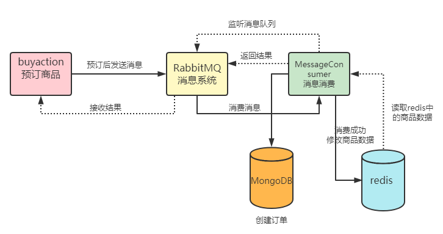

预订商品消息消费模块，pom.xml文件如下

```xml
<?xml version="1.0" encoding="UTF-8"?>
<project xmlns="http://maven.apache.org/POM/4.0.0"
         xmlns:xsi="http://www.w3.org/2001/XMLSchema-instance"
         xsi:schemaLocation="http://maven.apache.org/POM/4.0.0 http://maven.apache.org/xsd/maven-4.0.0.xsd">
    <parent>
        <artifactId>livegoods</artifactId>
        <groupId>com.bjsxt</groupId>
        <version>1.0-SNAPSHOT</version>
    </parent>
    <modelVersion>4.0.0</modelVersion>

   <artifactId>livegoods_buyaction_message_consumer</artifactId>
    <version>1.0-SNAPSHOT</version>
    <dependencies>
        <dependency>
            <groupId>com.bjsxt</groupId>
            <artifactId>livegoods_commons</artifactId>
            <version>1.0-SNAPSHOT</version>
        </dependency>
        <dependency>
            <groupId>com.bjsxt</groupId>
            <artifactId>livegoods_mongodb_dao</artifactId>
            <version>1.0-SNAPSHOT</version>
        </dependency>
        <dependency>
            <groupId>com.bjsxt</groupId>
            <artifactId>livegoods_cache_redis</artifactId>
            <version>1.0-SNAPSHOT</version>
        </dependency>
        <dependency>
            <groupId>org.springframework.cloud</groupId>
    <artifactId>spring-cloud-starter-stream-rabbit</artifactId>
        </dependency>
        <dependency>
            <groupId>com.fasterxml.jackson.core</groupId>
            <artifactId>jackson-databind</artifactId>
        </dependency>
        <!--配置中心客户端-->
        <dependency>
            <groupId>org.springframework.cloud</groupId>
            <artifactId>spring-cloud-config-client</artifactId>
        </dependency>
        <!--默认加载bootstrap-->
        <dependency>
         <groupId>org.springframework.cloud</groupId>
         <artifactId>spring-cloud-starter-bootstrap</artifactId>
        </dependency>
    </dependencies>
</project>
```

配置文件 bootstrap.yml

```yaml
spring:
  application:
    name: livegoods-message-consumer
  profiles:
    active: itemCacheName,buyQueue,mongodb,redis
  cloud:
    config:
      uri: http://localhost:9010
      label: master
      name: rabbit
      profile: dev
    stream:
      bindings:
        livegoodsMessenger-in-0:
          destination: livegoodsTopic # 对应的真实的 RabbitMQ Exchange
        livegoodsMessenger-out-0:
          destination: livegoodsTopic
      function:
        definition: livegoodsMessenger
```

启动类

```java
package com.livegoods.buyaction.message;

import org.springframework.boot.SpringApplication;
import org.springframework.boot.autoconfigure.SpringBootApplication;

@SpringBootApplication
public class MessageConsumerApplication {
    public static void main(String[] args) {
        SpringApplication.run(MessageConsumerApplication.class,args);
    }
}
```


##### livegoods-buytime模块

当用户点击房屋信息时，会发送请求，请求当前房屋开放时间，根据返回结果进行读秒，到达时间才能进行预订。


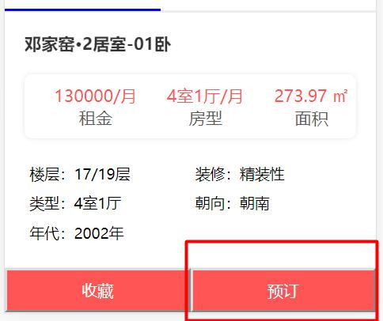

查询商品预订开始时间，pom.xml文件如下

```xml
<?xml version="1.0" encoding="UTF-8"?>
<project xmlns="http://maven.apache.org/POM/4.0.0"
         xmlns:xsi="http://www.w3.org/2001/XMLSchema-instance"
         xsi:schemaLocation="http://maven.apache.org/POM/4.0.0 http://maven.apache.org/xsd/maven-4.0.0.xsd">
    <parent>
        <artifactId>livegoods</artifactId>
        <groupId>com.bjsxt</groupId>
        <version>1.0-SNAPSHOT</version>
    </parent>
    <modelVersion>4.0.0</modelVersion>

    <artifactId>livegoods_buytime</artifactId>
    <version>1.0-SNAPSHOT</version>

    <dependencies>
        <dependency>
            <groupId>org.springframework.boot</groupId>
            <artifactId>spring-boot-starter-web</artifactId>
        </dependency>
        <dependency>
            <groupId>org.springframework.cloud</groupId>
			<artifactId>spring-cloud-starter-netflix-eureka-client</artifactId>
        </dependency>
        <!--配置中心客户端-->
        <dependency>
            <groupId>org.springframework.cloud</groupId>
            <artifactId>spring-cloud-config-client</artifactId>
        </dependency>
        <!--默认加载bootstrap-->
        <dependency>
            <groupId>org.springframework.cloud</groupId>
       <artifactId>spring-cloud-starter-bootstrap</artifactId>
        </dependency>
    </dependencies>
</project>
```

配置文件bootstrap.yml

```yaml
server:
  port: 9006
spring:
  application:
    name: livegoods-buytime
  profiles:
    active: mongodb
  cloud:
    config:
      uri: http://localhost:9010
      label: master
      name: livegoods
      profile: dev
```


##### livegoods-cache_redis模块

redis模板配置，pom.xml如下

```xml
<?xml version="1.0" encoding="UTF-8"?>
<project xmlns="http://maven.apache.org/POM/4.0.0"
         xmlns:xsi="http://www.w3.org/2001/XMLSchema-instance"
         xsi:schemaLocation="http://maven.apache.org/POM/4.0.0 http://maven.apache.org/xsd/maven-4.0.0.xsd">
    <parent>
        <artifactId>livegoods</artifactId>
        <groupId>com.bjsxt</groupId>
        <version>1.0-SNAPSHOT</version>
    </parent>
    <modelVersion>4.0.0</modelVersion>

    <artifactId>livegoods_cache_redis</artifactId>
    <version>1.0-SNAPSHOT</version>

    <dependencies>
        <dependency>
            <groupId>org.springframework.boot</groupId>
       <artifactId>spring-boot-starter-data-redis</artifactId>
        </dependency>
    </dependencies>
</project>
```

配置文件application-redis.yml如下

```yaml
spring:
  redis:
    host: 192.168.139.132
    port: 6390
    password: 123456
```


##### livegoods-comment模块

查询评论模块，pom.xml文件如下

```xml
<?xml version="1.0" encoding="UTF-8"?>
<project xmlns="http://maven.apache.org/POM/4.0.0"
         xmlns:xsi="http://www.w3.org/2001/XMLSchema-instance"
         xsi:schemaLocation="http://maven.apache.org/POM/4.0.0 http://maven.apache.org/xsd/maven-4.0.0.xsd">
    <parent>
        <artifactId>livegoods</artifactId>
        <groupId>com.bjsxt</groupId>
        <version>1.0-SNAPSHOT</version>
    </parent>
    <modelVersion>4.0.0</modelVersion>

    <artifactId>livegoods_comment</artifactId>
    <version>1.0-SNAPSHOT</version>

    <dependencies>
        <dependency>
            <groupId>org.springframework.boot</groupId>
            <artifactId>spring-boot-starter-web</artifactId>
        </dependency>
        <dependency>
            <groupId>org.springframework.cloud</groupId>
            <artifactId>spring-cloud-starter-netflix-eureka-client</artifactId>
        </dependency>
        <!--配置中心客户端-->
        <dependency>
            <groupId>org.springframework.cloud</groupId>
            <artifactId>spring-cloud-config-client</artifactId>
        </dependency>
        <!--默认加载bootstrap-->
        <dependency>
            <groupId>org.springframework.cloud</groupId>
         <artifactId>spring-cloud-starter-bootstrap</artifactId>
        </dependency>
    </dependencies>
</project>
```

配置文件bootstrap.yml

```yaml
server:
  port: 9005
spring:
  application:
    name: livegoods-comment
  profiles:
    active: mongodb
  cloud:
    config:
      uri: http://localhost:9010
      label: master
      name: livegoods
      profile: dev
```


##### livegoods-commons模块

公共模块，定义了一些公用类，pom.xml如下

```xml
<?xml version="1.0" encoding="UTF-8"?>
<project xmlns="http://maven.apache.org/POM/4.0.0"
         xmlns:xsi="http://www.w3.org/2001/XMLSchema-instance"
         xsi:schemaLocation="http://maven.apache.org/POM/4.0.0 http://maven.apache.org/xsd/maven-4.0.0.xsd">
    <parent>
        <artifactId>livegoods</artifactId>
        <groupId>com.bjsxt</groupId>
        <version>1.0-SNAPSHOT</version>
    </parent>
    <modelVersion>4.0.0</modelVersion>

    <artifactId>livegoods_commons</artifactId>
    <version>1.0-SNAPSHOT</version>

    <dependencies>
        <dependency>
            <groupId>org.projectlombok</groupId>
            <artifactId>lombok</artifactId>
        </dependency>
    </dependencies>

    <build>
        <plugins>
            <plugin>
                <groupId>org.apache.maven.plugins</groupId>
                <artifactId>maven-compiler-plugin</artifactId>
                <version>3.8.1</version>
                <configuration>
                    <target>11</target>
                    <source>11</source>
                </configuration>
            </plugin>
        </plugins>

    </build>
</project>
```

公用的配置文件，application-bannerNgix.yml

```yaml
livegoods:
  banner:
    nginx:
      prefix: http://192.168.139.132:8888/
```

application-itemCacheName.yml

```yaml
livegoods:
  cache:
    names:
      item:
        prefix: com:livegoods:details
        suffix: getDetails
```


##### livegoods-detail模块

查看商品详情，pom.xml文件如下

```xml
<?xml version="1.0" encoding="UTF-8"?>
<project xmlns="http://maven.apache.org/POM/4.0.0"
         xmlns:xsi="http://www.w3.org/2001/XMLSchema-instance"
         xsi:schemaLocation="http://maven.apache.org/POM/4.0.0 http://maven.apache.org/xsd/maven-4.0.0.xsd">
    <parent>
        <artifactId>livegoods</artifactId>
        <groupId>com.bjsxt</groupId>
        <version>1.0-SNAPSHOT</version>
    </parent>
    <modelVersion>4.0.0</modelVersion>

    <artifactId>livegoods_details</artifactId>
    <version>1.0-SNAPSHOT</version>

    <dependencies>
        <dependency>
            <groupId>org.springframework.boot</groupId>
            <artifactId>spring-boot-starter-web</artifactId>
        </dependency>
        <dependency>
            <groupId>org.springframework.cloud</groupId>
            <artifactId>spring-cloud-starter-netflix-eureka-client</artifactId>
        </dependency>
        <!--配置中心客户端-->
        <dependency>
            <groupId>org.springframework.cloud</groupId>
            <artifactId>spring-cloud-config-client</artifactId>
        </dependency>
        <!--默认加载bootstrap-->
        <dependency>
            <groupId>org.springframework.cloud</groupId>
            <artifactId>spring-cloud-starter-bootstrap</artifactId>
        </dependency>
        <!--openFeign-->
        <dependency>
            <groupId>org.springframework.cloud</groupId>
            <artifactId>spring-cloud-starter-openfeign</artifactId>
        </dependency>
        <!--断路器-->
        <dependency>
            <groupId>org.springframework.cloud</groupId>
 			<artifactId>spring-cloud-starter-circuitbreaker-resilience4j</artifactId>
        </dependency>
        <dependency>
            <groupId>com.bjsxt</groupId>
            <artifactId>livegoods_mongodb_dao</artifactId>
            <version>1.0-SNAPSHOT</version>
        </dependency>
        <dependency>
            <groupId>com.bjsxt</groupId>
            <artifactId>livegoods_commons</artifactId>
            <version>1.0-SNAPSHOT</version>
        </dependency>
        <dependency>
            <groupId>com.bjsxt</groupId>
            <artifactId>livegoods_cache_redis</artifactId>
            <version>1.0-SNAPSHOT</version>
        </dependency>
        <dependency>
            <groupId>org.springframework.boot</groupId>
            <artifactId>spring-boot-test</artifactId>
            <scope>test</scope>
        </dependency>
        <dependency>
            <groupId>junit</groupId>
            <artifactId>junit</artifactId>
            <scope>test</scope>
        </dependency>
        <dependency>
            <groupId>org.springframework</groupId>
            <artifactId>spring-test</artifactId>
            <scope>test</scope>
        </dependency>
    </dependencies>
</project>
```

配置文件，bootstrap.yml如下

```yaml
server:
  port: 9004
spring:
  application:
    name: livegoods-details
  profiles:
    active: mongodb,bannerNginx,redis
  cloud:
    config:
      uri: http://localhost:9010
      label: master
      name: livegoods
      profile: dev
```

启动类

```java
package com.renthouse.detail;


import org.springframework.boot.SpringApplication;
import org.springframework.boot.autoconfigure.SpringBootApplication;

@SpringBootApplication
public class DetailApplication {
    public static void main(String[] args) {
        SpringApplication.run(DetailApplication.class,args);
    }
}
```


##### livegoods-gateway网关模块

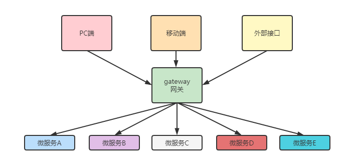

配置其它模块的访问路径，pom.xml文件如下

```xml
<?xml version="1.0" encoding="UTF-8"?>
<project xmlns="http://maven.apache.org/POM/4.0.0"
         xmlns:xsi="http://www.w3.org/2001/XMLSchema-instance"
         xsi:schemaLocation="http://maven.apache.org/POM/4.0.0 http://maven.apache.org/xsd/maven-4.0.0.xsd">
    <parent>
        <artifactId>livegoods</artifactId>
        <groupId>com.bjsxt</groupId>
        <version>1.0-SNAPSHOT</version>
    </parent>
    <modelVersion>4.0.0</modelVersion>

    <artifactId>livegoods_gateway</artifactId>
    <version>1.0-SNAPSHOT</version>

    <dependencies>
        <dependency>
            <groupId>org.springframework.cloud</groupId>
            <artifactId>spring-cloud-starter-netflix-eureka-client</artifactId>
        </dependency>
        <dependency>
            <groupId>org.springframework.cloud</groupId>
            <artifactId>spring-cloud-starter-gateway</artifactId>
        </dependency>
        <!--配置中心客户端-->
        <dependency>
            <groupId>org.springframework.cloud</groupId>
            <artifactId>spring-cloud-config-client</artifactId>
        </dependency>
        <!--默认加载bootstrap-->
        <dependency>
            <groupId>org.springframework.cloud</groupId>
            <artifactId>spring-cloud-starter-bootstrap</artifactId>
        </dependency>
    </dependencies>
    <build>
        <plugins>
            <plugin>
                <groupId>org.apache.maven.plugins</groupId>
                <artifactId>maven-compiler-plugin</artifactId>
                <version>3.8.1</version>
                <configuration>
                    <target>11</target>
                    <source>11</source>
                </configuration>
            </plugin>
        </plugins>
    </build>
</project>
```

配置文件bootstrap.yml如下

```yaml
server:
  port: 4006
spring:
  application:
    name: livegoods-gateway
  cloud:
    gateway:
      discovery:
        locator:
          enabled: false 	#不开启服务注册和发现的功能
          lower-case-service-id: true #请求路径上的服务名称转换为小写
      #断言如果断言为true则匹配该路由
      routes:
        - id: banner
          uri: lb://livegoods-banner
          predicates:
            - Path=/banner
    config:
      uri: http://localhost:9010
      label: master
      name: livegoods
      profile: dev
```


##### livegoods-hot_product模块

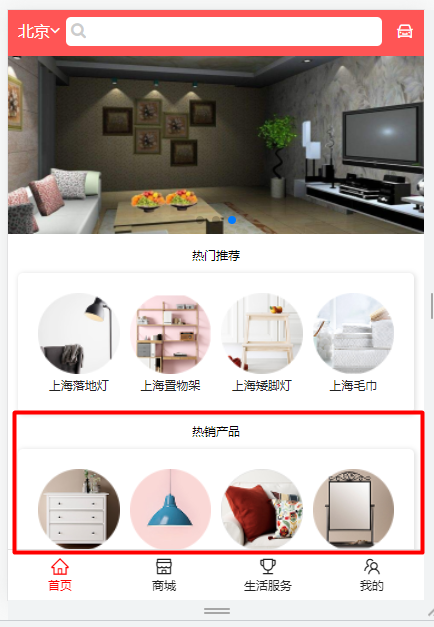

查询热销商品，pom.xml文件如下

```xml
<?xml version="1.0" encoding="UTF-8"?>
<project xmlns="http://maven.apache.org/POM/4.0.0"
         xmlns:xsi="http://www.w3.org/2001/XMLSchema-instance"
         xsi:schemaLocation="http://maven.apache.org/POM/4.0.0 http://maven.apache.org/xsd/maven-4.0.0.xsd">
    <parent>
        <artifactId>livegoods</artifactId>
        <groupId>com.bjsxt</groupId>
        <version>1.0-SNAPSHOT</version>
    </parent>
    <modelVersion>4.0.0</modelVersion>

    <artifactId>livegoods_hot_product</artifactId>
    <version>1.0-SNAPSHOT</version>

    <dependencies>
        <dependency>
            <groupId>org.springframework.boot</groupId>
            <artifactId>spring-boot-starter-web</artifactId>
        </dependency>
        <dependency>
            <groupId>org.springframework.cloud</groupId>
            <artifactId>spring-cloud-starter-netflix-eureka-client</artifactId>
        </dependency>
        <!--配置中心客户端-->
        <dependency>
            <groupId>org.springframework.cloud</groupId>
            <artifactId>spring-cloud-config-client</artifactId>
        </dependency>
        <!--默认加载bootstrap-->
        <dependency>
            <groupId>org.springframework.cloud</groupId>
       <artifactId>spring-cloud-starter-bootstrap</artifactId>
        </dependency>
    </dependencies>

    <build>
        <plugins>
            <plugin>
                <groupId>org.apache.maven.plugins</groupId>
                <artifactId>maven-compiler-plugin</artifactId>
                <version>3.8.1</version>
                <configuration>
                    <target>11</target>
                    <source>11</source>
                </configuration>
            </plugin>
        </plugins>
    </build>
</project>
```

配置文件bootstrap.yml如下

```yaml
server:
  port: 9001
spring:
  application:
    name: renthouse-hot-product
  profiles:
    active: mongodb,bannerNginx
  cloud:
    config:
      uri: http://localhost:9010
      label: master
      name: renthouse
      profile: dev
```

启动类

```java
package com.renthouse.hotproduct;

import org.springframework.boot.SpringApplication;
import org.springframework.boot.autoconfigure.SpringBootApplication;

@SpringBootApplication
public class HotProductApp {
    public static void main(String[] args) {
        SpringApplication.run(HotProductApp.class,args);
    }
}
```


##### livegoods-login模块

预订商品时登录，客户不需要注册，就可以登录系统，且不需要记住用户名和密码。手机号是用户名，发送的验证码就是登录密码。pom.xml文件如下

```xml
<?xml version="1.0" encoding="UTF-8"?>
<project xmlns="http://maven.apache.org/POM/4.0.0"
         xmlns:xsi="http://www.w3.org/2001/XMLSchema-instance"
         xsi:schemaLocation="http://maven.apache.org/POM/4.0.0 http://maven.apache.org/xsd/maven-4.0.0.xsd">
    <parent>
        <artifactId>livegoods</artifactId>
        <groupId>com.bjsxt</groupId>
        <version>1.0-SNAPSHOT</version>
    </parent>
    <modelVersion>4.0.0</modelVersion>

    <artifactId>livegoods_login</artifactId>
    <version>1.0-SNAPSHOT</version>

    <dependencies>
        <dependency>
            <groupId>org.springframework.boot</groupId>
            <artifactId>spring-boot-starter-web</artifactId>
        </dependency>
        <dependency>
            <groupId>org.springframework.cloud</groupId>
            <artifactId>spring-cloud-starter-netflix-eureka-client</artifactId>
        </dependency>
        <!--配置中心客户端-->
        <dependency>
            <groupId>org.springframework.cloud</groupId>
            <artifactId>spring-cloud-config-client</artifactId>
        </dependency>
        <!--默认加载bootstrap-->
        <dependency>
            <groupId>org.springframework.cloud</groupId>
            <artifactId>spring-cloud-starter-bootstrap</artifactId>
        </dependency>
    </dependencies>
</project>
```

配置文件bootstrap.yml如下

```yaml
server:
  port: 9007
spring:
  application:
    name: renthouse-login
  profiles:
    active: redis,mongodb
  cloud:
    config:
      uri: http://localhost:9010
      label: master
      name: renthouse
      profile: dev
```

启动类

```java
package com.renthouse.login;

import org.springframework.boot.SpringApplication;
import org.springframework.boot.autoconfigure.SpringBootApplication;

@SpringBootApplication
public class LoginApp {
    public static void main(String[] args) {
        SpringApplication.run(LoginApp.class,args);
    }
}
```


##### livegoods-mongodb_dao模块

mongodb连接配置，pom.xml如下

```xml
<?xml version="1.0" encoding="UTF-8"?>
<project xmlns="http://maven.apache.org/POM/4.0.0"
         xmlns:xsi="http://www.w3.org/2001/XMLSchema-instance"
         xsi:schemaLocation="http://maven.apache.org/POM/4.0.0 http://maven.apache.org/xsd/maven-4.0.0.xsd">
    <parent>
        <artifactId>livegoods</artifactId>
        <groupId>com.bjsxt</groupId>
        <version>1.0-SNAPSHOT</version>
    </parent>
    <modelVersion>4.0.0</modelVersion>

    <artifactId>livegoods_mongodb_dao</artifactId>
    <version>1.0-SNAPSHOT</version>

    <dependencies>
        <dependency>
            <groupId>org.springframework.boot</groupId>
            <artifactId>spring-boot-starter-data-mongodb</artifactId>
        </dependency>
        <dependency>
            <groupId>org.springframework.boot</groupId>
            <artifactId>spring-boot-starter-test</artifactId>
            <scope>test</scope>
        </dependency>
        <dependency>
            <groupId>org.testng</groupId>
            <artifactId>testng</artifactId>
            <version>RELEASE</version>
            <scope>test</scope>
        </dependency>
    </dependencies>
</project>
```

配置文件application-mongodb.yml如下

```yaml
spring:
  data:
    mongodb:
      host: 192.168.66.123
      port: 27017
      username: root
      password: root
      database: renthouse
      authentication-database: admin
```


##### livegoods-order模块


查询用户订单，pom.xml文件如下

```xml
<?xml version="1.0" encoding="UTF-8"?>
<project xmlns="http://maven.apache.org/POM/4.0.0"
         xmlns:xsi="http://www.w3.org/2001/XMLSchema-instance"
         xsi:schemaLocation="http://maven.apache.org/POM/4.0.0 http://maven.apache.org/xsd/maven-4.0.0.xsd">
    <modelVersion>4.0.0</modelVersion>

    <parent>
        <groupId>com.lzh</groupId>
        <artifactId>rentHouse</artifactId>
        <version>1.0-SNAPSHOT</version>
    </parent>
    <artifactId>renthouse-order</artifactId>
    <version>1.0-SNAPSHOT</version>

    <dependencies>
        <dependency>
            <groupId>org.springframework.boot</groupId>
            <artifactId>spring-boot-starter-web</artifactId>
        </dependency>
        <dependency>
            <groupId>org.springframework.cloud</groupId>
            <artifactId>spring-cloud-starter-netflix-eureka-client</artifactId>
        </dependency>
        <!--配置中心客户端-->
        <dependency>
            <groupId>org.springframework.cloud</groupId>
            <artifactId>spring-cloud-config-client</artifactId>
        </dependency>
        <!--默认加载bootstrap-->
        <dependency>
            <groupId>org.springframework.cloud</groupId>
            <artifactId>spring-cloud-starter-bootstrap</artifactId>
        </dependency>
        <dependency>
            <groupId>com.lzh</groupId>
            <artifactId>renthouse-mongodb-dao</artifactId>
            <version>1.0-SNAPSHOT</version>
        </dependency>
        <dependency>
            <groupId>com.lzh</groupId>
            <artifactId>renthouse-commons</artifactId>
            <version>1.0-SNAPSHOT</version>
        </dependency>
    </dependencies>
</project>
```

配置文件bootstrap.yml如下

```yaml
server:
  port: 9009
spring:
  application:
    name: renthouse-order
  profiles:
    active: mongodb
  cloud:
    config:
      uri: http://localhost:9010
      label: master
      name: renthouse
      profile: dev
```

启动类

```java
package com.renthouse.order;

import org.springframework.boot.SpringApplication;
import org.springframework.boot.autoconfigure.SpringBootApplication;

@SpringBootApplication
public class OrderAPP {
    public static void main(String[] args) {
        SpringApplication.run(OrderAPP.class,args);
    }
}
```


##### renthouse-rabbit-publisher模块

连接rabbitmq服务器，pom.xml如下

```xml
<?xml version="1.0" encoding="UTF-8"?>
<project xmlns="http://maven.apache.org/POM/4.0.0"
         xmlns:xsi="http://www.w3.org/2001/XMLSchema-instance"
         xsi:schemaLocation="http://maven.apache.org/POM/4.0.0 http://maven.apache.org/xsd/maven-4.0.0.xsd">
    <parent>
        <artifactId>livegoods</artifactId>
        <groupId>com.bjsxt</groupId>
        <version>1.0-SNAPSHOT</version>
    </parent>
    <modelVersion>4.0.0</modelVersion>

    <artifactId>livegoods-rabbit-publisher</artifactId>
    <version>1.0-SNAPSHOT</version>

    <dependencies>
        <!--  不需要了， 使用stram抽象了rabbitmq，不需要amqp的规范了-- >
        <dependency>
            <groupId>org.springframework.boot</groupId>
            <artifactId>spring-boot-starter-amqp</artifactId>
        </dependency>
        <dependency>
            <groupId>com.lzh</groupId>
            <artifactId>renthouse-commons</artifactId>
            <version>1.0-SNAPSHOT</version>
        </dependency>
    </dependencies>
</project>
```

配置文件，application-rabbit.yml如下

```yaml
spring:
  rabbitmq:
    host: 192.168.139.128
    username: admin
    password: admin
```


##### renthouse-recommendation模块

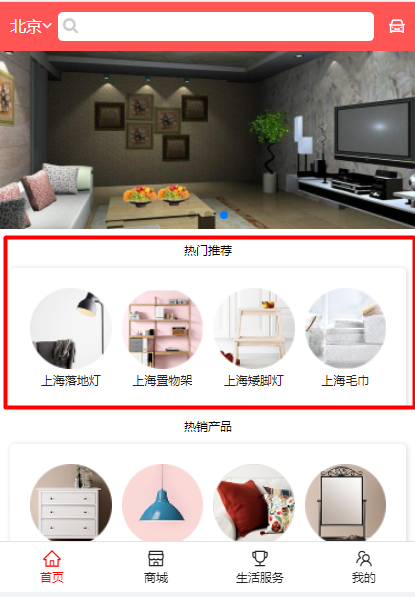

获取推荐商品，pom.xml文件如下

```xml
<?xml version="1.0" encoding="UTF-8"?>
<project xmlns="http://maven.apache.org/POM/4.0.0"
         xmlns:xsi="http://www.w3.org/2001/XMLSchema-instance"
         xsi:schemaLocation="http://maven.apache.org/POM/4.0.0 http://maven.apache.org/xsd/maven-4.0.0.xsd">
    <parent>
        <artifactId>rentHouse</artifactId>
        <groupId>com.lzh</groupId>
        <version>1.0-SNAPSHOT</version>
    </parent>
    <modelVersion>4.0.0</modelVersion>

    <artifactId>renthouse-recommendation</artifactId>
    <version>1.0-SNAPSHOT</version>

    <dependencies>
        <!--配置中心客户端-->
        <dependency>
            <groupId>org.springframework.cloud</groupId>
            <artifactId>spring-cloud-config-client</artifactId>
        </dependency>
        <!--默认加载bootstrap-->
        <dependency>
            <groupId>org.springframework.cloud</groupId>
            <artifactId>spring-cloud-starter-bootstrap</artifactId>
        </dependency>
        <dependency>
            <groupId>com.lzh</groupId>
            <artifactId>renthouse-mongodb-dao</artifactId>
            <version>1.0-SNAPSHOT</version>
        </dependency>
        <dependency>
            <groupId>com.lzh</groupId>
            <artifactId>renthouse-commons</artifactId>
            <version>1.0-SNAPSHOT</version>
        </dependency>
        <dependency>
            <groupId>org.springframework.boot</groupId>
            <artifactId>spring-boot-starter-web</artifactId>
        </dependency>
        <dependency>
            <groupId>org.springframework.cloud</groupId>
            <artifactId>spring-cloud-starter-netflix-eureka-client</artifactId>
        </dependency>
    </dependencies>

    <build>
        <plugins>
            <plugin>
                <groupId>org.apache.maven.plugins</groupId>
                <artifactId>maven-compiler-plugin</artifactId>
                <version>3.8.1</version>
                <configuration>
                    <target>11</target>
                    <source>11</source>
                </configuration>
            </plugin>
        </plugins>
    </build>
</project>
```

配置文件bootstrap.yml如下

```yaml
server:
  port: 9002
spring:
  application:
    name: renthouse-recommendation
  profiles:
    active: bannerNginx,mongodb
  cloud:
    config:
      uri: http://localhost:9010
      label: master
      name: renthouse
      profile: dev
```

启动类

```java
package com.renthouse.recommendation;

import org.springframework.boot.SpringApplication;
import org.springframework.boot.autoconfigure.SpringBootApplication;

@SpringBootApplication
public class RecommendationApp {
    public static void main(String[] args) {
        SpringApplication.run(RecommendationApp.class,args);
    }
}
```


##### renthouse-search模块

商品搜索器，pom.xml文件如下

```xml
<?xml version="1.0" encoding="UTF-8"?>
<project xmlns="http://maven.apache.org/POM/4.0.0"
         xmlns:xsi="http://www.w3.org/2001/XMLSchema-instance"
         xsi:schemaLocation="http://maven.apache.org/POM/4.0.0 http://maven.apache.org/xsd/maven-4.0.0.xsd">
    <parent>
        <artifactId>livegoods</artifactId>
        <groupId>com.lzh</groupId>
        <version>1.0-SNAPSHOT</version>
    </parent>
    <modelVersion>4.0.0</modelVersion>

    <artifactId>renthouse-search</artifactId>
    <version>1.0-SNAPSHOT</version>

    <dependencies>
        <dependency>
            <groupId>com.lzh</groupId>
            <artifactId>renthouse-mongodb-dao</artifactId>
            <version>1.0-SNAPSHOT</version>
            <scope>test</scope>
        </dependency>
        <dependency>
            <groupId>org.springframework.boot</groupId>
            <artifactId>spring-boot-starter-test</artifactId>
            <scope>test</scope>
        </dependency>
        <dependency>
            <groupId>com.bjsxt</groupId>
            <artifactId>livegoods-commons</artifactId>
            <version>1.0-SNAPSHOT</version>
        </dependency>
        <dependency>
            <groupId>org.springframework.boot</groupId>
            <artifactId>spring-boot-starter-web</artifactId>
        </dependency>
        <dependency>
            <groupId>org.springframework.cloud</groupId>
            <artifactId>spring-cloud-starter-netflix-eureka-client</artifactId>
        </dependency>
        <dependency>
            <groupId>org.springframework.boot</groupId>
            <artifactId>spring-boot-starter-data-elasticsearch</artifactId>
        </dependency>
        <dependency>
            <groupId>junit</groupId>
            <artifactId>junit</artifactId>
            <scope>test</scope>
        </dependency>
    </dependencies>
</project>
```

配置文件application.yml如下

```yaml
server:
  port: 9003
livegoods:
  search:
    init:
      enabled: true # 配置是否需要初始化索引，创建和设置映射。默认为false
spring:
  profiles:
    active: mongodb,bannerNginx
  application:
    name: livegoods-search
  elasticsearch:
    rest:
      uris: http://192.168.139.132:9200
eureka:
  client:
    service-url:
      defaultZone: http://192.168.139.132:8761/eureka/
  instance:
    prefer-ip-address: true
```


### 基础功能构建

项目基础模块包括配置中心、网关、commons、cache-redis、mongodb-dao这五个模块

#### configserver配置中心


模块的pom.xml如下

```xml
<?xml version="1.0" encoding="UTF-8"?>
<project xmlns="http://maven.apache.org/POM/4.0.0"
         xmlns:xsi="http://www.w3.org/2001/XMLSchema-instance"
         xsi:schemaLocation="http://maven.apache.org/POM/4.0.0 http://maven.apache.org/xsd/maven-4.0.0.xsd">
    <parent>
        <artifactId>livegoods</artifactId>
        <groupId>com.bjsxt</groupId>
        <version>1.0-SNAPSHOT</version>
    </parent>
    <modelVersion>4.0.0</modelVersion>

    <artifactId>livegoods_config_server</artifactId>
    <dependencies>
        <!--配置中心服务端-->
        <dependency>
            <groupId>org.springframework.cloud</groupId>
            <artifactId>spring-cloud-config-server</artifactId>
        </dependency>
        <!--eureka客户端-->
        <dependency>
            <groupId>org.springframework.cloud</groupId>
            <artifactId>spring-cloud-starter-netflix-eureka-client</artifactId>
        </dependency>
    </dependencies>
</project>
```

模块的配置文件bootstrap.yml如下

```yaml
server:
  port: 9010
spring:
  application:
    name: livegoods-configserver
  cloud:
    config:
      server:
        git:
          uri: https://gitee.com/zhaoyfi/xa-sxt.git
          search-paths:
            - livegoods
      label: master

eureka:
  client:
    service-url:
      defaultZone: http://192.168.139.128:8761/eureka/
  instance:
    prefer-ip-address: true
```

远程配置文件livegoods-dev.yml存放在gitee上，内容如下

```yaml
eureka:
  client:
    service-url:
      defaultZone: http://192.168.139.128:8761/eureka/
  instance:
    prefer-ip-address: true

livegoods:
  banner:
    nginx:
      prefix: http://192.168.139.128:8888
```

启动类ConfigApplication.java

```java
package com.bjsxt.livegoods.configserver;

@SpringBootApplication
@EnableConfigServer
public class ConfigApplication {

    public static void main(String[] args) {
        SpringApplication.run(ConfigApplication.class,args);
    }
}
```


#### mongoDB-dao模块

pom.xml内容如下

```xml
<?xml version="1.0" encoding="UTF-8"?>
<project xmlns="http://maven.apache.org/POM/4.0.0"
         xmlns:xsi="http://www.w3.org/2001/XMLSchema-instance"
         xsi:schemaLocation="http://maven.apache.org/POM/4.0.0 http://maven.apache.org/xsd/maven-4.0.0.xsd">
    <parent>
        <artifactId>livegoods</artifactId>
        <groupId>com.bjsxt</groupId>
        <version>1.0-SNAPSHOT</version>
    </parent>
    <modelVersion>4.0.0</modelVersion>

    <artifactId>livegoods_mongodb_dao</artifactId>
    <version>1.0-SNAPSHOT</version>

    <dependencies>
        <dependency>
            <groupId>org.springframework.boot</groupId>
            <artifactId>spring-boot-starter-data-mongodb</artifactId>
        </dependency>
        <dependency>
            <groupId>org.springframework.boot</groupId>
            <artifactId>spring-boot-starter-test</artifactId>
            <scope>test</scope>
        </dependency>
        <dependency>
            <groupId>org.testng</groupId>
            <artifactId>testng</artifactId>
            <version>RELEASE</version>
            <scope>test</scope>
        </dependency>
    </dependencies>
</project>
```

配置文件application-mongodb.yml内容

```yaml
spring:
  data:
    mongodb:
      host: 192.168.139.128
      port: 27017
      username: root
      password: root
      database: livegoods
      authentication-database: admin
```


#### commons公共模块

包含实体类，vo等公共类，pom.xml内容如下

```xml
<?xml version="1.0" encoding="UTF-8"?>
<project xmlns="http://maven.apache.org/POM/4.0.0"
         xmlns:xsi="http://www.w3.org/2001/XMLSchema-instance"
         xsi:schemaLocation="http://maven.apache.org/POM/4.0.0 http://maven.apache.org/xsd/maven-4.0.0.xsd">
    <parent>
        <artifactId>livegoods</artifactId>
        <groupId>com.bjsxt</groupId>
        <version>1.0-SNAPSHOT</version>
    </parent>
    <modelVersion>4.0.0</modelVersion>

    <artifactId>livegoods_commons</artifactId>
    <version>1.0-SNAPSHOT</version>

    <dependencies>
        <dependency>
            <groupId>org.projectlombok</groupId>
            <artifactId>lombok</artifactId>
        </dependency>
        <dependency>
            <groupId>io.github.resilience4j</groupId>
            <artifactId>resilience4j-spring-boot2</artifactId>
        </dependency>
    </dependencies>
    <build>
        <plugins>
            <plugin>
                <groupId>org.apache.maven.plugins</groupId>
                <artifactId>maven-compiler-plugin</artifactId>
                <version>3.8.1</version>
                <configuration>
                    <target>11</target>
                    <source>11</source>
                </configuration>
            </plugin>
        </plugins>
    </build>
</project>
```

配置文件application-bannerNginx.yml

```yaml
livegoods:
  banner:
    nginx:
      prefix: http://192.168.139.128:8888/
```

application-itemCacheName.yml

```yaml
livegoods:
  cache:
    names:
      item:
        prefix: com:livegoods:details
        suffix: getDetails
```

LivegoodsBuyMessage类

```java
// 购买商品的消息类型。
@Data
@EqualsAndHashCode
@ToString
@NoArgsConstructor
public class LivegoodsBuyMessage implements Serializable {
    // 要购买的商品主键
    private String itemId;
    // 购买商品的用户
    private String username;
}
```

pojo类，Banner

```java
/**
 * 轮播图实体
 */
@Data
@NoArgsConstructor
@EqualsAndHashCode
@ToString
public class Banner {
    // 主键
    private String id;
    // 图片地址
    private String url;
    // 创建时间
    private Date createTime;
}
```

comment类

```java
/**
 * 商品评价实体
 */
@Data
@NoArgsConstructor
@ToString
@EqualsAndHashCode
public class Comment {
    private String id;
    // 用户名， 手机号
    private String username;
    // 评价信息
    private String comment;
    // 评分
    private int star;
    // 商品主键，是为哪一个商品做的评价。
    private String itemId;
}
```

Item，商品类

```java
/**
 * 商品实体类型
 * Lombok技术不是通用的。在很多商业环境中，lombok并不适用。
 * 因为lombok相对来说，太死板。
 * 在使用lombok注解的同时，还需要，自定义增加一些辅助的getter和setter方法。
 */
@Data
@EqualsAndHashCode
@ToString
@NoArgsConstructor
public class Item {
    private String id;
    private String title;// 标题，字符串
    private Long sales;//销量，数学
    private Boolean recommendation;//是否为热门，布尔
    private Byte recoSort;//热门排序|权重，数学
    private String city;//所属城市，字符串
    private Long price;// 价格，数学, 单位是元
    private String rentType;//租赁方式，整租，合租等。 字符串
    private String houseType;// 房屋面积，字符串
    private Map<String, String> info;// 房屋特性， Map集合。集合存储数据内容为： years: "建造年份", type: "房屋类型，几室几厅", level: "所在楼层", style: "装修标准", orientation: "房屋朝向"
    private List<String> imgs;// 图片集合。字符串数组或集合
    private Date buytime; // 可购买时间， 可预订时间。
    private Boolean isRented; // 是否已出租
}
```

LoginLog类

```java
/**
 * 登录日志实体
 * 记录一个用户登录的日志数据。
 * 当前系统是一个无注册逻辑的系统，用户只要提供有效的手机号，即可通过验证码登录。
 */
@Data
@NoArgsConstructor
@EqualsAndHashCode
@ToString
public class LoginLog {
    private String id;
    private String username; // 用户名，就是手机号。
    private String type; // 登录方式， 1 - 验证码登录； 2 - 用户名密码登录
    private Date loginTime; // 登录时间
    private Boolean isSuccess; // 是否登录成功， true - 成功； false - 失败
    private String message; // 日志消息， 如：手机号不存在； 验证码错误； 验证码过期等。
}
```

Order，订单类

```java
@Data
@EqualsAndHashCode
@NoArgsConstructor
@ToString
public class Order {
    private String id;
    // 用户手机号
    private String username;
    // 商品主键
    private String itemId;
    // 商品标题
    private String title;
    // 房屋类型
    private String houseType;
    // 租赁方式
    private String rentType;
    // 价格
    private String price;
    // 图片地址
    private String img;
    // 是否已评论, 0-未评论； 2-已评论
    private int commentState;
}
```

值对象，LivegoodsResult类

```java
/**
 * 项目的返回结果类型
 * 根据开发进度逐渐增加需要的属性。
 */
@Data
@NoArgsConstructor
@EqualsAndHashCode
@ToString
public class LivegoodsResult {
    // 响应状态编码。 200 - 成功；  500 - 失败；
    private int status;
    // 返回结果数据； Banner轮播图使用，用于保存图片地址集合。
    private Object results;
    // 提示消息； Banner轮播图使用， 用于查询错误时返回提示消息。
    private String msg;
    // 返回的数据； 热销商品使用，返回查询的热销商品集合；热门推荐使用；
    private Object data;
    // 分页返回结果，是否还有更多的数据
    private boolean hasMore;
    // 预订倒计时，时间戳。
    private long time;

    public static LivegoodsResult ok(){
        LivegoodsResult result = new LivegoodsResult();
        result.setStatus(200);
        return result;
    }

    public static LivegoodsResult ok(Object data){
        LivegoodsResult result = new LivegoodsResult();
        result.setStatus(200);
        result.setData(data);
        return result;
    }

    public static LivegoodsResult error(){
        LivegoodsResult result = new LivegoodsResult();
        result.setStatus(500);
        return result;
    }

    public static LivegoodsResult error(String msg){
        LivegoodsResult result = new LivegoodsResult();
        result.setStatus(500);
        result.setMsg(msg);
        return result;
    }
}
```


#### gateway网关模块

网关在项目中的作用如图所示

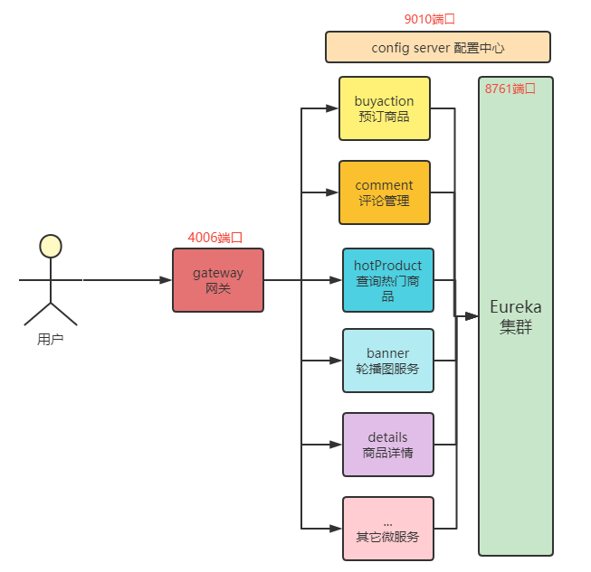

pom.xml文件如下

```xml
<?xml version="1.0" encoding="UTF-8"?>
<project xmlns="http://maven.apache.org/POM/4.0.0"
         xmlns:xsi="http://www.w3.org/2001/XMLSchema-instance"
         xsi:schemaLocation="http://maven.apache.org/POM/4.0.0 http://maven.apache.org/xsd/maven-4.0.0.xsd">
    <parent>
        <artifactId>livegoods</artifactId>
        <groupId>com.bjsxt</groupId>
        <version>1.0-SNAPSHOT</version>
    </parent>
    <modelVersion>4.0.0</modelVersion>

    <artifactId>livegoods_gateway</artifactId>
    <version>1.0-SNAPSHOT</version>

    <dependencies>
        <dependency>
            <groupId>org.springframework.cloud</groupId>
            <artifactId>spring-cloud-starter-netflix-eureka-client</artifactId>
        </dependency>
        <dependency>
            <groupId>org.springframework.cloud</groupId>
            <artifactId>spring-cloud-starter-gateway</artifactId>
        </dependency>
        <!--配置中心客户端-->
        <dependency>
            <groupId>org.springframework.cloud</groupId>
            <artifactId>spring-cloud-config-client</artifactId>
        </dependency>
        <!--默认加载bootstrap-->
        <dependency>
            <groupId>org.springframework.cloud</groupId>
            <artifactId>spring-cloud-starter-bootstrap</artifactId>
        </dependency>
    </dependencies>
    <build>
        <plugins>
            <plugin>
                <groupId>org.apache.maven.plugins</groupId>
                <artifactId>maven-compiler-plugin</artifactId>
                <version>3.8.1</version>
                <configuration>
                    <target>11</target>
                    <source>11</source>
                </configuration>
            </plugin>
        </plugins>
    </build>
</project>
```

网关配置文件bootstrap.yml如下

```yaml
server:
  port: 4006
spring:
  application:
    name: livegoods-gateway
  cloud:
    gateway:
      discovery:
        locator:
          enabled: false
          lower-case-service-id: true
      routes:
        - id: banner
          uri: lb://livegoods-banner
          predicates:
            - Path=/banner
        - id: hotproduct #完成网关模块后添加的
          uri: lb://livegoods-hot-product #应用名称
          predicates: #断言 参考banner
            - Path=/hotProduct
            - Query=city  #请求中，必须包含city请求参数。参数内容不限。
        - id: recommendation
          uri: lb://rentHous-recommendation
          predicates:
          	- Path=/recommendation
          	- Query=city
    config:
      uri: http://localhost:9010
      label: master
      name: livegoods
      profile: dev
```

启动类LivegoodsGatewayApp

```java
@SpringBootApplication
public class LivegoodsGatewayApp {
    public static void main(String[] args) {
        SpringApplication.run(LivegoodsGatewayApp.class, args);
    }
}
```


#### cache-redis模块

redis模板配置类

##### 主要作用

* 连接redis服务器
* 提供返回 redisTemplate方法，来操作redis

​		

```java
package com.livegoods.cache.config;

/**
 * 定义一个父类型，用于提供模板配置
 */
public abstract class RedisCacheConfiguration {
    protected RedisTemplate<String, Object> redisTemplate(RedisConnectionFactory redisConnectionFactory){
        RedisTemplate<String, Object> redisTemplate = new RedisTemplate<>();
        redisTemplate.setConnectionFactory(redisConnectionFactory);
        redisTemplate.setKeySerializer(new StringRedisSerializer());
        redisTemplate.setValueSerializer(new GenericJackson2JsonRedisSerializer());

        return redisTemplate;
    }
}
```

配置文件application-redis.yml

```yaml
spring:
  redis:
    host: 192.168.139.128
    port: 6390
    password: 123456
```


### banner模块

首页上轮流展示商品图片

#### 接口列表

| 序号 | 接口名称         | 接口地址 | 请求类型 |
| :--: | ---------------- | -------- | -------- |
|  1   | 查询轮播图片集合 | /banner  | get      |

#### 接口参数

无

返回JSON数据

| 名称    | 类型     | 其他信息 |
| ------- | -------- | -------- |
| status  | int      |          |
| results | String[] | 图片地址 |

#### 接口实现

##### 创建实体类

创建banner类

```java
@Data
@NoArgsConstructor
@EqualsAndHashCode
@ToString
public class Banner {
    // 主键
    private String id;
    // 图片地址
    private String url;
    // 创建时间
    private Date createTime;
}
```

##### 创建dao类

创建BannerDao接口

```java
// Banner轮播图的数据访问对象，实现数据查询。
public interface BannerDao {
    List<Banner> selectBanners(Query query);
}
```

创建BannerDao实现类

```java
/**
 * Banner数据访问对象
 * 连接MongoDB，访问banner集合。实现数据的查询。
 */
@Repository
public class BannerDaoImpl implements BannerDao {
    @Autowired
    private MongoTemplate mongoTemplate;

    @Override
    public List<Banner> selectBanners(Query query) {
        List<Banner> result = mongoTemplate.find(query, Banner.class);
        return result;
    }
}
```

##### 创建service接口

```java
// 轮播图服务接口
public interface BannerService {
    // 轮播图查询
    LivegoodsResult getBanners();
}
```

创建service实现类

```java
package com.livegoods.banner.service.impl;

/**
 * Banner轮播图查询服务实现。
 * 微服务。微服务应用是一个高内聚的，自省性非常高的工程。
 */
@Service
@RefreshScope
public class BannerServiceImpl implements BannerService {
    @Autowired
    private BannerDao bannerDao;
    @Value("${livegoods.banner.nginx.prefix}")
    private String nginxPrefix;

    /**
     * 通过DAO数据访问对象，访问MongoDB，查询轮播图数据。
     * 查询规则： 根据创建时间的降序排列， 查询前4条数据。
     * @return
     */
    @Override
    public LivegoodsResult getBanners() {
        LivegoodsResult result = new LivegoodsResult();
        try {
            // 定义查询条件
            Query query = new Query();
            query.with(PageRequest.of(0, 4));
            List<Banner> banners = bannerDao.selectBanners(query);
            // 成功
            result.setStatus(200);
            List<String> imgResults = new ArrayList<>();
            for(Banner banner : banners){
                imgResults.add(nginxPrefix+banner.getUrl());
            }
            result.setResults(imgResults);
        }catch (Exception e){
            e.printStackTrace();
            // 失败
            result.setStatus(500);
            result.setMsg("轮播图查询失败");
        }
        return result;
    }
}
```

##### 创建controller

```java
package com.livegoods.banner.controller;

@RestController
public class BannerController {
    @Autowired
    private BannerService bannerService;

    /**
     * 处理轮播图查询的方法。
     */
    @GetMapping("/banner")
    public LivegoodsResult banner(){
        return bannerService.getBanners();
    }
}
```

#### 接口测试

接口地址：localhost:9000/banner

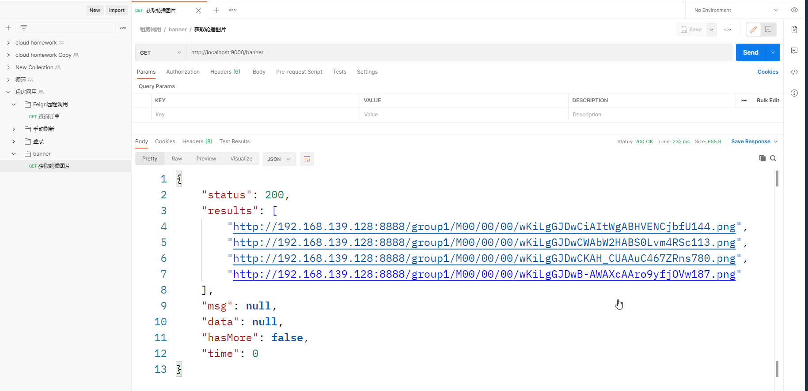


### hotproduct模块

#### 接口列表

| 序号 | 接口名称     | 接口地址    | 请求类型 |
| :--: | ------------ | ----------- | -------- |
|  1   | 查询热销商品 | /hotProduct | get      |

#### 接口参数

| 参数名称 | 是否必须 |
| -------- | -------- |
| city     | 是       |

返回JSON数据

| 名称    | 类型     | 其他信息 |
| ------- | -------- | -------- |
| data    | Object[] |          |
| --id    | String   | 商品id   |
| --title | String   | 商品标题 |
| --img   | String   | 商品图片 |

```bash
group1/M00/00/00/wKhCe2O2c-qAA3mXAAHhnl0byuU711.jpg
group1/M00/00/00/wKhCe2O2c_SAAwxFAAHi9pWaKhE961.jpg
group1/M00/00/00/wKhCe2O2c_-ALwbFAAKGJ3D_v1k562.jpg
group1/M00/00/00/wKhCe2O2dAuARDj5AAJI_3pe_30979.jpg
group1/M00/00/00/wKhCe2O2dBWALmC2AAJ6zxOohkc289.jpg
group1/M00/00/00/wKhCe2O2dB6AXMyrAAI1pI2ohVU034.jpg
group1/M00/00/00/wKhCe2O2dCeAYRFtAAHRIjaxOGM613.jpg
group1/M00/00/00/wKhCe2O2dC-AG1crAAIJt8EuM8M962.jpg
group1/M00/00/00/wKhCe2O2dDiACuNZAAG4U6ny2vQ219.jpg
group1/M00/00/00/wKhCe2O2dEGALW_lAAEefOtgMqQ850.jpg
group1/M00/00/00/wKhCe2O2dEuAZ0hNAAHiL9U5wu0807.jpg
```

#### 准备数据

```shell
use renthouse
db.item.insertMany([{
		"_id": "62451d3f76d3907ec8ab9a45",
		"title": "北京老小区",
		"sales": 300,
		"recommendation": true,
		"recoSort": 9,
		"city": "北京",
		"price": 3000,
		"rentType": " 整 租 ",
		"houseType": "60 ㎡ ",
		"info": {
			"orientation": "朝南",
			"level": "6/6 层",
			"style": "简单装修",
			"type": "2 室 1 厅",
			"years": "2000"
		},
		"imgs": [
"group1/M00/00/00/wKhCe2O2c-qAA3mXAAHhnl0byuU711.jpg",
"group1/M00/00/00/wKiLhGKMQ6-AcehiAAHiL9U5wu0197.jpg",
"group1/M00/00/00/wKhCe2O2c_-ALwbFAAKGJ3D_v1k562.jpg"
		],
		"_class": "com.lzh.renthouse.pojo.Item",
		"buytime": new Date(),
		"isRented": false
	},
	{
		"_id": "624519f876d3907ec8ab9a44",
		"title": "北京独栋别墅",
		"sales": 10,
		"recommendation": true,
		"recoSort": 6,
		"city": "北京",
		"price": 30000,
		"rentType": " 整 租 ",
		"houseType": "310 ㎡ ",
		"info": {
			"orientation": "四面环海",
			"level": "3/3 层",
			"style": "豪华装修",
			"type": "6 室 4 厅",
			"years": "2013"
		},
		"imgs": [
"group1/M00/00/00/wKhCe2O2dAuARDj5AAJI_3pe_30979.jpg",
"group1/M00/00/00/wKhCe2O2dBWALmC2AAJ6zxOohkc289.jpg"
		],
		"_class": "com.lzh.renthouse.pojo.Item",
		"buytime": new Date(),
		"isRented": true
	}, {
		"_id": "624519f876d3907ec8ab9a43",
		"title": "北京联排别墅",
		"sales": 30,
		"recommendation": true,
		"recoSort": 12,
		"city": "北京",
		"price": 21000,
		"rentType": "整租",
		"houseType": "230 ㎡",
		"info": {
			"orientation": "南北通透",
			"level": "2/2 层",
			"style": "精装修",
			"type": "5 室 3 厅",
			"years": "2007"
		},
		"imgs": [
"group1/M00/00/00/wKhCe2O2dB6AXMyrAAI1pI2ohVU034.jpg",
"group1/M00/00/00/wKhCe2O2dCeAYRFtAAHRIjaxOGM613.jpg",
"group1/M00/00/00/wKhCe2O2dC-AG1crAAIJt8EuM8M962.jpg"
		],
		"_class": "com.lzh.renthouse.pojo.Item",
		"buytime": new Date(),
		"isRented": true
	}, {
		"_id": "624519f876d3907ec8ab9a42",
		"title": "北京普通公寓",
		"sales": 100,
		"recommendation": true,
		"recoSort": 9,
		"city": "北京",
		"price": 12000,
		"rentType": "整租",
		"houseType": "150 ㎡",
		"info": {
			"orientation": "南北通透",
			"level": "10/18 层",
			"style": "精装修",
			"type": "3 室 2 厅",
			"years": "2010"
		},
		"imgs": [
"group1/M00/00/00/wKhCe2O2dDiACuNZAAG4U6ny2vQ219.jpg",
"group1/M00/00/00/wKhCe2O2dEGALW_lAAEefOtgMqQ850.jpg",
"group1/M00/00/00/wKhCe2O2dEuAZ0hNAAHiL9U5wu0807.jpg"
		],
		"_class": "com.lzh.renthouse.pojo.Item",
		"buytime": new Date(),
		"isRented": true
	}
])
```

#### 接口实现

创建dao

```java
// 热销商品中的商品数据访问接口
public interface ItemDao {
    // 查询热销商品的数据访问方法，根据销量排序，查询条件为城市。 查询只要4条数据。
    List<Item> getHotProduct(Query query);
}
```

```java
@Repository
public class ItemDaoImpl implements ItemDao {
    @Autowired
    private MongoTemplate mongoTemplate;

    @Override
    public List<Item> getHotProduct(Query query) {
        return mongoTemplate.find(query, Item.class);
    }
}
```

创建service

```java
// 热销商品服务接口
public interface HotProductService {
    /**
     * 查询热销商品方法。
     * 查询的返回结果，热销商品的数量必须是4。
     * 查询条件所在城市的热销商品数量大于4的时候，只查询销量排序的前4位商品。
     * 如果条件所在城市的热销商品数量小于4的时候，从其他的城市热销商品中查询销量排序考前的补足。
     * @param city 城市
     * @return
     */
    LivegoodsResult getHotProducts(String city);
}
```

```java
/**
 * 热销商品服务实现
 */
@Service
public class HotProductServiceImpl implements HotProductService {
    @Autowired
    private ItemDao itemDao;
    @Value("${livegoods.banner.nginx.prefix}")
    private String nginxPrefix;

    @Override
    public LivegoodsResult getHotProducts(String city) {

        // 查询热销商品
        Query query = new Query();
        // 查询条件
        query.addCriteria(Criteria.where("city").is(city));
        // 排序和分页
        query.with(
                PageRequest.of(0, 4,
                        Sort.by(Sort.Direction.DESC, "sales")));
        List<Item> items = itemDao.getHotProduct(query);
        if(items.size() < 4){
   // 查询的热销商品数量不足，需要查询其他城市的热销商品，填充到当前查询结果
            Query otherQuery = new Query();
          // 查询条件， 查询当前城市以外的其他城市热销商品，避免重复数据。
            otherQuery.addCriteria(Criteria.where("city").ne(city));
            // 排序和分页
            otherQuery.with(
                    PageRequest.of(0, 4 - items.size(),
                            Sort.by(Sort.Direction.DESC, "sales")));
            List<Item> otherItems = itemDao.getHotProduct(otherQuery);
            // 将其他城市的热销商品数据，填充到当前城市的热销商品数据集合中。补足4条数据。
            items.addAll(otherItems);
        }
    // 查询结果items，理论上一定有4条数据。如果不足？可以使用托底数据填充。
        if(items.size() < 4){ // 如果所有的热销商品数据总计不足4条，使用托底数据填充。
            for(int i = items.size(); i < 4; i++){
                items.add(fallbackItem());
            }
        }
        // 将图片路径，从相对路径转换为绝对路径。增加Nginx地址前缀。
        items = this.changeImgsUrl(items);
        return LivegoodsResult.ok(items);
    }

 
}
```

创建controller

```java
/**
 * 热销商品控制器
 */
@RestController
public class HotProductController {
    @Autowired
    private HotProductService hotProductService;

    /**
     * 查询热销商品数据
     * @param city 查询条件， 城市
     * @return
     */
    @GetMapping("/hotProduct")
    public LivegoodsResult getHotProduct(String city){
        return hotProductService.getHotProducts(city);
    }
}
```

#### 接口测试

接口地址：localhost:9001/hotProduct

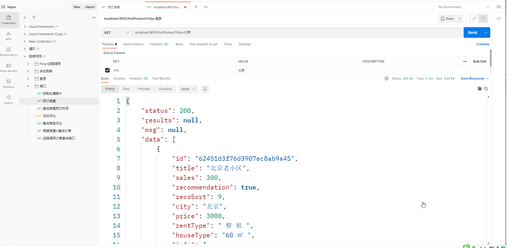


### recommendation模块

#### 接口列表

| 序号 | 接口名称         | 接口地址        | 请求类型 |
| :--: | ---------------- | --------------- | -------- |
|  1   | 查询热门推荐商品 | /recommendation | get      |

#### 接口参数

| 参数名称 | 是否必须 |
| -------- | -------- |
| city     | 是       |

返回JSon数据

| 名称   | 类型         | 其他信息     |
| ------ | ------------ | ------------ |
| status | int          |              |
| data   | Object[Item] | Item类型数组 |

#### 接口实现

##### 创建dao

```java
// 商品数据访问接口
public interface ItemDao {
    // 查询热门推荐商品
    List<Item> selectRecommendation(Query query);
}
```

```java
/**
 * 热门推荐 - 商品数据访问实现。
 */
@Repository
public class ItemDaoImpl implements ItemDao {
    @Autowired
    private MongoTemplate mongoTemplate;

    /**
     * 查询商品。
     * @param query
     * @return
     */
    @Override
    public List<Item> selectRecommendation(Query query) {
        return mongoTemplate.find(query, Item.class);
    }
}
```

##### 创建service

```java
// 热门推荐服务接口
public interface RecommendationService {
    /**
     * 查询热门推荐商品信息， 查询条件是所在城市
     * @param city 城市
     * @return
     */
    LivegoodsResult getRecommendation(String city);
}
```

```java
/**
 * 热门推荐服务实现
 */
@Service
public class RecommendationServiceImpl implements RecommendationService {
    @Autowired
    private ItemDao itemDao;
    @Value("${livegoods.banner.nginx.prefix}")
    private String nginxPrefix;

    /**
     * 查询条件是： 城市 = 方法参数 and 是否推荐 = true
     * @param city 城市
     * @return
     */
    @Override
    public LivegoodsResult getRecommendation(String city) {
        // 查询条件
        Query query = new Query();
        Criteria c = new Criteria();
        // 查询条件， 城市 = 参数值 and 是否推荐 = true
        c.andOperator(
                Criteria.where("city").is(city),
                Criteria.where("recommendation").is(true)
        );
        query.addCriteria(c);
        // 分页和排序
        query.with(
                PageRequest.of(0, 4,
                        Sort.by(Sort.Direction.DESC, "recoSort"))
        );
        List<Item> items = itemDao.selectRecommendation(query);

        // 判断查询结果数量是否达标。
        if(items.size() < 4){
            // 查询的热门推荐商品数量少于4。 从其他城市的推荐商品中查询
            Query otherQuery = new Query();
            Criteria otherCriteria = new Criteria();
            otherCriteria.andOperator(
                    Criteria.where("city").ne(city),
                    Criteria.where("recommendation").is(true)
            );
            otherQuery.addCriteria(otherCriteria);
            otherQuery.with(
                    PageRequest.of(0, 4 - items.size(),
                            Sort.by(Sort.Direction.DESC, "recoSort"))
            );
            List<Item> otherItems = itemDao.selectRecommendation(otherQuery);
            items.addAll(otherItems);
        }

        if(items.size() < 4){
            // 所有城市的热门推荐数据，总量少于4条。使用托底数据补足。
            for(int i = items.size(); i < 4; i++){
                items.add(fallbackItem());
            }
        }

        // 把图片URL地址，转换成完整路径。
        items = this.changeImgs(items);

        // 返回结果
        return LivegoodsResult.ok(items);
    }

    // 图片地址处理方法，相对路径转换为绝对路径。
    private List<Item> changeImgs(List<Item> items){
        for(Item item : items){
            List<String> newImgs = new ArrayList<>();
            for(String img : item.getImgs()){
                newImgs.add(nginxPrefix + img);
            }
            item.setImgs(newImgs);
        }
        return items;
    }

    // 创建托底数据
    private Item fallbackItem(){
        Item item = new Item();
        item.setId("5ec1ec6b7f56a946fb7fdffa");
        item.setCity("北京");
        item.setHouseType("150 ㎡");
        item.setImgs(
                Arrays.asList(
                        "group1/M00/00/01/wKhZjF6_UkuAGCsJABLGy04UWBI573.png",
                        "group1/M00/00/01/wKhZjF6_UlyANqRfAAjIoXS-cuE984.png",
                        "group1/M00/00/01/wKhZjF6_UmmAQsntAAro96E3Lio262.png"
                )
        );
        item.setPrice(12000L);
        item.setRecommendation(true);
        item.setRecoSort((byte)9);
        item.setRentType("整租");
        item.setSales(100L);
        item.setTitle("北京高档公寓");
        Map<String, String> info = new HashMap<>();
        info.put("years", "2010");
        info.put("type", "3室2厅");
        info.put("level", "10/18层");
        info.put("style", "精装修");
        info.put("orientation", "南北通透");
        item.setInfo(info);
        return item;
    }
}
```

##### 创建controller

```java
/**
 * 热门推荐控制器
 */
@RestController
public class RecommendationController {
    @Autowired
    private RecommendationService recommendationService;

    @GetMapping("/recommendation")
    public LivegoodsResult getRecommendation(String city){
        return recommendationService.getRecommendation(city);
    }
}
```

##### 创建启动类

```java
@SpringBootApplication
public class RecommendationApp {
    public static void main(String[] args) {
        SpringApplication.run(RecommendationApp.class, args);
    }
}
```

#### 接口测试

接口地址：localhost:9002/recommendation

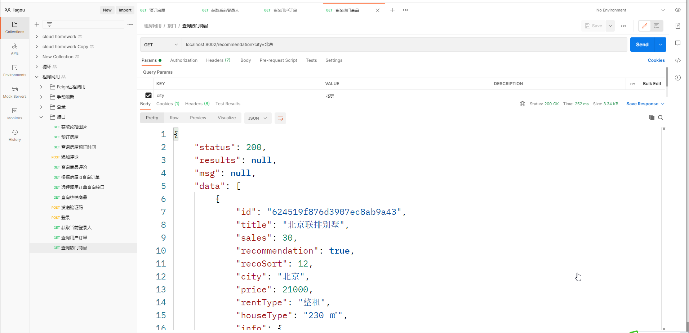


### details模块

#### 接口列表

| 序号 | 接口名称     | 接口地址 | 请求类型 |
| :--: | ------------ | -------- | -------- |
|  1   | 主键查询商品 | /details | get      |

#### 商品详情查询方法

##### 接口参数

| 名称 | 类型   | 其他信息 |
| ---- | ------ | -------- |
| id   | String |          |

##### 接口实现

###### 创建dao

```java
// 查询商品详情数据访问接口
public interface ItemDao {
    Item findItemById(String id);
}
```

```java
// 查询商品详情数据访问实现
@Repository
public class ItemDaoImpl implements ItemDao {
    @Autowired
    private MongoTemplate mongoTemplate;

    /**
     * 主键查询商品
     * @param id
     * @return
     */
    @Override
    public Item findItemById(String id) {
        return mongoTemplate.findById(id, Item.class);
    }
}
```

###### 创建service

```java
// 商品详情服务接口
public interface DetailsService {
    // 主键查询商品
    Item getDetails(String id);
}
```

```java
// 商品详情服务实现
@Service
public class DetailsServiceImpl implements DetailsService {
    @Autowired
    private ItemDao itemDao;
    @Value("${livegoods.banner.nginx.prefix}")
    private String nginxPrefix;

    /**
     * 主键查询商品。
     * 需要将商品中的图片地址，从相对路径修改为绝对路径。
     * @param id
     * @return
     */
    @Override
    public Item getDetails(String id) {
        // 主键查询
        Item item = itemDao.findItemById(id);
        // 把图片的相对路径修改成绝对路径。
        List<String> newImgs = new ArrayList<>();
        for(String img : item.getImgs()){
            newImgs.add(nginxPrefix + img);
        }
        item.setImgs(newImgs);
        return item;
    }
}
```

###### 创建controller

```java
package com.livegoods.details.controller;

import com.livegoods.commons.pojo.Item;
import com.livegoods.commons.pojo.Order;
import com.livegoods.details.service.DetailsService;
import com.livegoods.details.service.OrderServiceFeignClient;
import io.vavr.control.Try;
import org.springframework.beans.factory.annotation.Autowired;
import org.springframework.web.bind.annotation.CrossOrigin;
import org.springframework.web.bind.annotation.GetMapping;
import org.springframework.web.bind.annotation.RestController;

import java.util.*;

/**
 * 商品详情控制器
 */
@RestController
public class DetailsController {
    @Autowired
    private DetailsService detailsService;

    @Autowired
    private OrderServiceFeignClient orderServiceFeignClient;

    /**
     * 商品详情查询方法。 主键查询商品。
     * @param id
     * @return
     */
    @GetMapping("/details")
    public Item findDetails(String id){
        return detailsService.getDetails(id);
    }
}
```

##### 接口测试

接口地址：localhost:9004/details

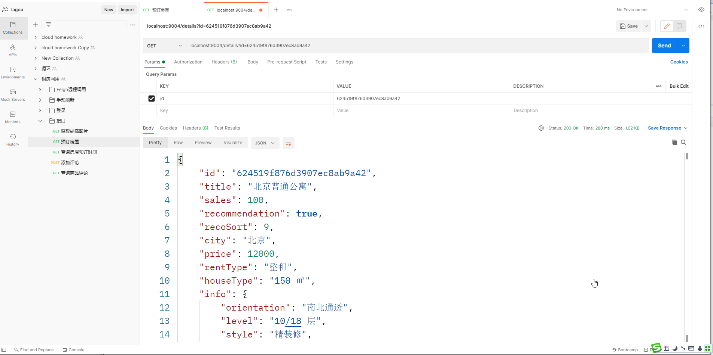


#### 添加详情缓存

修改redis-cache模块RedisCacheConfiguration类

添加cachaManager方法

```java
protected CacheManager cacheManager(RedisConnectionFactory redisConnectionFactory){
  org.springframework.data.redis.cache.RedisCacheConfiguration configuration =       org.springframework.data.redis.cache.RedisCacheConfiguration.defaultCacheConfig();

        configuration =
                configuration.entryTtl(Duration.ofMinutes(30L)) // 默认超时时间
                        .disableCachingNullValues() // 不缓存空数据
                        .serializeKeysWith( // key的序列化器
     RedisSerializationContext.SerializationPair.fromSerializer              
         new StringRedisSerializer()
                                )
                        )
                        .serializeValuesWith( // value的序列化器
                                RedisSerializationContext.SerializationPair.fromSerializer(
                                        new GenericJackson2JsonRedisSerializer()
                                ));
        return RedisCacheManager
                .builder(RedisCacheWriter.nonLockingRedisCacheWriter(redisConnectionFactory)).cacheDefaults(configuration).build();
    }
```

在details模块中添加DetailsConfiguration类

```java
// 商品详情配置类型
@Configuration
public class DetailsConfiguration extends RedisCacheConfiguration {
    /**
     * 创建缓存管理器。
     * @param redisConnectionFactory Redis连接工厂
     * @return
     */
    @Bean
    public CacheManager cacheManager(RedisConnectionFactory redisConnectionFactory){
        return super.cacheManager(redisConnectionFactory);
    }
}
```

修改pom.xml

```xml
<dependency>
    <groupId>com.bjsxt</groupId>
    <artifactId>livegoods_cache_redis</artifactId>
    <version>1.0-SNAPSHOT</version>
</dependency>
```

修改bootstrap.yml

```yaml
spring:
  application:
    name: livegoods-details
  profiles:
    active: mongodb ,bannerNginx,redis
```

为方法添加注解

```java
/**
     * 主键查询商品。
     * 需要将商品中的图片地址，从相对路径修改为绝对路径。
     * @param id
     * @return
     */
    @Override
    @Cacheable(cacheNames = "com:livegoods:details", key = "'getDetails('+#id+')'")
    public Item getDetails(String id) {
        // 主键查询
        Item item = itemDao.findItemById(id);
        // 把图片的相对路径修改成绝对路径。
        List<String> newImgs = new ArrayList<>();
        for(String img : item.getImgs()){
            newImgs.add(nginxPrefix + img);
        }
        item.setImgs(newImgs);
        return item;
    }
```

启动类上添加注解

```java
@SpringBootApplication
@EnableCaching
public class DetailApplication {

    public static void main(String[] args) {
        SpringApplication.run(DetailApplication.class,args);
    }
}
```


### comment模块

#### 接口列表

| 序号 | 接口名称     | 接口地址  | 请求类型 |
| :--: | ------------ | --------- | -------- |
|  1   | 新增评论     | /feelback | post     |
|  2   | 查询商品评论 | /comment  | get      |

#### 新增评论

##### 接口参数

| 参数名称 | 是否必须 |
| -------- | -------- |
| orderId  | 是       |
| feelback | 是       |

返回JSON数据

| 名称   | 类型   | 其他信息 |
| ------ | ------ | -------- |
| status | int    |          |
| msg    | String |          |

##### 接口实现

###### 创建dao

```java
// 订单数据访问接口
public interface OrderDao {
    void updateCommentState(String orderId, int commentState);
}
```

创建OrderDaoImpl.java，增加下列方法

```java
@Override
public void updateCommentState(String orderId, int commentState) {
    Query query = new Query();
    query.addCriteria(Criteria.where("_id").is(orderId));
    Update update = Update.update("commentState", commentState);
    mongoTemplate.updateFirst(query, update, Order.class);
}
```

```java
// 商品评论数据访问接口
public interface CommentDao {
    // 新增评论
    void save(Comment comment);
}
```

```java
package com.livegoods.comment.dao.impl;

// 商品评论数据访问实现
@Repository
public class CommentDaoImpl implements CommentDao {
    @Autowired
    private MongoTemplate mongoTemplate;

    // 新增商品评论
    @Override
    public void save(Comment comment) {
        mongoTemplate.save(comment);
    }
}
```

###### 创建service

```java
// 商品评论服务接口
public interface CommentService {
    // 新增商品评论
    LivegoodsResult fellback(String orderId, String comment);
}
```

```java
// 商品评论服务实现
@Service
public class CommentServiceImpl implements CommentService {
    @Autowired
    private CommentDao commentDao;
    @Autowired
    private OrderDao orderDao;

    /**
     * 新增商品评论
     * @param orderId 订单主键
     * @param comment 评论内容
     * @return
     */
    @Override
    public LivegoodsResult fellback(String orderId, String comment) {
        try {
            // 根据订单主键，查询订单数据
            Order order = orderDao.findById(orderId);
            // 根据查询的订单数据内容，创建一个评论数据对象Comment
            Comment commentObj = new Comment();
            commentObj.setUsername(order.getUsername());
            commentObj.setComment(comment);
            commentObj.setItemId(order.getItemId());
            commentObj.setStar(3); // 前端应用未提供星级请求参数。 赋予默认值 3。

            // 保存数据到MongoDB
            commentDao.save(commentObj);
            // 修改订单状态， commentState = 2， 设置为已评论
            orderDao.updateCommentState(orderId, 2);
            return LivegoodsResult.ok();
        }catch (Exception e){
            e.printStackTrace();
            return LivegoodsResult.error();
        }
    }
}
```

###### 创建controller

```java
package com.livegoods.comment.controller;

// 商品评论控制器
@RestController
public class CommentController {
    @Autowired
    private CommentService commentService;

    /**
     * 新增订单评论
     * @param orderId 订单主键
     * @param feelback 评论内容
     * @return
     */
    @PostMapping("/feelback")
    public LivegoodsResult feelback(String orderId, String feelback){
        return commentService.fellback(orderId, feelback);
    }
}
```

##### 接口测试

接口地址：localhost:9005/feelback

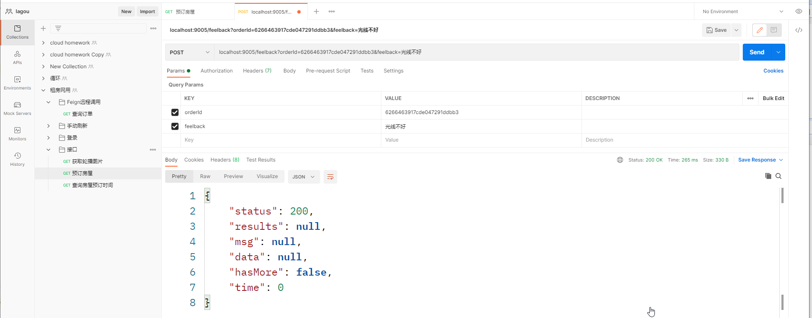


#### 查询评论

##### 接口参数

| 名称   | 类型   | 其他信息 |
| ------ | ------ | -------- |
| itemId | String |          |
| page   | int    |          |
| rows   | int    |          |

##### 接口实现

###### 创建dao

```java
// 商品评论数据访问接口
public interface CommentDao {
    // 分页查询评论数据
    List<Comment> findCommentsByPage(Query query);
    // 新增评论
    void save(Comment comment);
}
```

```java
package com.livegoods.comment.dao.impl;

// 商品评论数据访问实现
@Repository
public class CommentDaoImpl implements CommentDao {
    @Autowired
    private MongoTemplate mongoTemplate;

    // 新增商品评论
    @Override
    public void save(Comment comment) {
        mongoTemplate.save(comment);
    }

    // 分页查询商品评论
    @Override
    public List<Comment> findCommentsByPage(Query query) {
        return mongoTemplate.find(query, Comment.class);
    }
}
```

###### 修改service

在CommentService中添加查询评论方法

```java
// 根据商品主键，查询商品评论
LivegoodsResult findCommentByItemId(String itemId, int page, int rows);
```

```java
/**
 * 分页查询商品评论信息，查询条件是商品的主键。
 * @param itemId 商品主键
 * @param page 查询第几页
 * @param rows 每页多少行
 * @return
 */
@Override
public LivegoodsResult findCommentByItemId(String itemId, int page, int rows) {
    // 创建查询条件
    Query query = new Query();
    query.addCriteria(
            Criteria.where("itemId").is(itemId)
    );
    query.with( // 分页逻辑
            PageRequest.of(page, rows)
    );
    // 分页查询商品评论
    List<Comment> commentList = this.commentDao.findCommentsByPage(query);
    long count = commentList==null?0:commentList.size();

    // 隐藏用户手机号。 135 1234 4321 -> 135 **** 4321
    for(Comment comment : commentList){
        String username = comment.getUsername()
                            .replaceAll("(\\d{3})\\d{4}(\\d{4})", "$1****$2");
        comment.setUsername(username);
    }

    LivegoodsResult result = LivegoodsResult.ok(commentList);
    // 总计页码数
    long totalPages = ((count % rows == 0) ? (count / rows) : ((count / rows) + 1));
    if((page + 1) < totalPages) { // 有更多数据
        result.setHasMore(true);
    }else{ // 没有更多数据
        result.setHasMore(false);
    }
    return result;
}
```

###### 修改controller

增加按商品id查询评论方法

```java
/**
 * 根据商品主键查询商品评论
 * @param itemId
 * @return
 */
@GetMapping("/comment")
public LivegoodsResult getCommentByItemId(
        @RequestParam(value = "id") String itemId, int page,
        @RequestParam(defaultValue = "5") int rows){
    return commentService.findCommentByItemId(itemId, page, rows);
}
```

##### 接口测试

接口地址：localhost:9005/comment

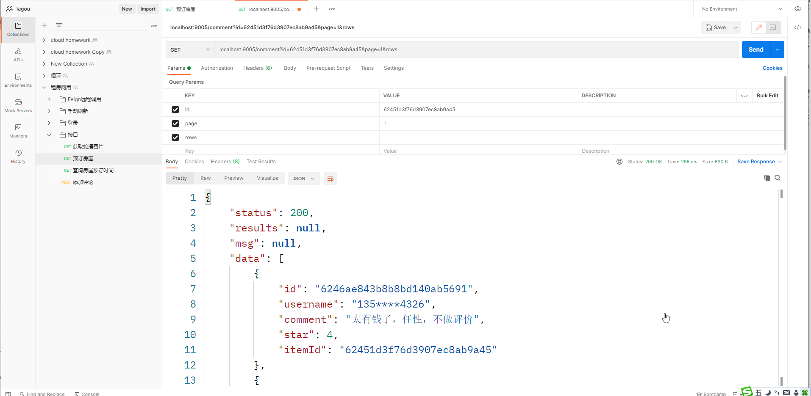


### search模块

#### 接口列表

| 序号 | 接口名称 | 接口地址 | 请求类型 |
| :--: | -------- | -------- | -------- |
|  1   | 搜索商品 | /search  | get      |

#### 接口参数

| 参数名称 | 是否必须 |
| -------- | -------- |
| city     | 是       |
| content  | 是       |
| page     | 是       |
| rows     | 否       |

返回JSON数据

| 名称   | 类型            | 其他信息        |
| ------ | --------------- | --------------- |
| status | int             |                 |
| data   | Object[Item4ES] | Item4ES类型数组 |

#### 接口实现

##### 修改pom.xml

添加相关依赖

```xml
<dependency>
    <groupId>org.springframework.boot</groupId>
    <artifactId>spring-boot-starter-data-elasticsearch</artifactId>
</dependency>
```

##### 修改配置文件

添加elasticeSearch配置

```yaml
spring
   elasticsearch:
     uris: http://192.168.139.132:9200
```

##### 创建实体类

创建Item4ES

```java
/**
 * ElasticSearch访问过程中使用的实体类型。
 * Spring Data Elasticsearch中使用的实体
 * 必须提供若干注解描述
 */
@Document(indexName = "livegoods-item")
@Data
@EqualsAndHashCode
@ToString
@NoArgsConstructor
public class Item4ES {
    @Id
    private String id;
    // 租赁方式, 不分词
    @Field(type = FieldType.Keyword)
    private String rentType;
    // 价格， <h3>价格</h3>， 不分词
    @Field(type = FieldType.Keyword)
    private String price;
    // 房屋类型
    @Field(type = FieldType.Text, analyzer = "ik_max_word")
    private String houseType;
    // 图片地址
    @Field(type = FieldType.Keyword)
    private String img;
    // 商品标题
    @Field(type = FieldType.Text, analyzer = "ik_max_word")
    private String title;
    // 城市
    @Field(type = FieldType.Keyword)
    private String city;
}
```

##### 创建dao

```java
public interface ItemDao4ES {
    // 分页查询
    List<Item4ES> queryForPage(String city, String content, int page, int rows);
    // 批量数据新增到ES
    void batchIndex(List<Item4ES> items);
    // 单数据新增到ES
    void index(Item4ES item);
}
```

```java
@Repository
public class ItemDao4ESImpl implements ItemDao4ES {
    @Autowired
    private ElasticsearchRestTemplate restTemplate;
    @Value("${livegoods.search.init.enabled}")
    private boolean initEnabled = false;

    /**
     * 分页搜索
     * @param city 城市
     * @param content 搜索关键字， 在title商品标题字段中匹配。
     * @param page 页码， 从0开始的
     * @param rows 查询行数
     * @return
     */
    @Override
    public List<Item4ES> queryForPage(String city, String content, int page, int rows) {
        // 高亮设置
        HighlightBuilder.Field field = new HighlightBuilder.Field("title");
        field.preTags("<span style='color:red'>");
        field.postTags("</span>");

        // 获取可选搜索条件集合
        BoolQueryBuilder shouldBuilder = QueryBuilders.boolQuery()
				.should(QueryBuilders.matchQuery("title", content))     // 标题搜索
                .should(QueryBuilders.matchQuery("houseType", content))     // 房屋类型搜索
                .should(QueryBuilders.matchQuery("rentType", content));// 租赁方式搜索
        // 获取必要搜索条件集合
        BoolQueryBuilder boolQueryBuilder = QueryBuilders.boolQuery();
        boolQueryBuilder.must(QueryBuilders.matchQuery("city", city)).must(shouldBuilder);
        // 搜索条件创建
        NativeSearchQuery  query =
            new NativeSearchQueryBuilder()
               .withQuery(boolQueryBuilder) // 搜索条件
               .withHighlightFields(field) // 高亮
               .withPageable(PageRequest.of(page, rows))   //分页
                        .build();

        // 搜索
        SearchHits<Item4ES> resultPage = restTemplate.search(query, Item4ES.class);
        List<SearchHit<Item4ES>> searchHits = resultPage.getSearchHits();
        List<Item4ES> resultList = new ArrayList<>();
        for (SearchHit<Item4ES> searchHit : searchHits) {
            // 处理高亮
            Map<String, List<String>> highlightFieldMap = searchHit.getHighlightFields();
            // 搜索的结果对象
            Item4ES item4ES = new Item4ES();
            // 数据的处理
            item4ES.setId(searchHit.getContent().getId());
            item4ES.setRentType(searchHit.getContent().getRentType());
            item4ES.setPrice(searchHit.getContent().getPrice());
            item4ES.setImg(searchHit.getContent().getImg());
            item4ES.setHouseType(searchHit.getContent().getHouseType());
            item4ES.setCity(searchHit.getContent().getCity());

            if(highlightFieldMap.containsKey("title")){
                // 高亮数据有title
                item4ES.setTitle(highlightFieldMap.get("title").toString());
            }else {
                // 没有高亮数据
                item4ES.setTitle(searchHit.getContent().getTitle());
            }
            resultList.add(searchHit.getContent());
        }
        return resultList;
    }

    @Override
    public void batchIndex(List<Item4ES> items) {
        // 判断是否需要创建索引和设置映射。
        if(initEnabled){
            this.createIndex();
        }
        List<IndexQuery> queryList = new ArrayList<>();
        for(Item4ES item : items){
            queryList.add(new IndexQueryBuilder().withObject(item).build());
        }
        // 批量新增
        restTemplate.bulkIndex(queryList,Item4ES.class);
    }

    @Override
    public void index(Item4ES item) {
        this.batchIndex(Arrays.asList(item));
    }

    // 创建索引--新版报错待处理
    private void createIndex(){
        IndexOperations indexOps = restTemplate.indexOps(Item4ES.class);
        if (indexOps.exists()) {
            indexOps.delete();
        }else{
            indexOps.create();
            indexOps.refresh();
            indexOps.putMapping(indexOps.createMapping());
        }
    }
}
```

##### 创建service

```java
// 搜索服务接口
public interface SearchService {
    // 搜索服务方法
    LivegoodsResult search(String city, String content, int page, int rows);
}
```

```java
// 搜索服务实现
@Service
public class SearchServiceImpl implements SearchService {
    @Autowired
    private ItemDao4ES itemDao4ES;

    /**
     * 搜索商品逻辑
     * @param city 城市
     * @param content 搜索关键字
     * @param page 第几页， 从0开始
     * @param rows 每页查询多少行
     * @return
     */
    @Override
    public LivegoodsResult search(String city, String content, int page, int rows) {
        // 搜索商品数据
        List<Item4ES> resultPage =
                this.itemDao4ES.queryForPage(city, content, page, rows);

        // 构建返回结果对象。
        LivegoodsResult result = LivegoodsResult.ok(resultPage);
        return result;
    }
}
```

##### 创建controller

```java
// 搜索控制器
@RestController
public class SearchController {
    @Autowired
    private SearchService searchService;
    @GetMapping("/search")
    public LivegoodsResult search(String city, String content, int page,@RequestParam(defaultValue = "4") int rows){
        return searchService.search(city, content, page, rows);
    }
}
```

##### 创建启动类

```java
@SpringBootApplication
public class SearchApp {
    public static void main(String[] args) {
        SpringApplication.run(SearchApp.class, args);
    }
}
```


#### 安装kibana

root账户下操作

```shell
tar zxvf kibana-7.13.1-linux-x86_64.tar.gz
```

添加新用户

```shell
useradd estest
passwd estest
```

改变目录的拥有者

```shell
chown -R estest /usr/local/kibana
```

设置访问权限

```shell
chmod -R 777 /usr/local/kibana
```

修改配置文件 kibana.yml  /kibana/config/kibana.yml

```yaml
server.port=5601
server.hosts=0.0.0.0
elasticsearch.hosts=elasticSearch主机的ip:9200
```

进入kibaba下的bin目录，启动kibana

```shell
su estest
./bin/kibana
```

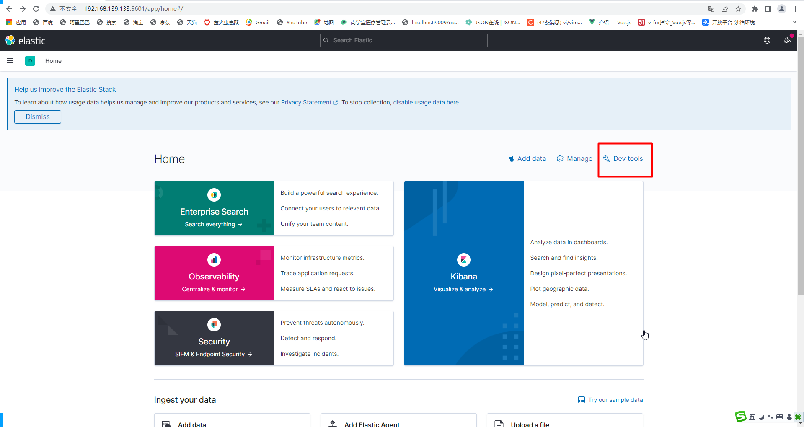

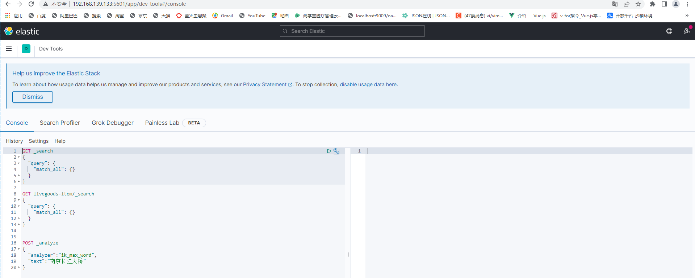


#### 接口测试

接口地址：localhost:9003/search

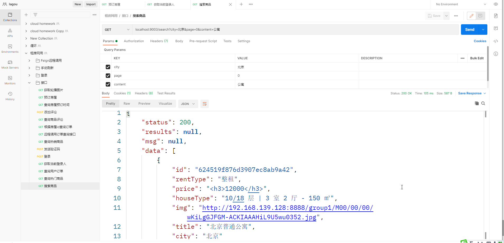


### login模块

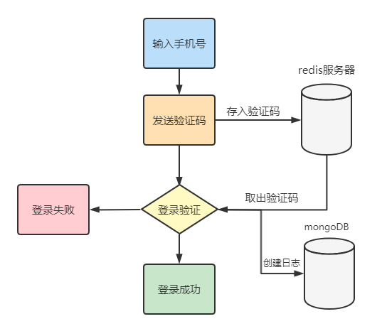

#### 接口列表

| 序号 | 接口名称       | 接口地址      | 请求类型 |
| :--: | -------------- | ------------- | -------- |
|  1   | 发送验证码     | /sendyzm      | post     |
|  2   | 登录           | /login        | post     |
|  3   | 获取当前登录人 | /getLoginUser | get      |

#### 发送验证码

##### 接口参数

| 参数名称 | 是否必须 |
| -------- | -------- |
| phone    | 是       |

返回JSON数据

| 名称   | 类型   | 其他信息 |
| ------ | ------ | -------- |
| status | int    |          |
| msg    | String |          |
| data   | Oject  |          |

##### 接口实现

###### 修改LoginService

```java
// 用户登录相关服务接口
public interface LoginService {
    // 发送验证码
    LivegoodsResult sendyzm(String phone);
    // 用户登录
    LivegoodsResult login(String username, String password);
}
```

```java
/**
 * 用户登录相关服务实现。
 */
@Service
public class LoginServiceImpl implements LoginService {
    @Autowired
    private ValidateCodeDao validateCodeDao;
    @Autowired
    private LoginLogDao loginLogDao;

    /**
     * 登录， 所有的操作结果都必须记录登录日志。
     * 1、 根据手机号查询redis，获取验证码。 检查redis中是否有数据，无数据，记录日志，返回登录失败。
     * 2、 校验，用户发送的验证码和redis中记录的验证码是否匹配，如果不匹配，记录日志，返回登录失败。
     * 3、 校验验证码成功，记录日志，并删除redis中存储的验证码。 返回登录成功。
     * @param username 手机号
     * @param password 验证码
     * @return
     */
    @Override
    public LivegoodsResult login(String username, String password) {
        // 创建登录日志对象
        LoginLog loginLog = new LoginLog();
        loginLog.setUsername(username); // 记录用户名， 哪一个用户在做登录。
        loginLog.setLoginTime(new Date()); // 记录登录操作时间。
        loginLog.setType("1"); // 登录方式， 1 - 验证码登录。

        // 从redis中查询用户的验证码
        ValidateCode validateCode = validateCodeDao.get(username);
        // 判断验证码是否存在
        if(null == validateCode){
            // 验证码不存在，或验证码过期
            loginLog.setIsSuccess(false); // 登录失败
            loginLog.setMessage("验证码已过期"); // 错误消息
            // 保存登录日志到MongoDB
            loginLogDao.insertLoginLog(loginLog);
            return LivegoodsResult.error("用户名或验证码错误，或验证码已过期");
        }

        // 客户端传递的验证码和服务端记录的验证码是否一致
        if(!password.equals(validateCode.getValidateCode())){
            // 客户端传递的验证码和服务端记录的验证码不一致。 登录失败
            loginLog.setIsSuccess(false); // 登录失败
            loginLog.setMessage("验证码不匹配"); // 错误消息
            // 保存登录日志到MongoDB
            loginLogDao.insertLoginLog(loginLog);
            return LivegoodsResult.error("用户名或验证码错误，或验证码已过期");
        }

        // 登录成功，记录日志，并返回。
        loginLog.setIsSuccess(true); // 登录成功
        loginLog.setMessage("用户登录"); // 日志消息
        // 删除redis中保存的验证码
        validateCodeDao.delete(username);
        // 保存日志到MongoDB
        loginLogDao.insertLoginLog(loginLog);

        return LivegoodsResult.ok("登录成功");
    }

    /**
     * 发送验证码
     * 动态生成一个长度为4的随机数字字符串作为验证码。
     * 保存手机号和验证码到redis，有效时长为2分钟。
     *
     * 在验证码仍旧有效的时候，再次申请验证码，应该如何处理？
     *  1、 生成新的验证码，有效时间刷新为2分钟，覆盖旧验证码。 对客户端比较友好，服务端成本提高。
     *  2、 通知客户端，验证码仍旧可用，不重新发送。 对客户端来说，友好度降低；服务器压力降低，成本降低。
     * @param phone 手机号。
     * @return
     */
    @Override
    public LivegoodsResult sendyzm(String phone) {
        ValidateCode oldCode = validateCodeDao.get(phone);
        if(oldCode != null){
            // 已有验证码，且有效。 不生成新的验证码，直接通知客户，使用现有的验证码
            return LivegoodsResult.error("原验证码仍旧可用，请不要重复申请验证码！");
        }

        // 拼接一个长度为4的数字字符串。
        StringBuilder builder = new StringBuilder("");
        Random r = new Random();
        for(int i = 0; i < 4; i++){
            builder.append(r.nextInt(10));
        }
        // 生成验证码。
        String validateCode = builder.toString();

        // 创建验证码对象
        ValidateCode code = new ValidateCode();
        code.setPhone(phone);
        code.setValidateCode(validateCode);

        // 保存验证码到redis。
        validateCodeDao.set(code.getPhone(), code);

        // 返回结果
        LivegoodsResult result = LivegoodsResult.ok();
        result.setMsg("验证码发送成功");

        System.out.println("手机号 ：" + phone + " ； 验证码 ： " + validateCode);

        return result;
    }
}
```

###### 修改controller

```java
/**
 * 发送验证码
 * @param phone 手机号码
 * @return
 */
@PostMapping("/sendyzm")
public LivegoodsResult sendyzm(String phone){
    return loginService.sendyzm(phone);
}
```

##### 接口测试

接口地址：localhost:9007/sendyzm

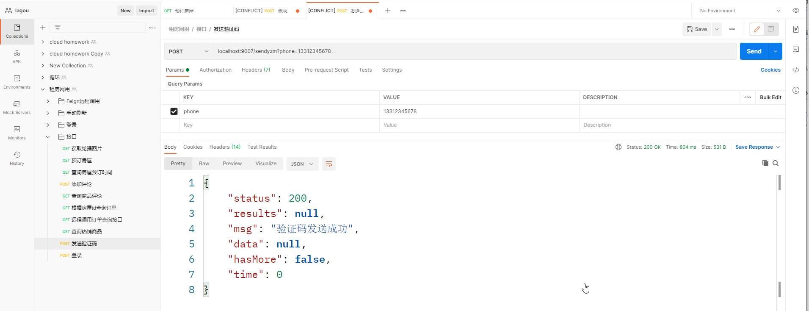

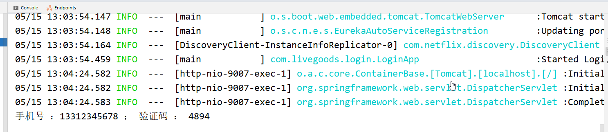


#### 登录

##### 接口参数

| 参数名称 | 是否必须 |
| -------- | -------- |
| username | 是       |
| password | 是       |

返回Json数据

| 名称   | 类型   | 其他信息 |
| ------ | ------ | -------- |
| status | int    |          |
| msg    | String |          |

##### 接口实现

###### 创建service

```java
// 用户登录相关服务接口
public interface LoginService {
    // 用户登录
    LivegoodsResult login(String username, String password);
}
```

```java
/**
 * 用户登录相关服务实现。
 */
@Service
public class LoginServiceImpl implements LoginService {
    @Autowired
    private ValidateCodeDao validateCodeDao;
    @Autowired
    private LoginLogDao loginLogDao;

    /**
     * 登录， 所有的操作结果都必须记录登录日志。
     * 1、 根据手机号查询redis，获取验证码。 检查redis中是否有数据，无数据，记录日志，返回登录失败。
     * 2、 校验，用户发送的验证码和redis中记录的验证码是否匹配，如果不匹配，记录日志，返回登录失败。
     * 3、 校验验证码成功，记录日志，并删除redis中存储的验证码。 返回登录成功。
     * @param username 手机号
     * @param password 验证码
     * @return
     */
    @Override
    public LivegoodsResult login(String username, String password) {
        // 创建登录日志对象
        LoginLog loginLog = new LoginLog();
        loginLog.setUsername(username); // 记录用户名， 哪一个用户在做登录。
        loginLog.setLoginTime(new Date()); // 记录登录操作时间。
        loginLog.setType("1"); // 登录方式， 1 - 验证码登录。

        // 从redis中查询用户的验证码
        ValidateCode validateCode = validateCodeDao.get(username);
        // 判断验证码是否存在
        if(null == validateCode){
            // 验证码不存在，或验证码过期
            loginLog.setIsSuccess(false); // 登录失败
            loginLog.setMessage("验证码已过期"); // 错误消息
            // 保存登录日志到MongoDB
            loginLogDao.insertLoginLog(loginLog);
            return LivegoodsResult.error("用户名或验证码错误，或验证码已过期");
        }

        // 客户端传递的验证码和服务端记录的验证码是否一致
        if(!password.equals(validateCode.getValidateCode())){
            // 客户端传递的验证码和服务端记录的验证码不一致。 登录失败
            loginLog.setIsSuccess(false); // 登录失败
            loginLog.setMessage("验证码不匹配"); // 错误消息
            // 保存登录日志到MongoDB
            loginLogDao.insertLoginLog(loginLog);
            return LivegoodsResult.error("用户名或验证码错误，或验证码已过期");
        }

        // 登录成功，记录日志，并返回。
        loginLog.setIsSuccess(true); // 登录成功
        loginLog.setMessage("用户登录"); // 日志消息
        // 删除redis中保存的验证码
        validateCodeDao.delete(username);
        // 保存日志到MongoDB
        loginLogDao.insertLoginLog(loginLog);

        return LivegoodsResult.ok("登录成功");
    }
}
```

###### 创建dao

```java
// 用户登录验证码数据访问接口， 访问redis
public interface ValidateCodeDao {
    // 删除验证码
    Boolean delete(String key);
}
```

```java
// 用户登录验证码数据访问实现
@Repository
public class ValidateCodeDaoImpl implements ValidateCodeDao {
    @Autowired
    private RedisTemplate<String, Object> redisTemplate;

    // 删除验证码
    @Override
    public Boolean delete(String key) {
        return redisTemplate.delete(key);
    }
}
```

```java
// 用户登录数据访问接口
public interface LoginLogDao {
    // 新增登录日志到MongoDB
    void insertLoginLog(LoginLog loginLog);
}
```

```java
// 用户登录日志数据访问实现
@Repository
public class LoginLogDaoImpl implements LoginLogDao {
    @Autowired
    private MongoTemplate mongoTemplate;

    // 新增登录日志到MongoDB数据库
    @Override
    public void insertLoginLog(LoginLog loginLog) {
        mongoTemplate.save(loginLog);
    }
}
```

###### 创建controller

```java
/**
 * 登录服务控制器
 */
@RestController
public class  LoginController {
    @Autowired
    private LoginService loginService;

    /**
     * 用户登录
     * @param username 手机号
     * @param password 验证码
     * @return
     */
    @PostMapping("/login")
    public LivegoodsResult login(String username, String password){
        LivegoodsResult result = loginService.login(username, password);
        return result;
    }
}
```

##### 接口测试

接口地址：localhost:9007/login

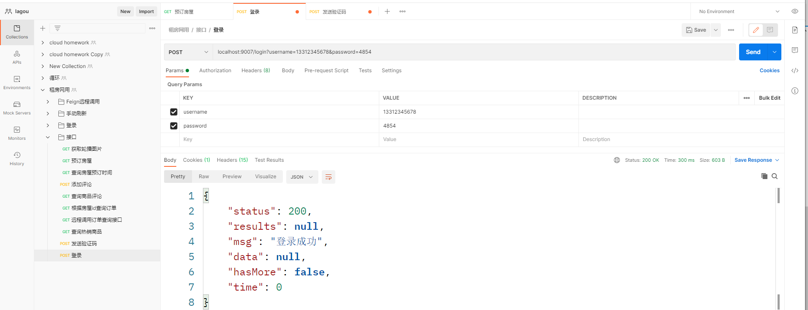


#### 获取当前登录信息

##### 接口参数

| 参数名称    | 是否必须 |
| ----------- | -------- |
| UserDetails | 是       |

返回JSON数据

| 名称     | 类型   | 其他信息 |
| -------- | ------ | -------- |
| username | String |          |
| password | String |          |

##### 接口实现

###### 修改Controller

```java
@GetMapping("/getLoginUser")
public UserDetails getCurrentUser(@AuthenticationPrincipal UserDetails userDetails){
    return userDetails;
}
```

##### 接口测试

接口地址：localhost:9007/getLoginUser

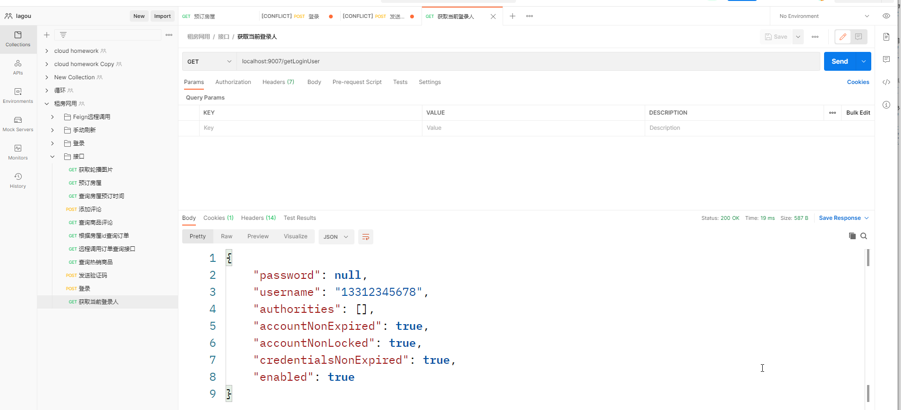


#### 使用spring-security开发自定义登录逻辑

Spring Security是一个功能强大且高度可定制的身份验证和访问控制框架。它是用于保护基于Spring的应用程序的实际标准。Spring Security是一个框架，致力于为Java应用程序提供身份验证和授权。与所有Spring项目一样，Spring Security的真正强大之处在于可以轻松扩展以满足自定义要求。

1. 认证: 用户登录, 解决的是"你是谁?"
2. 授权: 判断用户拥有什么权限，可以访问什么资源. 解决的是"你能干什么?"
3. 安全防护，防止跨站请求，session 攻击等

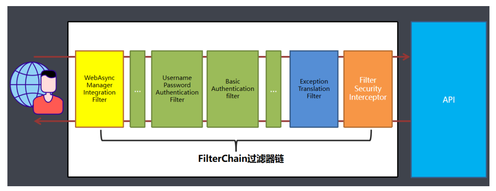

修改login模块的pom.xml文件，添加相关依赖

```xml
<!--添加Spring Security 依赖 -->
<dependency>
    <groupId>org.springframework.boot</groupId>
    <artifactId>spring-boot-starter-security</artifactId>
</dependency>
```

增加spring-security配置类

```java
package com.livegoods.login.config;

import com.livegoods.login.service.MyAuthenticationService;
import com.livegoods.login.service.MyUserDetailsService;
import org.springframework.beans.factory.annotation.Autowired;
import org.springframework.context.annotation.Configuration;
import org.springframework.security.config.annotation.authentication.builders.AuthenticationManagerBuilder;
import org.springframework.security.config.annotation.web.builders.HttpSecurity;
import org.springframework.security.config.annotation.web.builders.WebSecurity;
import org.springframework.security.config.annotation.web.configuration.WebSecurityConfigurerAdapter;
import org.springframework.web.cors.CorsConfiguration;
import org.springframework.web.cors.CorsConfigurationSource;
import org.springframework.web.cors.UrlBasedCorsConfigurationSource;

/**
 * spring security配置类
 */
@Configuration
public class SecurityConfig extends WebSecurityConfigurerAdapter {

    @Autowired
    private MyUserDetailsService myUserDetailsService;

    @Autowired
    private MyAuthenticationService myAuthenticationService;

    /**
     * 身份安全管理器
     * @param auth
     * @throws Exception
     */
    @Override
    protected void configure(AuthenticationManagerBuilder auth) throws Exception {
        auth.userDetailsService(myUserDetailsService);
    }

    @Override
    public void configure(WebSecurity web) throws Exception {
        super.configure(web);
    }

    @Override
    protected void configure(HttpSecurity http) throws Exception {
        http.formLogin().loginProcessingUrl("/login")
                .successForwardUrl("/details")
                .successHandler(myAuthenticationService)
                .failureHandler(myAuthenticationService)
                .and().rememberMe()
                .tokenValiditySeconds(1209600)
                .and().authorizeRequests().antMatchers("/sendyzm").permitAll()
                .anyRequest().authenticated();

        http.csrf().disable();  //关闭csrf防护
        http.cors().configurationSource(corsConfigurationSource());
    }

    /**
     * 跨域配置信息
     * @return
     */
    public CorsConfigurationSource corsConfigurationSource(){
        CorsConfiguration corsConfiguration = new CorsConfiguration();
        //允许跨域的站点
        corsConfiguration.addAllowedOrigin("*");
        //允许跨域的方法
        corsConfiguration.addAllowedMethod("*");
        //允许跨域的请求头
        corsConfiguration.addAllowedHeader("*");
        //对所有url都生效
        UrlBasedCorsConfigurationSource urlBasedCorsConfigurationSource =
                new UrlBasedCorsConfigurationSource();
        urlBasedCorsConfigurationSource.registerCorsConfiguration("/**",corsConfiguration);
        return urlBasedCorsConfigurationSource;
    }
}
```

编写自定义登录逻辑类MyUserDetailsService

```java
package com.livegoods.login.service;

@Service
public class MyUserDetailsService implements UserDetailsService {

    @Autowired
    private ValidateCodeDao validateCodeDao;

    @Override
    public UserDetails loadUserByUsername(String username) throws UsernameNotFoundException {
        String password = "";
        ValidateCode validateCode = validateCodeDao.get(userName);
        if(validateCode == null){
            //do nothing
        }else{
            password = validateCode.getValidateCode();
        }
        Collection<GrantedAuthority> authorities = new ArrayList<>();
        UserDetails userDetails = new org.springframework.security.core.userdetails.User
                (userName,"{noop}" + password,
                        true,   //启用用户
                        true,   //用户永不过期
                        true,   //凭证永不过期
                        true,      //锁定用户
                        authorities);
        return userDetails;
    }
}
```

编写登录成功或失败后的处理器-MyAuthenticationService

```java
/**
 * 自定义登录成功或失败处理器
 */
@Service
public class MyAuthenticationService implements AuthenticationSuccessHandler,AuthenticationFailureHandler {
    @Autowired
    ObjectMapper objectMapper;

    @Override
    public void onAuthenticationFailure(HttpServletRequest request, HttpServletResponse response, AuthenticationException exception) throws IOException, ServletException {
        System.out.println("登录失败后断续处理......");
        LivegoodsResult error = LivegoodsResult.error();
        response.setContentType("application/json;charset=UTF-8");
        response.getWriter().write(objectMapper.writeValueAsString(error));
    }

    @Override
    public void onAuthenticationSuccess(HttpServletRequest request, HttpServletResponse response, Authentication authentication) throws IOException, ServletException {
        System.out.println("登录成功后断续处理......");
        LivegoodsResult livegoodsResult = LivegoodsResult.ok();
        livegoodsResult.setMsg("登录成功");
        response.setContentType("application/json;charset=UTF-8");
        response.getWriter().write(objectMapper.writeValueAsString(livegoodsResult));
    }
}
```


### buyaction模块

预订房屋模块，并发送消息给消费端

#### 接口列表

| 序号 | 接口名称 | 接口地址   | 请求类型 |
| :--: | -------- | ---------- | -------- |
|  1   | 预订房屋 | /buyaction | get      |

#### 接口参数

| 参数名称 | 是否必须 |
| -------- | -------- |
| id       | 是       |
| user     | 是       |

#### 接口实现

##### 创建配置类

创建BuyactionConfiguration

```java
@Configuration
public class BuyactionConfiguration extends RedisCacheConfiguration {
    @Bean
    public RedisTemplate<String, Object> redisTemplate(RedisConnectionFactory redisConnectionFactory){
        return super.redisTemplate(redisConnectionFactory);
    }
}
```

##### 创建dao接口

创建ItemDao

```java
public interface ItemDao {
    // 根据key查询value。 根据key查询缓存中的商品对象。
    Item get(String key);
}
```

创建dao实现类

```java
@Repository
public class ItemDaoImpl implements ItemDao {
    @Autowired
    private RedisTemplate<String, Object> redisTemplate;
    @Override
    public Item get(String key) {
        return (Item) redisTemplate.opsForValue().get(key);
    }
}
```

##### 创建接口类

创建BuyactionService

```java
// 购买服务接口
public interface BuyactionService {
    /**
     * 购买商品服务方法
     * @param id 商品主键
     * @param user 用户手机号
     * @return 购买是否成功
     */
    LivegoodsResult buyaction(String id, String user);
}
```

创建BuyactionServiceImpl

```java
package com.livegoods.buyaction.service.impl;

// 购买商品服务实现
@Service
public class BuyactionServiceImpl implements BuyactionService {
    @Autowired
    private ItemDao itemDao;
    @Autowired
    private LivegoodsMessagePublisher messagePublisher;
    @Autowired
    private StreamBridge streamBridge;
    @Value("${livegoods.cache.names.item.prefix}")
    private String itemPrefix;
    @Value("${livegoods.cache.names.item.suffix}")
    private String itemSuffix;
    @Value("${livegoods.rabbit.buy.exchange}")
    private String exchange;
    @Value("${livegoods.rabbit.buy.routingKey}")
    private String routingKey;
    @Value("${eureka.client.service-url.defaultZone}")
    private String url;

    /**
     * 实现流程：
     *  1、 访问redis，查询这个商品是否可购买
     *  2、 封装一个消息对象，发送消息到MQ，并等待消费者的响应
     *  3、 根据消息消费者响应结果，返回操作结果
     * @param id 商品主键
     * @param user 用户手机号
     * @return
     */
    @Override
    public LivegoodsResult buyaction(String id, String user) {
        String key = itemPrefix + "::" + itemSuffix + "(" + id + ")";
        System.out.println("key...." + key);
        Item item = this.itemDao.get(key);
        if(item.getIsRented()){
            // 房屋已出租。不能再次预定。直接返回。
            LivegoodsResult result = LivegoodsResult.error();
            result.setMsg("手慢了，已经被抢订，预订失败！");
            return result;
        }
        // 创建消息对象
        LivegoodsBuyMessage message = new LivegoodsBuyMessage();
        message.setItemId(id);
        message.setUsername(user);
        // 发送消息
        boolean messageResult = streamBridge.send("livegoodsMessenger-out-0", message);
        if(messageResult){
            // 购买成功
            LivegoodsResult result = LivegoodsResult.ok();
            result.setMsg("预定成功！");
            return result;
        }else{
            // 购买失败
            LivegoodsResult result = LivegoodsResult.error();
            result.setMsg("手慢了，已经被抢订，预订失败！");
            return result;
        }
    }
}
```

##### 创建controller

```java
// 购买控制器
@RestController
public class BuyactionController {
    @Autowired
    private BuyactionService buyactionService;

    /**
     * 预定房屋
     * @param id 商品主键
     * @param user 登录用户手机号
     * @return 预定结果
     */
    @GetMapping("/buyaction")
    public LivegoodsResult buyaction(String id, String user){
        return buyactionService.buyaction(id, user);
    }
}
```

#### 接口测试

接口地址：localhost:9008/buyaction


### spring-cloud-stream在项目中的应用

在buyaction模块的pom.xml中引入依赖

```xml
 <!--stream依赖(rabbit)-->
 <dependency>
     <groupId>org.springframework.cloud</groupId>
     <artifactId>spring-cloud-starter-stream-rabbit</artifactId>
 </dependency>
```

在bootstrap.yml中增加stream的配置

```yaml
 spring:
   cloud:
     stream:
       bindings:
        # 消费者绑定名称，livegoodsMessenger是自定义的绑定名称，in代表消费者，0是固定写法
         livegoodsMessenger-in-0:
           destination: livegoodsTopic # 对应的真实的 RabbitMQ Exchange
         livegoodsMessenger-out-0:
           destination: livegoodsTopic
       function:
       #定义消费者，多个用分号分隔，当存在大于1个的消费者时，不定义不会生效
           definition: livegoodsMessenger
```

修改BuyactionServiceImpl.java方法中的buyaction()

```java
 LivegoodsBuyMessage message = new LivegoodsBuyMessage();
 message.setItemId(id);
 message.setUsername(user);
 // 发送消息
 boolean messageResult = streamBridge.send("livegoodsMessenger-out-0", message);
```


### buyaction-messege-consumer模块

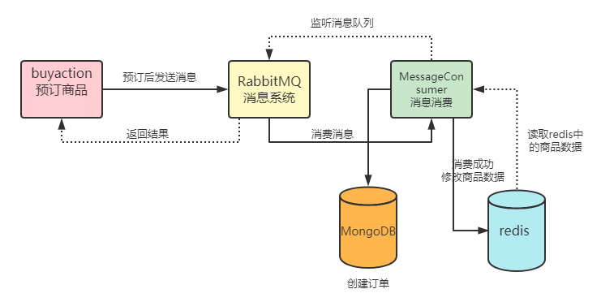

监听消息，预订房屋成功后生成order

修改pom.xml文件，增加stream依赖

```xml
 <dependency>
      <groupId>org.springframework.cloud</groupId>
     <artifactId>spring-cloud-starter-stream-rabbit</artifactId>
 </dependency>
```

修改bootstrap.yml文件，增加stream相关配置

```yaml
spring:
  cloud:
    config:
      uri: http://localhost:9010
      label: master
      name: rabbit	
      profile: dev
    stream:
      bindings:
        livegoodsMessenger-in-0:
          destination: livegoodsTopic # 对应的真实的 RabbitMQ Exchange
        livegoodsMessenger-out-0:
          destination: livegoodsTopic
      function:
        definition: livegoodsMessenger
```

#### 创建配置类

用于操作redis

```java
@Configuration
public class BuyactionMessageConsumerConfiguration extends RedisCacheConfiguration {
    @Bean
    public RedisTemplate<String, Object> redisTemplate(RedisConnectionFactory redisConnectionFactory){
        return super.redisTemplate(redisConnectionFactory);
    }
}
```

#### 创建dao接口

更新商品信息并生成order

```java
// 商品数据访问接口
public interface ItemDao {
    // 更新商品数据， 是否已出租字段。
    long update(String id, Boolean rented);
}
```

```java
// 订单数据访问接口
public interface OrderDao {
    void save(Order order);
}
```

```java
// 商品数据访问实现
@Repository
public class ItemDaoImpl implements ItemDao {
    @Autowired
    private MongoTemplate mongoTemplate;

    // 更新商品是否已出租字段。
    // 更新MongoDB中item集合的语法
    // db.item.update({},{"$set":{"isRented":false}}, false, true);
    @Override
    public long update(String id, Boolean rented) {
        Query query = new Query();
        // 更新条件
        query.addCriteria(Criteria.where("id").is(id));
        // 更新内容
        Update update = Update.update("isRented", rented);
        UpdateResult result = mongoTemplate.updateFirst(query, update, Item.class);
        return result.getModifiedCount();
    }
}
```

```java
@Repository
public class OrderDaoImpl implements OrderDao {
    @Autowired
    private MongoTemplate mongoTemplate;

    @Override
    public void save(Order order) {
        mongoTemplate.save(order);
    }
}
```

```java
// 商品数据访问接口
public interface ItemDao4Redis {
    // 根据key查询缓存的商品
    Item get(String key);
    // 设置新的键值对到redis。如果key重复，则覆盖。
    boolean set(String key, Object value);
}
```

```java
 /**
     * 当前的方法，需要原子操作。要在更新之前，先查询一下key对应的商品，
     * 是否可以预定。如果可预定，则更新，如果不可预定，则忽略本次操作。
     * @param key
     * @param value
     */
    @Override
    public boolean set(final String key, final Object value) {
        try {
            redisTemplate.setEnableTransactionSupport(true);
        // 执行多次操作，且操作是原子性操作的时候，可以通过回调逻辑，实现。
            List<Object> result = redisTemplate.execute(
                    new SessionCallback<List<Object>>() {
                        public List<Object> execute(RedisOperations redisOperations) throws DataAccessException {
                            Item item = (Item) redisOperations.opsForValue().get(key);
                            if (item.getIsRented()) {
                                // 已出租，考虑并发环境。
                                return null;
                            }
                 // 开启事务， 通知redis后续的多条命令，是一个原子操作。
                            redisOperations.multi();
                            // 未出租， 可以更新数据
                            redisOperations.opsForValue().set(key, value);
                            // 相当于是提交事务， 通知redis，前置的命令都运行，如果有任何命令出错，回滚，没有出错提交。
                            return redisOperations.exec();
                        }
                    }
            );
            redisTemplate.setEnableTransactionSupport(false);
            if (null == result) { // 原子操作失败， 更新失败。
                return false;
            }
            return true;
        }catch(Exception e){
   // 发生任何异常，redisTemplate都会回滚事务，释放资源，但是不处理异常。
 // 如果此处没有异常处理逻辑，异常会抛到主线程（main方法）、直到虚拟机为止。
            e.printStackTrace();
            return false;
        }
    }

    @Override
    public Item get(String key) {
        return (Item) redisTemplate.opsForValue().get(key);
    }
}
```

#### 创建service

```java
// 购买服务接口
public interface BuyactionService {
    /**
     * 购买商品
     * @param id 商品主键
     * @param user 用户手机号
     * @return
     */
    boolean buyaction(String id, String user);
}
```

```java
// 购买服务实现
@Service
public class BuyactionServiceImpl implements BuyactionService {
    @Autowired
    private ItemDao itemDao;
    @Autowired
    private ItemDao4Redis itemDao4Redis;
    @Autowired
    private OrderDao orderDao;
    @Value("${livegoods.cache.names.item.prefix}")
    private String itemPrefix;
    @Value("${livegoods.cache.names.item.suffix}")
    private String itemSuffix;
    @Value("${spring.rabbitmq.host}")
    private String rabbiturl;

    /**
     * 购买流程：
     * 1、 更新缓存中的商品数据。并判断更新结果。 更新成功执行后续。 原子操作。
     * 2、 更新MongoDB中的商品数据。
     * 3、 记录订单信息
     * 4、 返回处理结果
     * @param id 商品主键
     * @param user 用户手机号
     * @return
     */
 @Override
 public boolean buyaction(String id, String user) {

   String key = itemPrefix + "::" + itemSuffix + "(" + id + ")";
        // 要更新的商品对象
        Item value = itemDao4Redis.get(key);
        value.setIsRented(true); // 设置为已出租
        // 更新缓存
        boolean isUpdateRedis = itemDao4Redis.set(key, value);
        if(isUpdateRedis){// 更新MongoDB
            long rows = itemDao.update(id, true);
            if(rows == 1) { // 更新了一行数据。
                // 记录订单
                Order order = new Order();
                order.setCommentState(0);
                order.setHouseType(value.getHouseType4Search());
                order.setImg(value.getImg());
                order.setItemId(value.getId());
                order.setPrice(value.getPrice().toString());
                order.setRentType(value.getRentType());
                order.setTitle(value.getTitle());
                order.setUsername(user);
                orderDao.save(order);
                return true;
            }
        }
        // 购买失败
        return false;
    }
}
```

#### 消息监听器

```java
// 购买消息消费者
@Component
@Slf4j
public class LivegoodsBuyactionConsumer {
    @Autowired
    private BuyactionService buyactionService;

    // 消费消息
    @Bean
    public Consumer<LivegoodsBuyMessage> livegoodsMessenger() {  // 方法名必须与生产消息时自定义的绑定名称一致
        return message -> {
            // 商品主键
            String itemId = message.getItemId();
            // 用户手机号
            String user = message.getUsername();
            boolean result = buyactionService.buyaction(itemId, user);
            log.info("消息消费结果....." + result);
        };
    }
}
```

#### 功能测试


### buytime模块

当用户点击房屋信息时会发送请求，请求当前房屋开放时间

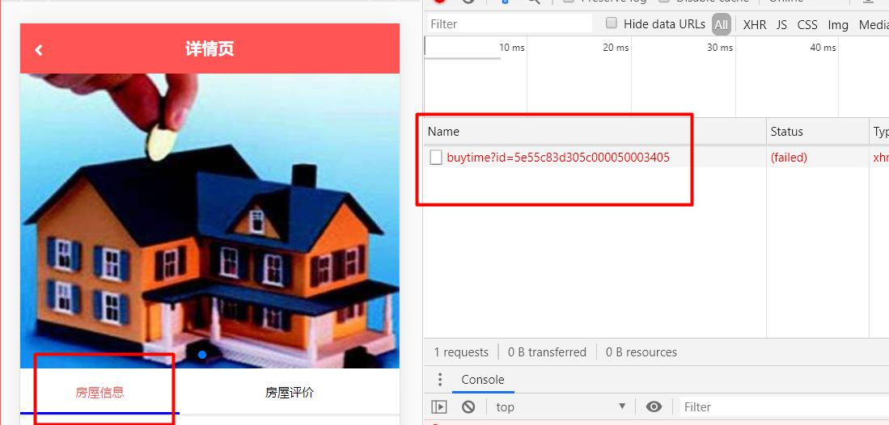

根据返回结果进行读秒，到达时间才能进行预订，且预订时要求必须登录。

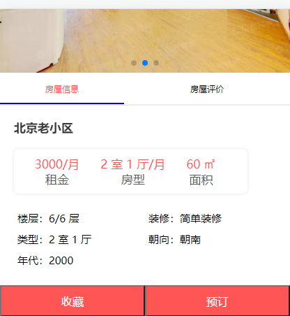

| 序号 | 接口名称                     | 接口地址 | 请求类型 |
| :--: | ---------------------------- | -------- | -------- |
|  1   | 根据商品主键查询商品预订时间 | /buytime | get      |

#### 接口参数

| 参数名称 | 是否必须 |
| -------- | -------- |
| id       | 是       |

返回JSON数据

| 名称   | 类型 | 其他信息 |
| ------ | ---- | -------- |
| status | int  |          |
| time   | Long |          |

#### 接口实现

##### 创建dao接口

```java
// 查询商品预订倒计时，数据访问接口
public interface ItemDao {
    // 根据主键，查询商品
    Item findById(String id);
}
```

```java
/**
 * 查询商品预订倒计时，数据访问实现
 */
@Repository
public class ItemDaoImpl implements ItemDao {
    @Autowired
    private MongoTemplate mongoTemplate;

    @Override
    public Item findById(String id) {
        return mongoTemplate.findById(id, Item.class);
    }
}
```

##### 创建service接口

```java
// 查询商品预订倒计时服务接口
public interface BuytimeService {
    // 根据商品主键，查询预订倒计时
    LivegoodsResult getBuytimeById(String id);
}
```

```java
/**
 * 查询商品预订倒计时， 服务实现
 */
@Service
public class BuytimeServiceImpl implements BuytimeService {
    @Autowired
    private ItemDao itemDao;

    @Override
    public LivegoodsResult getBuytimeById(String id) {
        Item item = this.itemDao.findById(id);
        LivegoodsResult result = LivegoodsResult.ok();
        // 获取商品预订时间的时间戳。
        result.setTime(item.getBuytime().getTime());
        return result;
    }
}
```

##### 创建controller

```java
/**
 * 查询商品预订倒计时控制器。
 */
@RestController
public class BuytimeController {
    @Autowired
    private BuytimeService buytimeService;

    /**
     * 根据商品主键，查询商品预订时间。
     * @param id 商品主键
     * @return
     */
    @GetMapping("/buytime")
    public LivegoodsResult getBuytime(String id){
        return buytimeService.getBuytimeById(id);
    }
}
```

#### 接口测试

接口地址：localhost:9006/buytime

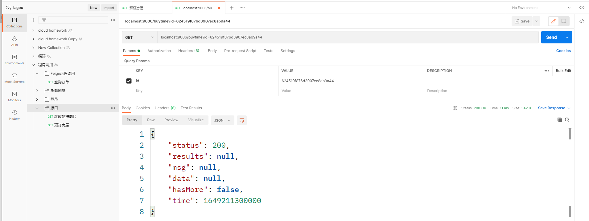


### resillience4j在项目中的应用


resillience4j在本项目中主要用于限流，以details模块为例进行讲解

#### 配置resillience4j

在bootstrap.yml中配置resillience4j

```yaml
resilience4j.circuitbreaker:
  configs:
    default:
      registerHealthIndicator: true
      slidingWindowSize: 10   #配置滑动窗口的大小。
      minimumNumberOfCalls: 5     #断路器计算失败率或慢调用率之前所需的最小调用数（每个滑动窗口周期）。
      permittedNumberOfCallsInHalfOpenState: 3    #断路器在半开状态下允许通过的调用次数。
      automaticTransitionFromOpenToHalfOpenEnabled: true      #如果设置为true，则意味着断路器将自动从开启状态过渡到半开状态，并且不需要调用来触发转换。创建一个线程来监视断路器的所有实例，以便在WaitDurationInOpenstate之后将它们转换为半开状态。但是，如果设置为false，则只有在发出调用时才会转换到半开，即使在waitDurationInOpenState之后也是如此。这里的优点是没有线程监视所有断路器的状态。
      waitDurationInOpenState: 5s     #断路器从开启过渡到半开应等待的时间。
      failureRateThreshold: 50    #以百分比配置失败率阈值。当失败率等于或大于阈值时，断路器状态并关闭变为开启，并进行服务降级。
      eventConsumerBufferSize: 10  #表示重试事件缓冲区大小
      recordExceptions:       #记录为失败并因此增加失败率的异常列表。除非通过ignoreExceptions显式忽略，否则与列表中某个匹配或继承的异常都将被视为失败
        - org.springframework.web.client.HttpServerErrorException
        - java.util.concurrent.TimeoutException
        - java.io.IOException
      ignoreExceptions:
        - com.livegoods.details.exception.BusinessException
    shared:
      slidingWindowSize: 100
      permittedNumberOfCallsInHalfOpenState: 30
      waitDurationInOpenState: 1s
      failureRateThreshold: 50
      eventConsumerBufferSize: 10
      ignoreExceptions:
        - com.livegoods.details.exception.BusinessException
  instances:
    backendA:
      baseConfig: default
    backendB:
      registerHealthIndicator: true
      slidingWindowSize: 10
      minimumNumberOfCalls: 10
      permittedNumberOfCallsInHalfOpenState: 3
      waitDurationInOpenState: 5s
      failureRateThreshold: 50
      eventConsumerBufferSize: 10
      recordFailurePredicate: com.livegoods.details.exception.RecordFailurePredicate

resilience4j.ratelimiter:
  configs:
    default:
      registerHealthIndicator: false
      limitForPeriod: 1   #一个周期内最大允许访问次数 1次/秒
      limitRefreshPeriod: 1s
      timeoutDuration: 0
      eventConsumerBufferSize: 100
  instances:
    backendA:
      baseConfig: default
    backendB:
      limitForPeriod: 1
      limitRefreshPeriod: 1s
      timeoutDuration: 3s
```

#### 修改service

```java
// 商品详情服务实现
@Service
public class DetailsServiceImpl implements DetailsService {
    @Autowired
    private ItemDao itemDao;
    @Value("${livegoods.banner.nginx.prefix}")
    private String nginxPrefix;
    private static final String BACKEND_B = "backendB";

    /**
     * 主键查询商品。
     * 需要将商品中的图片地址，从相对路径修改为绝对路径。
     * @param id
     * @return
     */
    @Override
    @CircuitBreaker(name = BACKEND_B)
    @RateLimiter(name = BACKEND_B)
//    @Cacheable(cacheNames = "com:livegoods:details", key = "'getDetails('+#id+')'")
    public Item getDetails(String id) {
        // 主键查询
        Item item = itemDao.findItemById(id);
        // 把图片的相对路径修改成绝对路径。
        List<String> newImgs = new ArrayList<>();
        for(String img : item.getImgs()){
            newImgs.add(nginxPrefix + img);
        }
        item.setImgs(newImgs);
        return item;
    }
}
```

#### 修改controller

在detailsController中增加方法用于测试方法熔断

```java
    @GetMapping("/testDetails")
    public LivegoodsResult testDetails(){
        ArrayList<String> idList = new ArrayList<>();
        idList.add("628ca685fefa3f45504692d6");
        idList.add("628ca685fefa3f45504692d5");
        idList.add("628ca685fefa3f45504692d4");
        idList.add("628ca685fefa3f45504692d3");

        for (String s : idList) {
            Item item = detailService.getDetails(s);
        }
        return LivegoodsResult.ok();
    }
```

#### 接口测试

localhost:9004/testDetails（频繁访问时开启限流）

```json
05/13 11:26:20.743 ERROR ---  [http-nio-9004-exec-8] o.a.c.c.C.[.[localhost].[/].[dispatcherServlet]   :Servlet.service() for servlet [dispatcherServlet] in context with path [] threw exception [Request processing failed; nested exception is io.github.resilience4j.circuitbreaker.CallNotPermittedException: CircuitBreaker 'backendB' is OPEN and does not permit further calls] with root cause
io.github.resilience4j.circuitbreaker.CallNotPermittedException: CircuitBreaker 'backendB' is OPEN and does not permit further calls
	at io.github.resilience4j.circuitbreaker.CallNotPermittedException.createCallNotPermittedException(CallNotPermittedException.java:48) ~[resilience4j-circuitbreaker-1.7.0.jar:1.7.0]
```


### order模块

#### 接口列表

| 序号 | 接口名称           | 接口地址 | 请求类型 |
| :--: | ------------------ | -------- | -------- |
|  1   | 查询用户的订单集合 | /order   | get      |

#### 接口参数

| 参数名称 | 是否必须 |
| -------- | -------- |
| user     | 是       |

返回集合数据

| 名称      | 类型 | 其他信息 |
| --------- | ---- | -------- |
| OrderList | List |          |

#### 接口实现

##### 创建dao

```java
// 订单数据访问接口
public interface OrderDao {
    // 根据用户手机号，查询订单。不分页，查询全部。
    List<Order> getOrders(String user);
}
```

```java
// 订单数据访问实现
@Repository
public class OrderDaoImpl implements OrderDao {
    @Autowired
    private MongoTemplate mongoTemplate;

    /**
     * 根据用户手机号查询订单
     * @param user 用户手机号
     * @return
     */
    @Override
    public List<Order> getOrders(String user) {
        Query query = new Query();
        query.addCriteria(Criteria.where("username").is(user));
        return mongoTemplate.find(query, Order.class);
    }
}
```

##### 创建service

```java
// 订单服务接口
public interface OrderService {
    // 查询用户的订单集合。
    List<Order> getOrders(String user);
}
```

```java
// 订单服务实现
@Service
public class OrderServiceImpl implements OrderService {
    @Autowired
    private OrderDao orderDao;

    @Override
    public List<Order> getOrders(String user) {
        return orderDao.getOrders(user);
    }
}
```

##### 创建controller

```java
// 订单控制器
@RestController
public class OrderController {
    @Autowired
    private OrderService orderService;

    // 查询用户的订单集合
    @GetMapping("/order")
    public List<Order> getOrders(String user){
        return orderService.getOrders(user);
    }

}
```

##### 创建启动类

```java
@SpringBootApplication
public class OrderApp {
    public static void main(String[] args) {
        SpringApplication.run(OrderApp.class, args);
    }
}
```

#### 接口测试

接口地址：localhost:9009/order

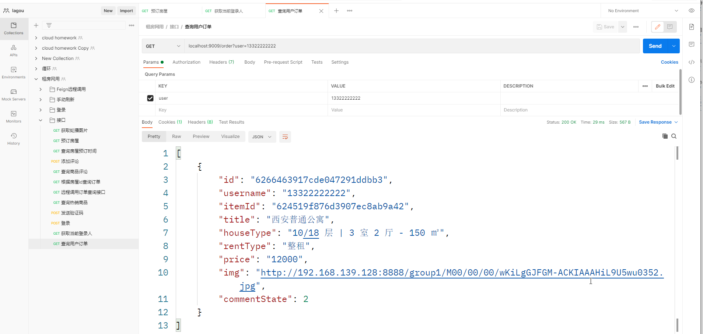


### 使用openfeign远程调用

修改details模块（服务调用方）中的pom.xml文件

```xml
<!--openFeign-->
<dependency>
    <groupId>org.springframework.cloud</groupId>
    <artifactId>spring-cloud-starter-openfeign</artifactId>
</dependency>
```

#### 创建远程调用接口

```java
/**
 * 远程调用订单查询接口，value的值是eureka注册中心上的服务名
 */
@FeignClient(value="livegoods-order")
public interface OrderServiceFeignClient {

    @GetMapping("/order")
    public List<Order> getOrders(@RequestParam("user") String user);
}
```

#### 修改controller

在detailsController中注入接口

```java
/**
 * 商品详情控制器
 */
@RestController
public class DetailsController {
    @Autowired
    private DetailsService detailsService;

    @Autowired(required=false)
    private OrderServiceFeignClient orderServiceFeignClient;
    
     /**
     * 远程调用订单查询接口
     * @param user
     * @return
     */
    @GetMapping("/detail/order")
    public List<Order> selectOrder(String user){
   		List<Order> orders = orderServiceFeignClient.getOrders(user);
        return orders;
    }
}
```

主启动类DetailApplication

```java
@SpringBootApplication
@EnableCaching
@EnableFeignClients
public class DetailApplication {

    public static void main(String[] args) {
        SpringApplication.run(DetailApplication.class,args);
    }
}
```


#### 接口测试

接口地址：localhost:9004/detail/order

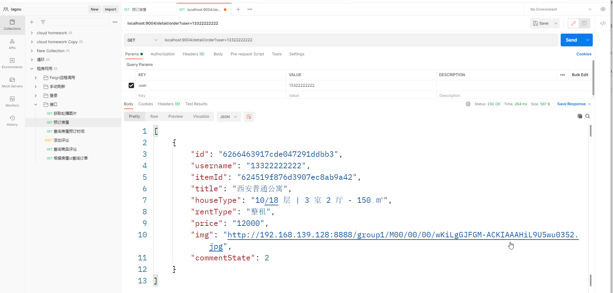

### 